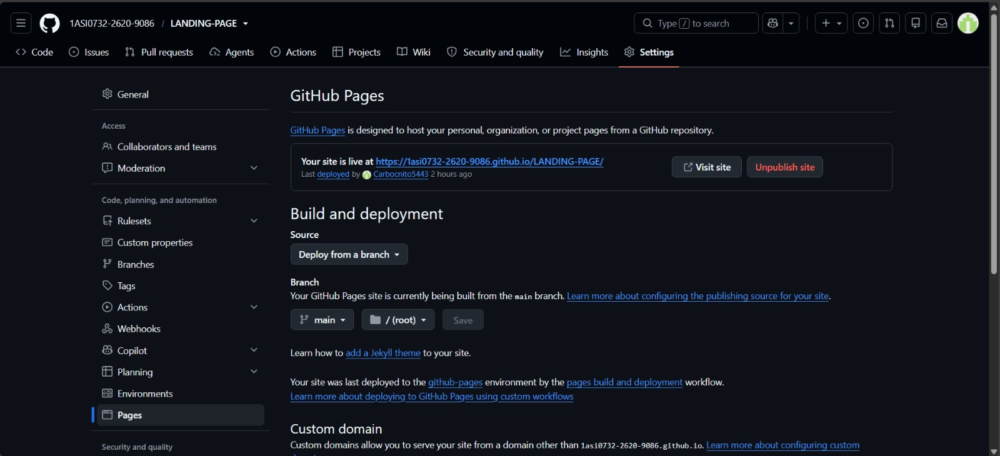
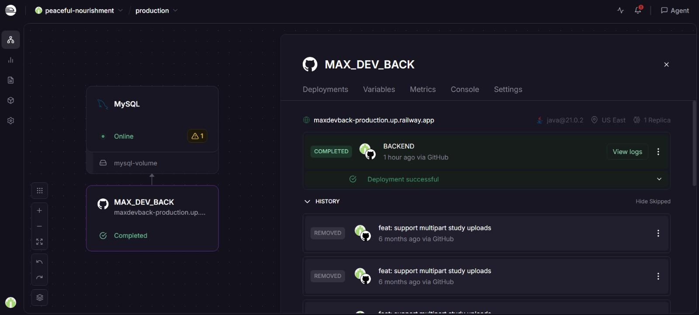
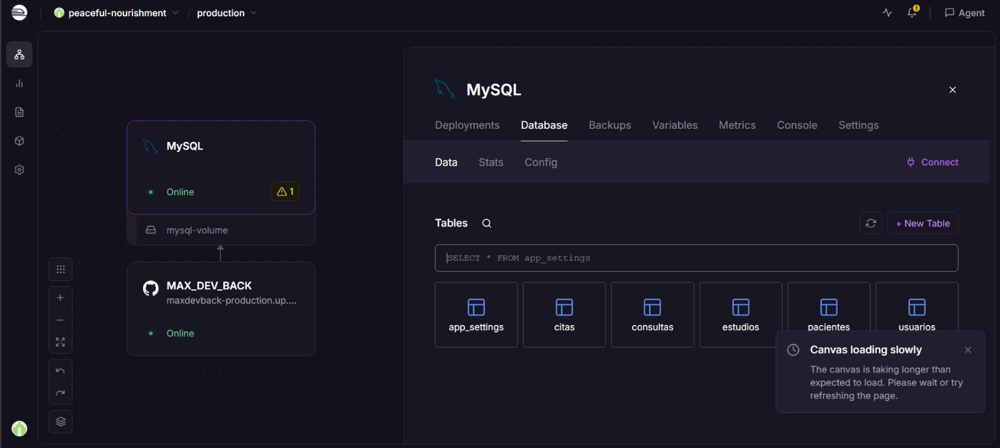
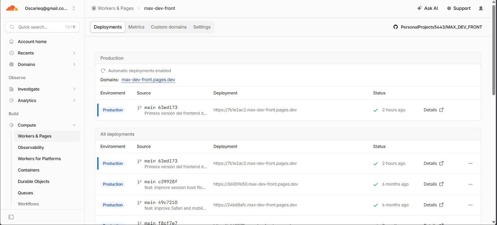

## Capítulo V: Product Implementation, Validation & Deployment
### 5.1. Software Configuration Management
### Requirements Management

- **Discord y WhatsApp:** Estas plataformas fueron esenciales para la comunicación interna del equipo, siendo WhatsApp especialmente útil por su facilidad para gestionar grupos de trabajo.

- **Trello:** Se utilizó para planificar y dar seguimiento al avance del proyecto mediante tableros que representaban el backlog del producto y otras tareas organizativas.

### Product UX/UI

- **Figma:** Herramienta principal para el diseño de wireframes y prototipos, tanto en versiones de escritorio como móviles.

- **Miro:** Se utilizó como apoyo en la creación de los Scenario Mapping para ambos segmentos objetivo considerados en el desarrollo del proyecto.

### Software Development

- **Visual Studio Code:** Editor principal utilizado para el desarrollo y programación del landing page.

- **GitHub y Git Bash:** Herramientas empleadas para el control de versiones y el desarrollo colaborativo del repositorio del proyecto.

- **HTML y CSS:** Lenguajes fundamentales utilizados para la estructura (HTML) y el diseño visual (CSS) del landing page.

### Software Documentation

- **Google Drive:** Plataforma utilizada para el almacenamiento compartido de documentación e informes colaborativos.

- **Google Meet y Zoom:** Google Meet fue utilizado principalmente para las reuniones virtuales del equipo, mientras que Zoom se empleó para las grabaciones de entrevistas y presentaciones relacionadas con el desarrollo del proyecto.

- **Lucidchart:** Herramienta utilizada para la creación de diagramas de flujo y modelado visual del sistema, incluyendo diagramas de clases.


- **Vertabelo:** Herramienta empleada para el diseño de la base de datos y la elaboración de diagramas lógicos.
- 
#### 5.1.1. Software Development Environment Configuration

Para el desarrollo de MAX se configuraron diferentes entornos y servicios que permiten gestionar el código fuente, desplegar los componentes de la solución y mantener disponible la infraestructura necesaria para su funcionamiento. La arquitectura de despliegue considera de manera independiente el Landing Page, Frontend, Backend y Base de Datos.

El equipo utiliza **GitHub** como plataforma principal para el almacenamiento del código fuente y el control de versiones. Los diferentes componentes de la solución se encuentran organizados en repositorios independientes, permitiendo administrar de manera separada el desarrollo y despliegue de cada aplicación.

#### Landing Page

El Landing Page de MAX se encuentra alojado en un repositorio de GitHub y desplegado mediante **GitHub Pages**. La configuración utiliza la rama `main` como fuente de publicación, permitiendo que los cambios integrados en esta rama puedan reflejarse posteriormente en la versión publicada del sitio.

El despliegue mediante GitHub Pages permite disponer de una versión pública del Landing Page sin necesidad de administrar un servidor web independiente.



#### Backend

El Backend de MAX se encuentra desplegado mediante **Railway**. El servicio está conectado con el repositorio correspondiente en GitHub, permitiendo desplegar la aplicación a partir del código fuente del proyecto.

Railway proporciona el entorno necesario para mantener disponible el servicio Backend y permite consultar información relacionada con los deployments, variables de entorno, métricas y registros de ejecución.

En la configuración mostrada, el servicio `MAX_DEV_BACK` se encuentra desplegado correctamente en el ambiente de producción.



#### Base de Datos

La base de datos utilizada por MAX se encuentra desplegada mediante **Railway** utilizando **MySQL**. Este servicio se encuentra conectado con el Backend, permitiendo almacenar y consultar la información necesaria para el funcionamiento de la plataforma.

La instancia contiene las diferentes tablas utilizadas por el sistema, entre las que se encuentran `app_settings`, `citas`, `consultas`, `estudios`, `pacientes` y `usuarios`.

La separación entre el servicio Backend y la instancia MySQL permite mantener diferenciadas la lógica de negocio y la persistencia de los datos dentro del entorno desplegado.



#### Frontend Web Application

El Frontend de MAX se encuentra desplegado mediante **Cloudflare Workers & Pages**. El proyecto está conectado con su repositorio de GitHub y utiliza la rama `main` para realizar los deployments correspondientes al ambiente de producción.

La plataforma mantiene un historial de los diferentes despliegues realizados y permite verificar el estado de cada versión publicada. De esta manera, los cambios incorporados al Frontend pueden ser desplegados y posteriormente validados en el ambiente de producción.



#### Resumen del entorno de despliegue

| Componente | Tecnología / Servicio | Función |
| --- | --- | --- |
| **Control de versiones** | GitHub | Administración de repositorios, ramas y versiones del código fuente. |
| **Landing Page** | GitHub Pages | Publicación y alojamiento del Landing Page de MAX. |
| **Frontend** | Cloudflare Workers & Pages | Despliegue y alojamiento de la aplicación web. |
| **Backend** | Railway | Ejecución y despliegue del servicio Backend. |
| **Base de Datos** | MySQL en Railway | Persistencia y administración de los datos utilizados por MAX. |
| **Entorno de desarrollo** | Visual Studio Code | Desarrollo y edición del código fuente de los componentes del proyecto. |

#### 5.1.2. Source Code Management

La gestión del código fuente de **MAX** se realiza mediante **Git** como sistema de control de versiones y **GitHub** como plataforma para el almacenamiento de los repositorios y el trabajo colaborativo. Esta configuración permite mantener un historial de los cambios realizados, separar el desarrollo de los diferentes componentes de la solución y controlar la integración de nuevas funcionalidades.

MAX mantiene sus principales componentes en repositorios independientes, permitiendo que cada aplicación pueda evolucionar y desplegarse de manera separada.

#### Organización de repositorios

| Repositorio | Descripción |
| --- | --- |
| **REPORT** | Contiene la documentación, capítulos y evidencias correspondientes al desarrollo del proyecto. |
| **LANDING-PAGE** | Contiene el código fuente del Landing Page de MAX. |
| **FRONT** | Contiene el código fuente de la aplicación web utilizada por los usuarios de MAX. |
| **BACK** | Contiene el código fuente correspondiente al Backend y los servicios necesarios para procesar las operaciones de la plataforma. |
| **MOBILE** | Contiene el código fuente correspondiente a la aplicación móvil de MAX. |

Esta separación permite administrar de manera independiente la documentación, presentación del producto, interfaz web, lógica del servidor y aplicación móvil.

#### Estrategia de Branching

Para organizar el desarrollo colaborativo se utiliza una estrategia basada en **GitFlow**, evitando realizar el desarrollo de nuevas funcionalidades directamente sobre la rama estable.

Las principales ramas consideradas son:

- **`main`:** contiene las versiones estables e integradas del proyecto y funciona como referencia para los despliegues de producción.

- **`develop`:** concentra los cambios provenientes de las diferentes funcionalidades antes de su integración hacia `main`.

- **`feature/*`:** ramas destinadas al desarrollo de funcionalidades, componentes o secciones específicas del proyecto.

El flujo de integración utilizado puede representarse de la siguiente manera:

```text

feature/*

    │

    ▼

 develop

    │

    ▼

  main

```

Cada nueva funcionalidad puede desarrollarse inicialmente en una rama `feature/*`. Una vez terminada y revisada, sus cambios pueden integrarse a `develop`. Posteriormente, cuando el conjunto de cambios se encuentra preparado para formar parte de una versión estable, se integra a `main`.

En el repositorio de documentación, por ejemplo, se pueden utilizar ramas específicas para trabajar los diferentes capítulos:

```text

feature/report-chapter-1

feature/report-chapter-2

feature/report-chapter-3

feature/report-chapter-4

feature/report-chapter-5

```

Esto permite que los integrantes trabajen sobre diferentes partes del proyecto sin modificar directamente el contenido estable.

#### Gestión de commits

Los cambios realizados en el código y documentación son registrados mediante **commits**, permitiendo mantener la trazabilidad de la evolución del proyecto.

Para facilitar la comprensión del historial se considera el uso de **Conventional Commits**, utilizando prefijos que permitan identificar el propósito principal de cada cambio.

| Convención | Propósito |
| --- | --- |
| `feat:` | Incorporación de una nueva funcionalidad. |
| `fix:` | Corrección de errores. |
| `docs:` | Modificaciones relacionadas con documentación. |
| `refactor:` | Reestructuración del código sin incorporar una nueva funcionalidad. |
| `test:` | Incorporación o modificación de pruebas. |
| `chore:` | Cambios de mantenimiento, configuración u otras tareas técnicas. |

Algunos ejemplos de mensajes de commit aplicables al proyecto son:

```text
feat: add appointment management
feat: support multipart study uploads
fix: correct patient document upload
docs: update chapter 5 documentation
refactor: improve appointment service
test: add appointment unit tests

```

De esta manera, el historial del repositorio permite identificar con mayor facilidad qué tipo de modificación fue realizada.

#### Integración y revisión de cambios

GitHub permite centralizar el trabajo realizado por los diferentes integrantes del equipo. Los cambios desarrollados localmente son enviados a sus respectivas ramas remotas y posteriormente pueden integrarse mediante **Pull Requests**.

Los Pull Requests permiten revisar las modificaciones antes de incorporarlas a una rama principal, identificar posibles conflictos y mantener evidencia de las integraciones realizadas durante el desarrollo.

El flujo general de gestión del código fuente es:

1. Crear o seleccionar una rama `feature/*`.

2. Realizar los cambios correspondientes.

3. Registrar los cambios mediante commits.

4. Publicar la rama en GitHub.

5. Crear un Pull Request hacia `develop`.

6. Revisar e integrar los cambios.

7. Integrar posteriormente `develop` hacia `main` cuando corresponda a una versión estable.

#### Relación entre Source Code Management y Deployment

Los repositorios almacenados en GitHub también funcionan como fuente para los diferentes servicios utilizados durante el despliegue de MAX.
| Componente | Repositorio | Servicio de despliegue |
| --- | --- | --- |
| **Landing Page** | LANDING-PAGE | GitHub Pages |
| **Frontend Web** | FRONT | Cloudflare Workers & Pages |
| **Backend** | BACK | Railway |
| **Aplicación móvil** | MOBILE | Repositorio de código fuente |
| **Documentación** | REPORT | GitHub |

En los componentes desplegados, la rama `main` representa el código utilizado como referencia para el ambiente de producción. De esta manera, existe una relación entre el control de versiones y los deployments de la solución.

Por ejemplo, el Landing Page publicado mediante GitHub Pages utiliza el código almacenado en la rama `main`, mientras que el Frontend desplegado mediante Cloudflare y el Backend desplegado mediante Railway se encuentran vinculados con sus respectivos repositorios de GitHub.

#### Trazabilidad del código fuente

El uso conjunto de Git y GitHub permite mantener trazabilidad sobre la evolución de MAX. A través del historial del repositorio es posible identificar los commits realizados, las ramas utilizadas para cada funcionalidad, los integrantes responsables de los cambios y las integraciones realizadas.

Esta estrategia permite mantener organizado el desarrollo de los diferentes componentes de MAX y conservar un registro de la evolución del producto durante las distintas etapas del proyecto.

#### 5.1.3. Source Code Style Guide & Conventions
#### 5.1.4. Software Deployment Configuration
### 5.2. Product implementation & deployment
#### 5.2.1. Sprint 1
##### 5.2.1.1. Sprint Planning 1
##### 5.2.1.2. Aspect Leaders and Collaborators
##### 5.2.1.3. Sprint Backlog 1
##### 5.2.1.4. Development Evidence for Sprint Review
##### 5.2.1.5. Execution Evidence for Sprint Review
##### 5.2.1.6. Services Documentation Evidence for Sprint Review
##### 5.2.1.7. Software Deployment Evidence for Sprint Review
##### 5.2.1.8. Team Collaboration Insights during Sprint
*(Nota: Repetir esta estructura para Sprint 2, 3, y 4 según corresponda cada hito de evaluación)*
#### 5.2.2. Implemented Landing Page Evidence
#### 5.2.3. Implemented Frontend-Web Application Evidence
#### 5.2.4. Implemented Native-Mobile Application Evidence
#### 5.2.5. Implemented RESTful API and/or Serverless Backend Evidence
#### 5.2.6. RESTful API Documentation
#### 5.2.7. Team Collaboration Insights
### 5.3. Video About-the-Product

---

## Conclusiones
### Conclusiones y recomendaciones
### Video About-the-Team

---

## Bibliografía

---

## Anexos
### Anexo A. Videos de Exposiciones
*(Incluir de forma progresiva el título e hipervínculo al video de Exposición en Microsoft Stream para cada entrega AV1, TB1, AV2, TB2).*
