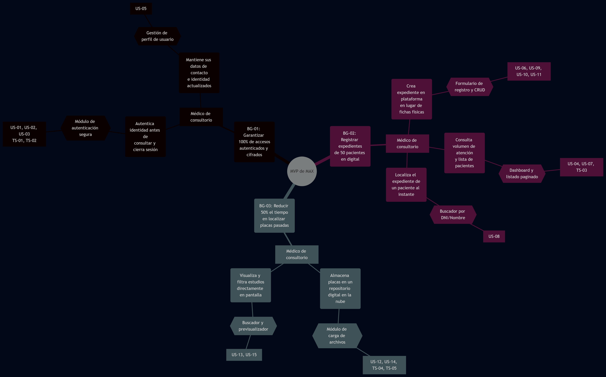

  
   
  <h3>Universidad Peruana de Ciencias Aplicadas</h3>
  <h4>Facultad de Ingeniería</h4>
  <h4>Carrera de Ingeniería de Software</h4>
   
  <h4>Ciclo 2026-20</h4>
   
  <h4>1ASI0732 - Diseño de Experimentos de Ingeniería de Software</h4>
  <h4>NRC: 2620</h4>
  <h4>Profesor: Julio Manuel Noriega Melendez</h4>
   
  <h2>Informe de Trabajo Final</h2>
   
  <h3>Startup: [Nuevo Nombre de la Startup]</h3>
  <h3>Producto: [Nuevo Nombre del Producto]</h3>
   
  <h4>Integrantes:</h4>
  <ul style="list-style-type: none; padding: 0;">
    <li>[Código 1] - [Apellidos, Nombres 1]</li>
    <li>[Código 2] - [Apellidos, Nombres 2]</li>
    <li>[Código 3] - [Apellidos, Nombres 3]</li>
    <li>[Código 4] - [Apellidos, Nombres 4]</li>
  </ul>
   
  <h4>Septiembre, 2026</h4>

---

## Registro de Versiones del Informe

| Versión | Fecha | Autor | Descripción de modificación |
|---------|-------|-------|-----------------------------|
| 1.0     | [Fecha] | [Autor] | Versión inicial del documento (Estructura base) |

---

## Project Report Collaboration Insights

URL del repositorio: `[URL del Repositorio de GitHub para el Informe]`

*(En esta sección se explicará cómo se han desarrollado las actividades de elaboración del informe y se presentarán capturas de los analíticos de colaboración y commits en GitHub).*

---

## Contenido

- [Registro de Versiones del Informe](#registro-de-versiones-del-informe)
- [Project Report Collaboration Insights](#project-report-collaboration-insights)
- [Contenido](#contenido)
- [Student Outcome](#student-outcome)
- [Capítulo I: Introducción](#capítulo-i-introducción)
  - [1.1. Startup Profile](#11-startup-profile)
    - [1.1.1. Descripción de la Startup](#111-descripción-de-la-startup)
    - [1.1.2. Perfiles de integrantes del equipo](#112-perfiles-de-integrantes-del-equipo)
  - [1.2. Solution Profile](#12-solution-profile)
    - [1.2.1 Antecedentes y problemática](#121-antecedentes-y-problemática)
    - [1.2.2 Lean UX Process](#122-lean-ux-process)
      - [1.2.2.1. Lean UX Problem Statements](#1221-lean-ux-problem-statements)
      - [1.2.2.2. Lean UX Assumptions](#1222-lean-ux-assumptions)
      - [1.2.2.3. Lean UX Hypothesis Statements](#1223-lean-ux-hypothesis-statements)
      - [1.2.2.4. Lean UX Canvas](#1224-lean-ux-canvas)
  - [1.3. Segmentos objetivo](#13-segmentos-objetivo)
- [Capítulo II: Requirements Elicitation \& Analysis](#capítulo-ii-requirements-elicitation--analysis)
  - [2.1. Competidores](#21-competidores)
    - [2.1.1. Análisis competitivo](#211-análisis-competitivo)
    - [2.1.2. Estrategias y tácticas frente a competidores](#212-estrategias-y-tácticas-frente-a-competidores)
  - [2.2. Entrevistas](#22-entrevistas)
    - [2.2.1. Diseño de entrevistas](#221-diseño-de-entrevistas)
    - [2.2.2. Registro de entrevistas](#222-registro-de-entrevistas)
    - [2.2.3. Análisis de entrevistas](#223-análisis-de-entrevistas)
  - [2.3. Needfinding](#23-needfinding)
    - [2.3.1. User Personas](#231-user-personas)
    - [2.3.2. User Task Matrix](#232-user-task-matrix)
    - [2.3.3. User Journey Mapping](#233-user-journey-mapping)
    - [2.3.4. Empathy Mapping](#234-empathy-mapping)
    - [2.3.5. As-Is Scenario Mapping](#235-as-is-scenario-mapping)
  - [2.4. Ubiquitous Language](#24-ubiquitous-language)
- [Capítulo III: Requirements Specification](#capítulo-iii-requirements-specification)
  - [3.1. To-Be Scenario Mapping](#31-to-be-scenario-mapping)
  - [3.2. User Stories](#32-user-stories)
    - [Cuadro de Epics, User Stories y Technical Stories](#cuadro-de-epics-user-stories-y-technical-stories)
- [EP-01: Gestión de Identidad y Acceso](#ep-01-gestión-de-identidad-y-acceso)
- [EP-02: Gestión de Pacientes](#ep-02-gestión-de-pacientes)
- [EP-03: Gestión de Placas y Estudios](#ep-03-gestión-de-placas-y-estudios)
  - [3.3. Product Backlog](#33-product-backlog)
    - [Distribución por entrega](#distribución-por-entrega)
    - [Distribución por Epic](#distribución-por-epic)
    - [Consideraciones sobre el orden](#consideraciones-sobre-el-orden)
  - [3.4. Impact Mapping](#34-impact-mapping)
    - [Business Goals SMART](#business-goals-smart)
    - [Actores considerados](#actores-considerados)
    - [Mapa de impacto](#mapa-de-impacto)
    - [Conclusión del Impact Mapping](#conclusión-del-impact-mapping)
- [Capítulo IV: Product Design](#capítulo-iv-product-design)
  - [4.1. Style Guidelines](#41-style-guidelines)
    - [4.1.1. General Style Guidelines](#411-general-style-guidelines)
    - [4.1.2. Web Style Guidelines](#412-web-style-guidelines)
    - [4.1.3. Mobile Style Guidelines](#413-mobile-style-guidelines)
      - [4.1.3.1. IOS Mobile Style Guidelines](#4131-ios-mobile-style-guidelines)
      - [4.1.3.2. Android Mobile Style Guidelines](#4132-android-mobile-style-guidelines)
  - [4.2. Information Architecture](#42-information-architecture)
    - [4.2.1. Organization Systems](#421-organization-systems)
    - [4.2.2. Labeling Systems](#422-labeling-systems)
    - [4.2.3. SEO Tags and Meta Tags](#423-seo-tags-and-meta-tags)
    - [4.2.4. Searching Systems](#424-searching-systems)
    - [4.2.5. Navigation Systems](#425-navigation-systems)
  - [4.3. Landing Page UI Design](#43-landing-page-ui-design)
    - [4.3.1. Landing Page Wireframe](#431-landing-page-wireframe)
    - [4.3.2. Landing Page Mock-up](#432-landing-page-mock-up)
  - [4.4. Mobile Applications UX/UI Design](#44-mobile-applications-uxui-design)
    - [4.4.1. Mobile Applications Wireframes](#441-mobile-applications-wireframes)
    - [4.4.2. Mobile Applications Wireflow Diagrams](#442-mobile-applications-wireflow-diagrams)
    - [4.4.3. Mobile Applications Mock-ups](#443-mobile-applications-mock-ups)
    - [4.4.4. Mobile Applications User Flow Diagrams](#444-mobile-applications-user-flow-diagrams)
  - [4.5. Mobile Applications Prototyping](#45-mobile-applications-prototyping)
    - [4.5.1. Android Mobile Applications Prototyping](#451-android-mobile-applications-prototyping)
    - [4.5.2. IOS Mobile Applications Prototyping](#452-ios-mobile-applications-prototyping)
  - [4.6. Web Applications UX/UI Design](#46-web-applications-uxui-design)
    - [4.6.1. Web Applications Wireframes](#461-web-applications-wireframes)
    - [4.6.2. Web Applications Wireflow Diagrams](#462-web-applications-wireflow-diagrams)
    - [4.6.3. Web Applications Mock-ups](#463-web-applications-mock-ups)
    - [4.6.4. Web Applications User Flow Diagrams](#464-web-applications-user-flow-diagrams)
  - [4.7. Web Applications Prototyping](#47-web-applications-prototyping)
  - [4.8. Domain-Driven Software Architecture](#48-domain-driven-software-architecture)
    - [4.8.1. Software Architecture Context Diagram](#481-software-architecture-context-diagram)
    - [4.8.2. Software Architecture Container Diagrams](#482-software-architecture-container-diagrams)
    - [4.8.3. Software Architecture Components Diagrams](#483-software-architecture-components-diagrams)
  - [4.9. Software Object-Oriented Design](#49-software-object-oriented-design)
    - [4.9.1. Class Diagrams](#491-class-diagrams)
    - [4.9.2. Class Dictionary](#492-class-dictionary)
  - [4.10. Database Design](#410-database-design)
    - [4.10.1. Relational/Non-Relational Database Diagrams](#4101-relationalnon-relational-database-diagrams)
- [Capítulo V: Product Implementation, Validation \& Deployment](#capítulo-v-product-implementation-validation--deployment)
  - [5.1. Software Configuration Management](#51-software-configuration-management)
    - [5.1.1. Software Development Environment Configuration](#511-software-development-environment-configuration)
    - [5.1.2. Source Code Management](#512-source-code-management)
    - [5.1.3. Source Code Style Guide \& Conventions](#513-source-code-style-guide--conventions)
    - [5.1.4. Software Deployment Configuration](#514-software-deployment-configuration)
  - [5.2. Product implementation \& deployment](#52-product-implementation--deployment)
    - [5.2.1. Sprint 1](#521-sprint-1)
      - [5.2.1.1. Sprint Planning 1](#5211-sprint-planning-1)
      - [5.2.1.2. Aspect Leaders and Collaborators](#5212-aspect-leaders-and-collaborators)
      - [5.2.1.3. Sprint Backlog 1](#5213-sprint-backlog-1)
      - [5.2.1.4. Development Evidence for Sprint Review](#5214-development-evidence-for-sprint-review)
      - [5.2.1.5. Execution Evidence for Sprint Review](#5215-execution-evidence-for-sprint-review)
      - [5.2.1.6. Services Documentation Evidence for Sprint Review](#5216-services-documentation-evidence-for-sprint-review)
      - [5.2.1.7. Software Deployment Evidence for Sprint Review](#5217-software-deployment-evidence-for-sprint-review)
      - [5.2.1.8. Team Collaboration Insights during Sprint](#5218-team-collaboration-insights-during-sprint)
    - [5.2.2. Implemented Landing Page Evidence](#522-implemented-landing-page-evidence)
    - [5.2.3. Implemented Frontend-Web Application Evidence](#523-implemented-frontend-web-application-evidence)
    - [5.2.4. Implemented Native-Mobile Application Evidence](#524-implemented-native-mobile-application-evidence)
    - [5.2.5. Implemented RESTful API and/or Serverless Backend Evidence](#525-implemented-restful-api-andor-serverless-backend-evidence)
    - [5.2.6. RESTful API Documentation](#526-restful-api-documentation)
    - [5.2.7. Team Collaboration Insights](#527-team-collaboration-insights)
  - [5.3. Video About-the-Product](#53-video-about-the-product)
- [Conclusiones](#conclusiones)
  - [Conclusiones y recomendaciones](#conclusiones-y-recomendaciones)
  - [Video About-the-Team](#video-about-the-team)
- [Bibliografía](#bibliografía)
- [Anexos](#anexos)
  - [Anexo A. Videos de Exposiciones](#anexo-a-videos-de-exposiciones)

---

## Student Outcome
**ABET - EAC - Student Outcome 3**
**Criterio:** Capacidad de comunicarse efectivamente con un rango de audiencias.

El curso contribuye al cumplimiento del Student Outcome ABET. En el siguiente cuadro se describe las acciones realizadas y enunciados de conclusiones por parte del grupo, que permiten sustentar el haber alcanzado el logro.

| Criterio específico | Acciones realizadas | Conclusiones |
|---------------------|---------------------|--------------|
| Comunica oralmente con efectividad a diferentes rangos de audiencia. | **[Apellidos, Nombres 1]** AV1: [Acción 1] AV2: [Acción 2] | *(Conclusión grupal sobre la mejora en comunicación oral y medios audiovisuales)* |
| Comunica por escrito con efectividad a diferentes rangos de audiencia. | **[Apellidos, Nombres 1]** AV1: [Acción 1] AV2: [Acción 2] | *(Conclusión grupal sobre redacción técnica, calidad de entregables e idioma)* |

---

## Capítulo I: Introducción
### 1.1. Startup Profile
#### 1.1.1. Descripción de la Startup
#### 1.1.2. Perfiles de integrantes del equipo
### 1.2. Solution Profile
#### 1.2.1 Antecedentes y problemática
#### 1.2.2 Lean UX Process
##### 1.2.2.1. Lean UX Problem Statements
##### 1.2.2.2. Lean UX Assumptions
##### 1.2.2.3. Lean UX Hypothesis Statements
##### 1.2.2.4. Lean UX Canvas
### 1.3. Segmentos objetivo

---

## Capítulo II: Requirements Elicitation & Analysis
### 2.1. Competidores
#### 2.1.1. Análisis competitivo
#### 2.1.2. Estrategias y tácticas frente a competidores
### 2.2. Entrevistas
#### 2.2.1. Diseño de entrevistas
#### 2.2.2. Registro de entrevistas
#### 2.2.3. Análisis de entrevistas
### 2.3. Needfinding
#### 2.3.1. User Personas
#### 2.3.2. User Task Matrix
#### 2.3.3. User Journey Mapping
#### 2.3.4. Empathy Mapping
#### 2.3.5. As-Is Scenario Mapping
### 2.4. Ubiquitous Language

---

## Capítulo III: Requirements Specification
### 3.1. To-Be Scenario Mapping
### 3.2. User Stories
Esta sección presenta el conjunto de Epics, User Stories y Technical Stories definidos para MAX. Su elaboración parte de la evidencia recogida en el capítulo anterior: las tareas identificadas en la User Task Matrix, los puntos de fricción de los User Journey Maps, los problemas y oportunidades del Event Storming y el vocabulario fijado en el Ubiquitous Language.

Las User Stories expresan necesidades funcionales desde la perspectiva de los usuarios finales, es decir, los médicos de consultorio y el personal de salud. Las Technical Stories expresan las necesidades técnicas que sostienen esas funcionalidades, principalmente la seguridad de la plataforma, los recursos del RESTful API y la gestión del almacenamiento de archivos.

Los criterios de aceptación se redactan en formato Gherkin, con la estructura Given – When – Then. Se mantienen en tiempo presente y tercera persona, se evita referirse a detalles específicos de la interfaz gráfica y cada condición se formula de manera comprobable. Los Epics no incluyen criterios de aceptación, ya que funcionan como agrupadores: la verificación se realiza sobre las historias que contienen.

| Epic ID | Nombre del Epic | Alcance |
| :--- | :--- | :--- |
| **EP-01** | Gestión de Identidad y Acceso | Autenticación de usuarios, registro de nuevas cuentas médicas, cierre de sesión seguro y administración del perfil básico del profesional. |
| **EP-02** | Gestión de Pacientes | Registro, visualización estructurada, edición, búsqueda y eliminación lógica de la información personal y médica de los pacientes. |
| **EP-03** | Gestión de Placas y Estudios | Carga, almacenamiento, filtrado, visualización y organización de archivos médicos adjuntos (radiografías y documentos PDF) vinculados a cada paciente. |
#### Cuadro de Epics, User Stories y Technical Stories

## EP-01: Gestión de Identidad y Acceso
| Epic / Story ID | Título | Descripción | Criterios de Aceptación | Relacionado con (Epic ID) |
|---|---|---|---|---|
| **EP-01** | **Gestión de Identidad y Acceso** | Como médico, quiero iniciar sesión, registrar mi cuenta y administrar mi perfil para acceder de forma segura a la plataforma MAX. | — | — |
| **US-01** | Iniciar sesión en la plataforma | Como médico, quiero iniciar sesión con mi correo y contraseña para acceder a mi panel clínico. | **Given** que el médico ingresa sus credenciales en el cuadro "Iniciar sesión", **When** hace clic en el botón "Ingresar", **Then** el sistema lo redirige al panel de Inicio (Dashboard).    **Given** que ingresa una contraseña incorrecta, **When** intenta iniciar sesión, **Then** el sistema no permite el acceso. | EP-01 |
| **US-02** | Crear una nueva cuenta médica | Como profesional, quiero registrar una cuenta ingresando mis datos en el formulario interno para utilizar MAX. | **Given** que el usuario completa Nombres, Apellidos, Correo y confirma su contraseña, **When** hace clic en "Registrarme", **Then** el sistema crea la cuenta médica. | EP-01 |
| **US-03** | Cerrar sesión de forma segura | Como médico, quiero cerrar mi sesión desde mi perfil para proteger los datos de mi consultorio. | **Given** que el médico se encuentra en la vista "Perfil del Médico", **When** hace clic en el botón rojo "Cerrar sesión", **Then** el sistema lo redirige al Login. | EP-01 |
| **US-04** | Visualizar resumen en Dashboard | Como médico, quiero ver los indicadores de mi consultorio al ingresar para tener un control rápido. | **Given** que el médico accede a "Inicio", **When** la vista carga, **Then** el sistema muestra las tarjetas de "Número de pacientes" (activos/total) y "Últimos estudios subidos". | EP-01 |
| **US-05** | Editar perfil básico | Como médico, quiero actualizar mis datos básicos para mantener mi información al día. | **Given** que el médico modifica su Nombre, Apellido o Email en la tarjeta "Mi perfil", **When** hace clic en "Guardar cambios", **Then** el sistema actualiza su información. | EP-01 |
| **TS-01** | Autenticación y seguridad JWT | Como desarrollador, quiero implementar seguridad basada en JSON Web Tokens (JWT) para proteger las rutas de la aplicación. | **Given** que el frontend solicita cargar el listado de pacientes, **When** envía un token JWT válido, **Then** el servidor retorna HTTP 200 y los datos. | EP-01 |
| **TS-02** | Cifrado de contraseñas | Como desarrollador, quiero asegurar que las contraseñas se guarden encriptadas mediante bcrypt. | **Given** que un nuevo usuario se registra, **When** el backend procesa la petición, **Then** almacena únicamente el hash de la contraseña en la base de datos. | EP-01 |

## EP-02: Gestión de Pacientes

| Epic / Story ID | Título | Descripción | Criterios de Aceptación | Relacionado con (Epic ID) |
|---|---|---|---|---|
| **EP-02** | **Gestión de Pacientes** | Como médico, quiero registrar, visualizar y administrar la información de mis pacientes para mantener un control organizado de sus expedientes. | — | — |
| **US-06** | Registrar un nuevo paciente | Como médico, quiero registrar a un paciente ingresando su información personal y médica. | **Given** que el médico hace clic en "Registrar Paciente", **When** completa el modal de Información personal y médica (Alergias, Riesgo, Diagnóstico) y guarda, **Then** el sistema crea el expediente. | EP-02 |
| **US-07** | Consultar el listado en tarjetas | Como médico, quiero ver a mis pacientes en tarjetas independientes para visualizar sus datos básicos rápidamente. | **Given** que el médico accede a "Pacientes", **When** la vista carga, **Then** el sistema muestra tarjetas con el Nombre, DNI, Edad y estado (Activo) de cada paciente. | EP-02 |
| **US-08** | Buscar pacientes por DNI o Nombre | Como médico, quiero localizar rápidamente a mis pacientes usando los campos de búsqueda superiores. | **Given** que el médico escribe en los inputs "Buscar por nombre" o "Buscar por DNI", **When** existen coincidencias, **Then** el listado de tarjetas se filtra en tiempo real. | EP-02 |
| **US-09** | Visualizar detalle estático | Como médico, quiero consultar la información de un paciente en una vista de solo lectura para revisar antecedentes. | **Given** que el médico hace clic en el botón "Ver" de una tarjeta, **When** se abre el modal "Detalle del paciente", **Then** el sistema muestra la información inhabilitada para edición. | EP-02 |
| **US-10** | Editar información del paciente | Como médico, quiero actualizar los datos de un paciente usando el mismo formulario de registro. | **Given** que el médico selecciona "Editar", **When** modifica campos en el modal "Editar paciente" y guarda, **Then** la tarjeta del paciente se actualiza en el listado. | EP-02 |
| **US-11** | Eliminar un paciente del sistema | Como médico, quiero eliminar un paciente validando la acción mediante su nombre o documento. | **Given** que el médico selecciona el botón rojo "Eliminar paciente", **When** el modal solicita buscar por Nombre o DNI para confirmar, **Then** el sistema valida la entrada antes de permitir el borrado. | EP-02 |
| **TS-03** | Carga de pacientes | Como desarrollador, quiero implementar paginación en el backend para no saturar la respuesta del servidor en la vista de tarjetas. | **Given** que el médico tiene una gran base de pacientes, **When** solicita la vista "Pacientes", **Then** el backend retorna el listado en bloques optimizados. | EP-02 |

## EP-03: Gestión de Placas y Estudios

| Epic / Story ID | Título | Descripción | Criterios de Aceptación | Relacionado con (Epic ID) |
|---|---|---|---|---|
| **EP-03** | **Gestión de Placas y Estudios** | Como médico, quiero cargar, visualizar y organizar archivos médicos adjuntos (radiografías y documentos PDF) vinculados a cada paciente. | — | — |
| **US-12** | Adjuntar nueva placa o estudio | Como médico, quiero subir archivos médicos indicando el paciente y el tipo de documento. | **Given** que el médico selecciona "Adjuntar estudio", **When** elige al paciente, el tipo de estudio, agrega una descripción y sube el archivo, **Then** el sistema lo registra. | EP-03 |
| **US-13** | Buscar placas por paciente o fecha | Como médico, quiero filtrar el repositorio buscando por DNI/Nombre o por una fecha específica. | **Given** que el médico ingresa datos en los inputs "Buscar por nombre o DNI" o "Fecha (dd/mm/aaaa)", **When** presiona enter, **Then** el sistema filtra las tarjetas de estudios. | EP-03 |
| **US-14** | Identificar formato del estudio (Etiquetas) | Como médico, quiero ver visualmente si un estudio adjunto es una placa radiográfica o un documento PDF. | **Given** que el médico revisa la sección Estudios, **When** visualiza las tarjetas, **Then** el sistema muestra una etiqueta indicadora (ej. "RX" o "PDF médico") en la esquina superior derecha. | EP-03 |
| **US-15** | Visualizar archivo adjunto | Como médico, quiero abrir el archivo del estudio haciendo clic en su botón de acción. | **Given** que un estudio tiene un archivo subido, **When** el médico hace clic en el botón "Ver", **Then** el sistema despliega el documento (PDF o Imagen) para su lectura. | EP-03 |
| **TS-04** | Almacenamiento seguro de archivos | Como desarrollador, quiero implementar un repositorio para guardar los binarios de las placas. | **Given** que el frontend envía un archivo (`.pdf`, `.png`, `.jpg`), **When** el backend lo procesa, **Then** almacena el archivo y guarda su ruta referencial en la base de datos. | EP-03 |
| **TS-05** | Validación de Tipos | Como desarrollador, quiero verificar desde el backend que los archivos subidos sean formatos válidos. | **Given** que un usuario intenta subir un formato no permitido, **When** el backend evalúa el tipo, **Then** rechaza la carga devolviendo un error. | EP-03 |

### 3.3. Product Backlog

El Product Backlog ordena las User Stories y Technical Stories definidas para la primera entrega (MVP) de la plataforma MAX. El orden responde al plan lógico de construcción del producto: primero la infraestructura de seguridad e identidad, luego el núcleo transaccional (expedientes de pacientes) y, finalmente, el soporte para archivos adjuntos.

La estimación se expresa en Story Points siguiendo la sucesión de Fibonacci (1, 2, 3, 5, 8). El valor representa el esfuerzo relativo considerando complejidad técnica, incertidumbre y volumen de trabajo, y no una cantidad exacta de horas.

| Orden | Entrega | Story ID | Título | Descripción | Story Points |
|---:|---|---|---|---|---:|
| 1 | Entrega 1 | TS-01 | Autenticación y seguridad JWT | Como desarrollador, quiero implementar seguridad basada en JSON Web Tokens. | 5 |
| 2 | Entrega 1 | TS-02 | Cifrado de contraseñas | Como desarrollador, quiero asegurar que las contraseñas se guarden encriptadas. | 2 |
| 3 | Entrega 1 | US-02 | Crear una nueva cuenta médica | Como profesional, quiero registrar una cuenta ingresando mis datos personales. | 3 |
| 4 | Entrega 1 | US-01 | Iniciar sesión en la plataforma | Como médico, quiero iniciar sesión con mi correo y contraseña. | 3 |
| 5 | Entrega 1 | US-03 | Cerrar sesión de forma segura | Como médico, quiero cerrar mi sesión para proteger la confidencialidad. | 1 |
| 6 | Entrega 1 | US-05 | Editar perfil básico | Como médico, quiero actualizar mi nombre y correo. | 2 |
| 7 | Entrega 1 | US-06 | Registrar un nuevo paciente | Como médico, quiero registrar a un paciente ingresando su información base. | 5 |
| 8 | Entrega 1 | US-07 | Consultar el listado en tarjetas | Como médico, quiero ver a mis pacientes en tarjetas independientes. | 3 |
| 9 | Entrega 1 | TS-03 | Paginación / Carga diferida | Como desarrollador, quiero implementar paginación en el backend. | 5 |
| 10 | Entrega 1 | US-08 | Buscar pacientes por DNI o Nombre | Como médico, quiero localizar rápidamente a mis pacientes. | 3 |
| 11 | Entrega 1 | US-09 | Visualizar detalle estático | Como médico, quiero consultar la información de un paciente sin habilitar edición. | 2 |
| 12 | Entrega 1 | US-10 | Editar información del paciente | Como médico, quiero actualizar los datos de un paciente. | 3 |
| 13 | Entrega 1 | US-11 | Eliminar un paciente del sistema | Como médico, quiero eliminar un paciente validando la acción mediante su nombre. | 2 |
| 14 | Entrega 1 | US-04 | Visualizar resumen en Dashboard | Como médico, quiero ver los indicadores de mi consultorio al ingresar. | 3 |
| 15 | Entrega 1 | TS-04 | Almacenamiento seguro de archivos | Como desarrollador, quiero implementar un repositorio para los binarios de placas. | 5 |
| 16 | Entrega 1 | TS-05 | Validación de Tipos | Como desarrollador, quiero verificar que los archivos subidos sean formatos válidos. | 2 |
| 17 | Entrega 1 | US-12 | Adjuntar nueva placa o estudio | Como médico, quiero subir archivos médicos indicando el paciente. | 5 |
| 18 | Entrega 1 | US-13 | Buscar placas por paciente o fecha | Como médico, quiero filtrar el repositorio buscando por DNI/Nombre o fecha. | 3 |
| 19 | Entrega 1 | US-14 | Identificar formato del estudio | Como médico, quiero ver visualmente si un estudio adjunto es RX o PDF. | 2 |
| 20 | Entrega 1 | US-15 | Visualizar archivo adjunto | Como médico, quiero abrir el archivo del estudio haciendo clic en su botón. | 3 |

#### Distribución por entrega

| Entrega | Alcance | Historias | Story Points |
|---|---|---:|---:|
| **Entrega 1** | Configuración de seguridad, gestión integral de pacientes y almacenamiento de estudios adjuntos. | 20 | 62 |
| **Total** | — | **20** | **62** |

#### Distribución por Epic

| Epic | Historias | Story Points |
|---|---:|---:|
| EP-01 Gestión de Identidad y Acceso | 7 | 19 |
| EP-02 Gestión de Pacientes | 7 | 23 |
| EP-03 Gestión de Placas y Estudios | 6 | 20 |
| **Total** | **20** | **62** |

#### Consideraciones sobre el orden

La secuencia del Product Backlog para esta primera entrega obedece a las dependencias técnicas y de negocio. Se abordan íntegramente las bases del sistema (TS-01 y TS-02) antes de desarrollar las interfaces de usuario de acceso. 

A continuación, se desarrolla el núcleo transaccional, ya que el sistema requiere usuarios autenticados para asignarles la autoría de los registros. Asimismo, la historia US-04 se relega hacia el final de este bloque debido a que requiere la existencia previa de pacientes para mostrar las métricas correctamente.

Finalmente, la sección de placas y estudios se construye al final del ciclo porque la entidad "Estudio" depende obligatoriamente de la existencia de la entidad "Paciente" para poder ser registrada y vinculada en el repositorio.

### 3.4. Impact Mapping

El Impact Mapping conecta los objetivos de negocio de MAX con los actores capaces de contribuir a ellos, los cambios de comportamiento que se espera provocar, los entregables digitales que los harían posibles y las User Stories que los materializan. Su utilidad radica en verificar que cada historia del backlog persigue un objetivo declarado: si una historia no puede rastrearse hasta un Business Goal, se considera fuera del alcance del MVP.

El artefacto responde a cuatro preguntas encadenadas:

| Elemento | Pregunta que responde |
|---|---|
| **Business Goal** | ¿Qué objetivo de negocio se busca alcanzar? |
| **Actor** | ¿Quién puede contribuir a alcanzarlo? |
| **Impact** | ¿Qué debería hacer ese actor, de forma distinta a hoy, para contribuir? |
| **Deliverable** | ¿Qué se puede construir para provocar ese cambio de comportamiento? |

#### Business Goals SMART

Los objetivos se formulan bajo criterios SMART (específicos, medibles, alcanzables, relevantes y acotados en el tiempo). Los plazos se definen respecto a la liberación de la primera entrega de la plataforma.

| ID | Business Goal |
|---|---|
| **BG-01** | Garantizar que el **100%** de los accesos a la información de los pacientes se realice mediante sesiones autenticadas y cifradas durante la fase de despliegue inicial. |
| **BG-02** | Lograr que los médicos participantes registren digitalmente los expedientes base de al menos **50 pacientes** sin recurrir a formatos de papel durante el primer mes de uso. |
| **BG-03** | Reducir en un **50%** el tiempo que el médico invierte en localizar radiografías y estudios pasados, utilizando la búsqueda digital por DNI, en un plazo de **2 meses**. |

#### Actores considerados

| Actor | Rol respecto de los objetivos |
|---|---|
| **Médico de consultorio** | Es el usuario central de la plataforma. Produce la información (registra pacientes y sube placas) y la consume. Su adopción determina si el sistema contiene datos y si se abandona el uso de expedientes físicos. |

#### Mapa de impacto

| Business Goal | Actor | Impact (cambio de comportamiento esperado) | Deliverable | User Stories |
|---|---|---|---|---|
| **BG-01** | Médico de consultorio | Autentica su identidad antes de consultar cualquier dato y cierra su sesión al terminar. | Módulo de autenticación segura (Login/Logout) y cifrado de credenciales. | US-01, US-02, US-03, TS-01, TS-02 |
| **BG-01** | Médico de consultorio | Mantiene sus datos de contacto e identidad actualizados en el sistema. | Gestión de perfil de usuario. | US-05 |
| **BG-02** | Médico de consultorio | Crea el expediente del paciente directamente en la plataforma en lugar de usar fichas físicas. | Formulario de registro de pacientes y almacenamiento centralizado. | US-06, US-09, US-10, US-11 |
| **BG-02** | Médico de consultorio | Consulta su volumen total de atención y la lista de pacientes desde un entorno digital. | Dashboard de métricas, listado en tarjetas y paginación. | US-04, US-07, TS-03 |
| **BG-02** | Médico de consultorio | Localiza el expediente de un paciente específico de manera instantánea. | Buscador en tiempo real por DNI o Nombre. | US-08 |
| **BG-03** | Médico de consultorio | Almacena las placas y resultados médicos en un repositorio digital seguro en la nube. | Módulo de carga de archivos con validación de formatos. | US-12, US-14, TS-04, TS-05 |
| **BG-03** | Médico de consultorio | Visualiza y filtra los estudios directamente en pantalla sin buscar en carpetas físicas. | Buscador de estudios y previsualizador integrado de PDF/RX. | US-13, US-15 |

#### Conclusión del Impact Mapping

El mapa evidencia que los objetivos del MVP de MAX dependen de una adopción secuencial por parte del médico de consultorio. El primer cambio (BG-01) es un requisito de seguridad habilitante: el médico debe interiorizar el acceso mediante credenciales. El segundo cambio (BG-02) es la carga inicial de datos; sin expedientes de pacientes, el sistema carece de utilidad. El tercer cambio (BG-03) consolida el valor de la herramienta al centralizar los archivos adjuntos. 

Esta dependencia justifica la priorización reflejada en el Product Backlog: la infraestructura de identidad debe construirse primero, seguida por la gestión de expedientes de pacientes, para finalmente habilitar la vinculación de placas y estudios.

## Bibliografía

---

## Anexos
### Anexo A. Videos de Exposiciones
*(Incluir de forma progresiva el título e hipervínculo al video de Exposición en Microsoft Stream para cada entrega AV1, TB1, AV2, TB2).*
