# Capítulo IV: Product Design

En este capítulo se presenta la propuesta de diseño de MAX, una plataforma orientada a facilitar la organización de información relacionada con la atención médica y la interacción entre médicos y pacientes. Se establecen los lineamientos visuales, la arquitectura de información, el diseño de las interfaces y las bases de la arquitectura de software y del modelo de datos.

Las decisiones de diseño toman como referencia las necesidades descritas en los capítulos anteriores. Se busca que los médicos puedan gestionar pacientes y documentación de manera organizada, mientras que los pacientes dispongan de una experiencia que facilite la consulta de la información compartida con ellos.

El diseño prioriza la claridad de la información, la facilidad de navegación, la consistencia entre pantallas y el acceso a las funciones según las responsabilidades de cada usuario.

## 4.1. Style Guidelines

Los lineamientos de estilo de MAX establecerán los criterios visuales y de comunicación que se aplicarán en la landing page y en las aplicaciones web y móvil. Su propósito es mantener una identidad reconocible y una experiencia consistente entre los productos de la plataforma.

Estos lineamientos abarcan la identidad de marca, la tipografía, la paleta de colores, la iconografía, el espaciado y los componentes de interacción. Su aplicación permitirá que los usuarios reconozcan las acciones disponibles y comprendan la información presentada.

> **Imagen pendiente:** Insertar aquí una vista general de la guía de estilos de MAX.

### 4.1.1. General Style Guidelines

La identidad visual de MAX estará orientada a transmitir organización, confianza y claridad. La presentación del producto deberá facilitar la lectura de información y el reconocimiento de las funciones principales.

La selección de colores establecerá una jerarquía entre acciones principales, elementos secundarios y mensajes de estado. Los avisos de éxito, advertencia o error deberán acompañarse de textos o elementos visuales que permitan comprender su significado sin depender únicamente del color.

La tipografía deberá favorecer la lectura de nombres, datos personales, fechas y descripciones de documentos. Se definirá una jerarquía consistente para títulos, subtítulos, contenido, etiquetas y mensajes de ayuda.

La iconografía se utilizará como apoyo para reconocer acciones como buscar, consultar, editar, cargar archivos y cerrar sesión. Cuando un icono pueda generar dudas, se acompañará de una etiqueta textual.

El tono de comunicación será profesional, respetuoso, claro y sereno. Los mensajes explicarán qué ocurrió y, cuando corresponda, qué acción puede realizar el usuario para continuar. Se evitarán expresiones ambiguas y términos técnicos innecesarios.

Los valores específicos de colores, fuentes, tamaños y espaciado se documentarán junto con la identidad visual del sistema.

> **Imágenes pendientes:** Insertar aquí el logotipo, la paleta de colores, las muestras tipográficas, la iconografía y la escala de espaciado de MAX.

### 4.1.2. Web Style Guidelines

La experiencia web de MAX estará orientada principalmente al trabajo del médico. La distribución de la interfaz deberá permitir consultar información, registrar pacientes y gestionar documentos sin perder el contexto de la actividad realizada.

Se mantendrá una estructura consistente para la navegación, los encabezados, los formularios y las acciones principales. Los campos relacionados se agruparán de manera lógica para facilitar el registro y la revisión de información.

Los controles deberán mostrar estados comprensibles durante la carga, el procesamiento y la finalización de una acción. También se contemplarán mensajes para formularios incompletos, búsquedas sin resultados y operaciones que no puedan completarse.

El diseño se adaptará a diferentes tamaños de pantalla. En espacios reducidos, el contenido se reorganizará conservando su jerarquía y manteniendo accesibles las funciones principales.

> **Imágenes pendientes:** Insertar aquí ejemplos de componentes web, botones, formularios, mensajes y distribución adaptable de las interfaces.

### 4.1.3. Mobile Style Guidelines

La propuesta móvil de MAX se orienta a facilitar que el paciente consulte información relacionada con su atención y acceda a la documentación disponible desde su dispositivo.

La interfaz priorizará los contenidos más relevantes para cada tarea y distribuirá la información en bloques fáciles de reconocer. Las acciones deberán ser accesibles mediante controles táctiles claros y formularios que soliciten únicamente los datos necesarios.

Se contemplarán estados de carga, ausencia de documentos, errores de conexión y confirmaciones de las operaciones realizadas. El diseño también deberá facilitar la lectura y evitar que los controles del dispositivo oculten información importante.

La distribución definitiva de las funcionalidades móviles se ajustará al alcance acordado para el producto y a sus historias de usuario.

> **Imágenes pendientes:** Insertar aquí ejemplos de componentes móviles, navegación, controles táctiles y estados de la interfaz.

#### 4.1.3.1. iOS Mobile Style Guidelines

La propuesta para iOS mantendrá la identidad visual de MAX y considerará las convenciones de navegación e interacción de esta plataforma.

Las pantallas deberán ofrecer títulos claros y mecanismos consistentes para regresar, consultar detalles y completar acciones. La presentación de formularios y documentos respetará las áreas disponibles de la pantalla y el comportamiento del teclado.

Se buscará que los cambios de vista permitan comprender la relación entre el contenido de origen y la información consultada, especialmente durante la navegación entre listados y documentos.

> **Imágenes pendientes:** Insertar aquí los componentes y ejemplos de navegación propuestos para la versión iOS de MAX.

#### 4.1.3.2. Android Mobile Style Guidelines

La propuesta para Android mantendrá los mismos criterios de identidad y organización de MAX, considerando los patrones de interacción de la plataforma y los principios de Material Design.

La navegación deberá conservar un comportamiento predecible al avanzar o regresar entre pantallas. Los controles proporcionarán respuesta visual a las interacciones y permitirán reconocer cuándo una operación está siendo procesada.

La distribución de los elementos se adaptará a diferentes dimensiones de dispositivos, conservando la legibilidad y la facilidad de interacción.

> **Imágenes pendientes:** Insertar aquí los componentes y ejemplos de navegación propuestos para la versión Android de MAX.

## 4.2. Information Architecture

La arquitectura de información de MAX organiza los contenidos y las funciones según los objetivos de médicos y pacientes. Su propósito es facilitar que cada usuario encuentre la información necesaria y comprenda qué acciones puede realizar.

La propuesta considera la separación entre la información pública de la landing page y la información disponible dentro de las aplicaciones. En estas últimas, la organización dependerá del rol del usuario y de los permisos asociados a los recursos.

> **Imagen pendiente:** Insertar aquí el mapa general de la arquitectura de información de MAX.

### 4.2.1. Organization Systems

MAX utilizará una organización jerárquica para distribuir sus funciones en secciones y vistas de detalle. En la experiencia del médico, el contenido se agrupará alrededor del resumen general, la gestión de pacientes, los estudios y el perfil profesional.

Se empleará una organización secuencial en actividades que requieran completar pasos, como registrar un paciente o adjuntar un estudio. En estos procesos, se mostrará una relación clara entre la información solicitada y la acción que se realizará.

Los documentos y estudios podrán organizarse cronológicamente para facilitar la consulta de información reciente y la revisión de registros anteriores. También se utilizarán categorías relacionadas con el paciente y el tipo de documento.

La landing page agrupará sus contenidos por temas, como presentación del producto, beneficios, funcionalidades e información de contacto.

> **Imágenes pendientes:** Insertar aquí los esquemas que representen la organización jerárquica, secuencial y cronológica del contenido.

### 4.2.2. Labeling Systems

Las etiquetas de MAX deberán expresar de forma breve y directa el contenido de cada sección y el resultado de las acciones disponibles.

Se mantendrán los mismos términos cuando un concepto aparezca en diferentes pantallas. Por ejemplo, la denominación utilizada para un estudio deberá conservarse en el listado, el formulario de carga y la vista de detalle.

Como base para la propuesta, se consideran las siguientes etiquetas:

| Concepto o acción | Español | Inglés |
|---|---|---|
| Resumen general | Inicio | Dashboard |
| Gestión de pacientes | Pacientes | Patients |
| Consulta de estudios | Estudios | Studies |
| Información del usuario | Mi perfil | My Profile |
| Creación de un paciente | Registrar paciente | Add Patient |
| Incorporación de un estudio | Adjuntar estudio | Upload Study |
| Consulta de información | Ver detalle | View Details |
| Confirmación de modificaciones | Guardar cambios | Save Changes |
| Finalización de la sesión | Cerrar sesión | Sign Out |

Las etiquetas se revisarán junto con las interfaces definitivas. La propuesta considerará inglés como idioma predeterminado y español como alternativa, de acuerdo con el enunciado del proyecto.

> **Imágenes pendientes:** Insertar aquí ejemplos de las etiquetas utilizadas en menús, botones, encabezados y formularios.

### 4.2.3. SEO Tags and Meta Tags

La landing page contará con títulos y metadatos que describan el propósito de MAX y permitan identificar el contenido de sus páginas.

Los valores deberán ser coherentes con las funcionalidades incluidas en el producto. Para la página principal se propone la siguiente base:

| Elemento | Valor propuesto en inglés | Valor propuesto en español |
|---|---|---|
| Title | MAX — Patient and Medical Document Management | MAX — Gestión de pacientes y documentos médicos |
| Description | MAX helps doctors organize patient records and medical documents in one digital platform. | MAX ayuda a los médicos a organizar la información de sus pacientes y sus documentos médicos en una plataforma digital. |
| Keywords | MAX, patient management, medical documents, medical studies | MAX, gestión de pacientes, documentos médicos, estudios médicos |
| Author | MAX Development Team | Equipo de desarrollo de MAX |

Las vistas internas utilizarán títulos que permitan reconocer la sección abierta. Los metadatos públicos no incluirán nombres de pacientes ni información relacionada con sus documentos.

> **Imagen pendiente:** Insertar aquí una captura o representación de los títulos y metadatos definidos para la landing page.

### 4.2.4. Searching Systems

La búsqueda de pacientes permitirá localizar registros mediante el nombre o el DNI, según las historias de usuario definidas para MAX.

En la sección de estudios se contemplará la búsqueda por identificación del paciente y el filtrado por fecha. Los resultados deberán mostrar información suficiente para distinguir los archivos disponibles, incluyendo su relación con el paciente y su tipo.

La interfaz informará cuando no existan coincidencias y permitirá modificar o limpiar los criterios utilizados. El comportamiento definitivo de la búsqueda se mantendrá consistente con lo establecido en los requisitos.

> **Imágenes pendientes:** Insertar aquí las vistas de búsqueda de pacientes y estudios, incluyendo filtros, resultados y estados sin coincidencias.

### 4.2.5. Navigation Systems

La navegación de MAX permitirá acceder a las funciones principales desde una estructura reconocible y consistente.

En la experiencia web del médico se distinguirán los accesos al resumen general, pacientes, estudios y perfil. Desde los listados se podrá continuar hacia las acciones de consulta o gestión correspondientes.

La propuesta móvil organizará sus accesos según las tareas del paciente incluidas en el alcance definitivo. Se mantendrán mecanismos claros para regresar a las vistas anteriores y reconocer la ubicación actual.

La landing page facilitará el recorrido por la información del producto y el acceso a las aplicaciones. Los enlaces y acciones conservarán denominaciones coherentes con sus destinos.

> **Imágenes pendientes:** Insertar aquí los menús y esquemas de navegación de la landing page y de las aplicaciones web y móvil.

## 4.3. Landing Page UI Design

La landing page de MAX presentará el propósito del producto, los usuarios a quienes está dirigido y los beneficios de organizar la información relacionada con la atención médica.

Su contenido explicará las funciones disponibles mediante una jerarquía clara, combinando textos breves, elementos visuales y accesos a las aplicaciones. Se diferenciará la información dirigida al médico de aquella orientada al paciente.

El diseño se desarrollará para navegador de escritorio y móvil.

> **Imagen pendiente:** Insertar aquí una vista general de la propuesta de diseño de la landing page.

### 4.3.1. Landing Page Wireframe

El wireframe de la landing page establecerá la ubicación de la navegación, la presentación principal de MAX, sus beneficios, funcionalidades y acciones de acceso.

Este artefacto permitirá revisar el orden de los contenidos y la visibilidad de las acciones antes de incorporar la identidad visual. También mostrará cómo se reorganizan las secciones en la versión móvil.

> **Imágenes pendientes:** Insertar aquí los wireframes de la landing page para navegador de escritorio y móvil.

### 4.3.2. Landing Page Mock-up

El mockup incorporará los colores, tipografías, imágenes, iconos y componentes definidos para MAX sobre la estructura del wireframe.

Permitirá evaluar la jerarquía visual, la legibilidad y la consistencia de la presentación del producto. Las versiones para escritorio y móvil conservarán el mismo mensaje y facilitarán el acceso a las acciones principales.

> **Imágenes pendientes:** Insertar aquí los mockups de la landing page para navegador de escritorio y móvil.

## 4.4. Mobile Applications UX/UI Design

El diseño de la aplicación móvil desarrollará la experiencia propuesta para el paciente, considerando el acceso a información relacionada con su atención y la consulta de documentos compartidos.

Los flujos de citas, recordatorios e intercambio de documentación se incorporarán conforme se confirme su alcance y se especifiquen las historias de usuario correspondientes.

La propuesta se documentará mediante wireframes, wireflows, mockups y user flows.

> **Imagen pendiente:** Insertar aquí una vista general de las pantallas principales de la propuesta móvil.

### 4.4.1. Mobile Applications Wireframes

Los wireframes móviles representarán la distribución inicial de los contenidos, controles y acciones de cada pantalla.

Se priorizará la identificación de la información que el paciente necesita consultar y la facilidad para acceder a sus detalles. También se contemplarán pantallas o estados para contenidos vacíos, procesos de carga y operaciones que no puedan completarse.

> **Imágenes pendientes:** Insertar aquí los wireframes de las pantallas móviles, incluyendo sus principales estados.

### 4.4.2. Mobile Applications Wireflow Diagrams

Los wireflows mostrarán la secuencia de pantallas necesaria para completar cada objetivo del paciente incluido en el alcance.

Cada recorrido señalará su punto de inicio, las acciones del usuario y los cambios de estado de la interfaz. Cuando una interacción modifique una misma pantalla, se representará el nuevo estado para que el comportamiento resulte comprensible.

> **Imágenes pendientes:** Insertar aquí los wireflow diagrams móviles, indicando el objetivo del usuario correspondiente a cada recorrido.

### 4.4.3. Mobile Applications Mock-ups

Los mockups móviles aplicarán la identidad visual de MAX a las pantallas previamente estructuradas.

Se definirán la apariencia de los controles, la jerarquía del contenido, los mensajes y la presentación de documentos. La propuesta mantendrá consistencia entre pantallas y considerará las particularidades de Android e iOS.

> **Imágenes pendientes:** Insertar aquí los mockups de las pantallas móviles con los colores, tipografías y componentes definitivos.

### 4.4.4. Mobile Applications User Flow Diagrams

Los user flows relacionarán los mockups para representar los recorridos completos del paciente.

Cada flujo incluirá el objetivo que se busca cumplir, las decisiones necesarias y las rutas alternativas relevantes. Se contemplarán situaciones como ausencia de información, cancelación de una acción o imposibilidad de acceder a un documento.

> **Imágenes pendientes:** Insertar aquí los user flow diagrams móviles, incluyendo las rutas exitosas y alternativas.

## 4.5. Mobile Applications Prototyping

Los prototipos móviles permitirán simular la navegación y las interacciones planteadas para MAX antes de su implementación.

La simulación cubrirá los recorridos definidos en los user flows y permitirá revisar la comprensión de los controles, la secuencia de acciones y la respuesta visual del sistema.

Se documentarán los enlaces a los prototipos y las evidencias de demostración de sus principales recorridos.

> **Imagen pendiente:** Insertar aquí una vista general de los prototipos móviles y agregar los enlaces correspondientes.

### 4.5.1. Android Mobile Applications Prototyping

El prototipo para Android permitirá recorrer las pantallas y acciones propuestas para esta plataforma.

Se revisará la continuidad de la navegación, el comportamiento al regresar entre vistas y la facilidad para completar las tareas seleccionadas. Las observaciones obtenidas servirán para ajustar la propuesta antes de desarrollar las interfaces.

> **Imágenes y enlaces pendientes:** Insertar aquí capturas del prototipo Android, el enlace al prototipo interactivo y una captura con el enlace al video de demostración.

### 4.5.2. iOS Mobile Applications Prototyping

El prototipo para iOS permitirá evaluar los mismos objetivos funcionales considerando la navegación y presentación definidas para esta plataforma.

Se revisará la claridad de las transiciones, el acceso a las acciones y la visualización de información. La experiencia conservará la identidad de MAX y la coherencia con el alcance funcional del producto.

> **Imágenes y enlaces pendientes:** Insertar aquí capturas del prototipo iOS, el enlace al prototipo interactivo y una captura con el enlace al video de demostración.

## 4.6. Web Applications UX/UI Design

La aplicación web de MAX estará orientada a facilitar el trabajo del médico mediante la gestión de pacientes y estudios.

La propuesta incluirá los flujos de acceso a la plataforma, consulta del resumen general, administración del perfil, registro y búsqueda de pacientes, revisión de sus datos y gestión de archivos médicos.

El diseño buscará reducir confusiones durante el registro y la consulta de información, manteniendo visible el contexto del paciente o documento sobre el cual se trabaja.

> **Imagen pendiente:** Insertar aquí una vista general de las pantallas principales de la aplicación web.

### 4.6.1. Web Applications Wireframes

Los wireframes web establecerán la estructura de las vistas de acceso, inicio, pacientes, estudios y perfil.

En la gestión de pacientes se representarán los campos y controles necesarios para registrar, consultar y actualizar información. En la gestión de estudios se organizarán los elementos destinados a seleccionar al paciente, adjuntar archivos, buscar registros y abrir documentos.

La distribución se revisará para su uso en diferentes tamaños de pantalla.

> **Imágenes pendientes:** Insertar aquí los wireframes de la aplicación web y sus adaptaciones para pantallas reducidas.

### 4.6.2. Web Applications Wireflow Diagrams

Los wireflows web mostrarán los pasos necesarios para completar los principales objetivos del médico.

Se documentarán recorridos como registrar un paciente, localizar su información, actualizar sus datos, adjuntar un estudio y consultar un archivo existente. Cada recorrido mostrará las pantallas involucradas y los cambios que producen las acciones del usuario.

> **Imágenes pendientes:** Insertar aquí los wireflow diagrams web, indicando el objetivo del médico correspondiente a cada recorrido.

### 4.6.3. Web Applications Mock-ups

Los mockups web incorporarán los lineamientos visuales de MAX a la estructura de las pantallas.

Se representará la apariencia de los listados, tarjetas, formularios, controles de búsqueda y mensajes. También se diferenciarán visualmente las acciones de consulta, modificación y eliminación para facilitar su reconocimiento.

Los diseños mantendrán consistencia entre las secciones de pacientes, estudios y perfil.

> **Imágenes pendientes:** Insertar aquí los mockups de las vistas de acceso, inicio, pacientes, estudios y perfil.

### 4.6.4. Web Applications User Flow Diagrams

Los user flows web describirán los recorridos completos mediante los mockups de las pantallas.

Además de las rutas exitosas, se contemplarán situaciones como credenciales incorrectas, búsquedas sin coincidencias, datos incompletos y archivos con formatos no permitidos.

Los flujos deberán corresponder con las historias de usuario y permitir identificar el resultado esperado de cada interacción.

> **Imágenes pendientes:** Insertar aquí los user flow diagrams web, incluyendo decisiones, rutas exitosas y alternativas.

## 4.7. Web Applications Prototyping

El prototipo web integrará las pantallas diseñadas para simular los principales procesos del médico dentro de MAX.

Permitirá recorrer las funciones de acceso, gestión de pacientes, consulta de estudios y actualización del perfil. También permitirá revisar la relación entre la navegación general y las acciones disponibles dentro de cada sección.

Se prepararán experiencias para navegador de escritorio y móvil. La documentación incluirá el enlace al prototipo, una descripción de los recorridos cubiertos y la evidencia en video de su funcionamiento.

> **Imágenes y enlaces pendientes:** Insertar aquí capturas de los prototipos web para escritorio y móvil, los enlaces interactivos y una captura con el enlace al video de demostración.

## 4.8. Domain-Driven Software Architecture

La arquitectura de software de MAX organiza las responsabilidades de la plataforma tomando como referencia las funcionalidades de identidad y acceso, gestión de pacientes y administración de estudios y documentos médicos.

La documentación utiliza diferentes niveles de representación para explicar el sistema: contexto, contenedores y componentes. Estas vistas permiten comprender la relación de MAX con sus usuarios, la distribución de responsabilidades entre sus aplicaciones y la organización interna de los elementos que implementan sus funcionalidades.

Asimismo, se incluyen diagramas complementarios de interacción y despliegue para facilitar la comprensión de los recorridos de información y de la organización de la solución. Las representaciones relacionadas con el futuro portal del paciente se consideran parte de la evolución propuesta del producto.

### 4.8.1. Software Architecture Context Diagram

El diagrama de contexto presenta a MAX como un sistema dentro de su entorno de interacción. Su propósito es identificar los actores y sistemas externos relacionados con la plataforma, así como las relaciones que permiten comprender su alcance general.

Esta vista permite comunicar la finalidad de MAX sin profundizar en los detalles internos de implementación. A partir de ella se establece una referencia común para interpretar los diagramas de contenedores y componentes desarrollados en las siguientes secciones.

  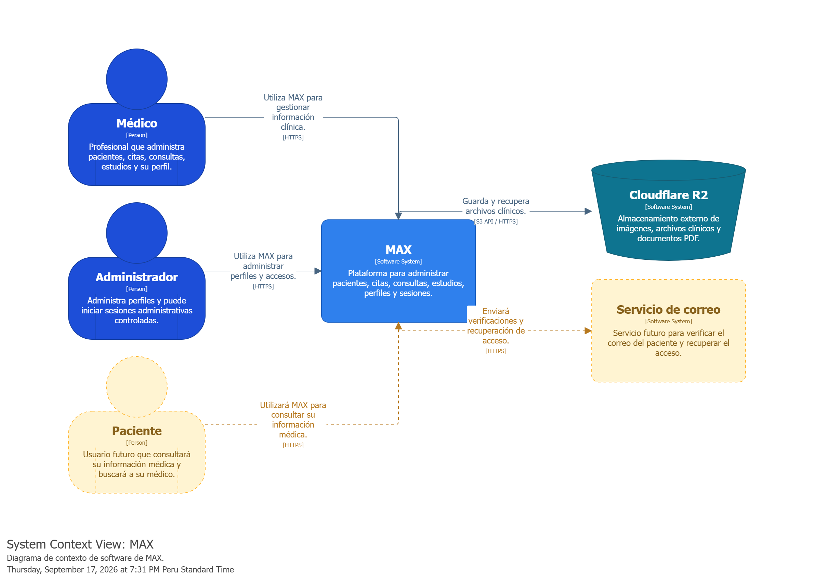
  
<em>Diagrama de contexto del sistema MAX.</em>

### 4.8.2. Software Architecture Container Diagrams

El diagrama de contenedores presenta la distribución de responsabilidades entre las aplicaciones, servicios y mecanismos de almacenamiento que conforman MAX.

Esta vista permite comprender cómo se relacionan las interfaces utilizadas por los usuarios con los servicios que procesan las operaciones y los recursos que almacenan la información. También facilita identificar los límites de cada elemento y las comunicaciones necesarias para completar los procesos de la plataforma.

  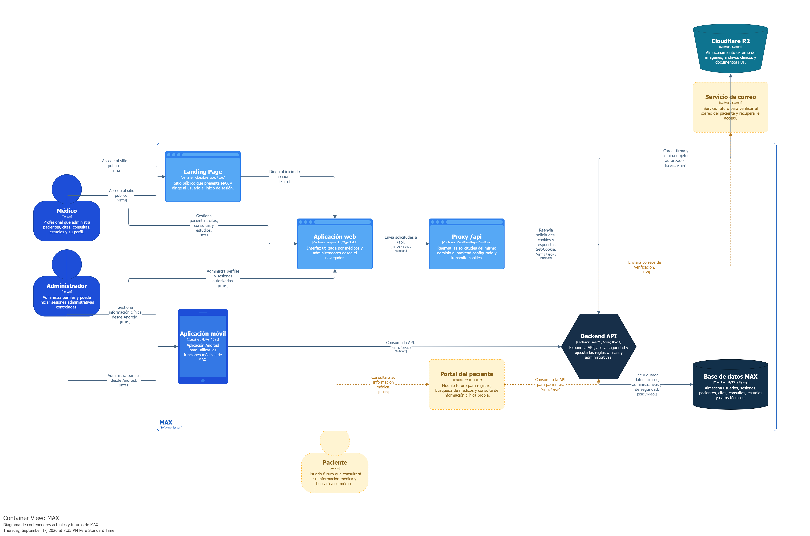
  
<em>Diagrama de contenedores de MAX.</em>

#### Vista complementaria de despliegue

Como complemento de la estructura de contenedores, se incluye una vista de despliegue. Su propósito es documentar la distribución de los elementos de software sobre el entorno de ejecución y facilitar la comprensión de las relaciones entre la aplicación y su infraestructura.

Esta representación complementa el análisis de la arquitectura al mostrar una perspectiva diferente de la organización lógica del sistema.

  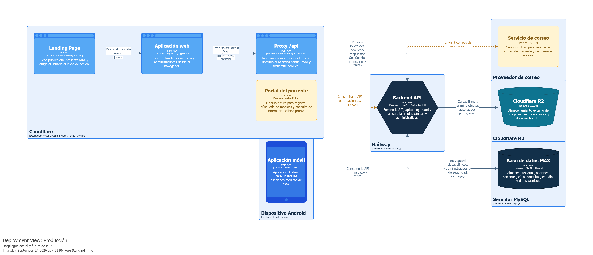
  
<em>Vista de despliegue de MAX.</em>

#### Interacción de la aplicación web

El flujo de la aplicación web complementa la vista de contenedores al representar el recorrido de las interacciones correspondientes a esta aplicación.

Su lectura permite relacionar las acciones iniciadas desde la experiencia web con los elementos de la arquitectura que intervienen en su procesamiento.

  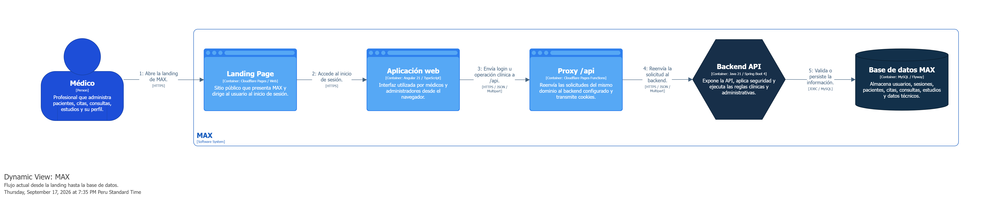
  
<em>Flujo de interacción de la aplicación web.</em>

#### Interacción de la aplicación móvil

El flujo móvil presenta una perspectiva complementaria de las interacciones correspondientes a la aplicación móvil de MAX.

Esta representación permite analizar el recorrido de las solicitudes y respuestas entre la experiencia móvil y los elementos de la plataforma, manteniendo coherencia con las responsabilidades definidas en la arquitectura.

  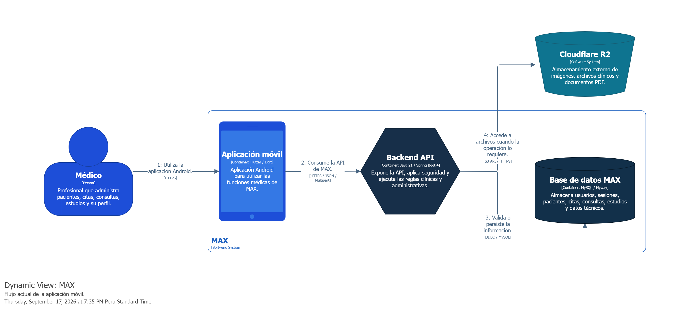
  
<em>Flujo de interacción de la aplicación móvil.</em>

#### Interacción propuesta para el futuro portal del paciente

El siguiente flujo documenta la propuesta de interacción del paciente como parte de la evolución de MAX. Su finalidad es representar cómo podría integrarse esta experiencia con la plataforma y servir como referencia para la especificación de sus funcionalidades.

La incorporación de este flujo al producto dependerá de la definición de sus historias de usuario y de la confirmación del alcance correspondiente.

  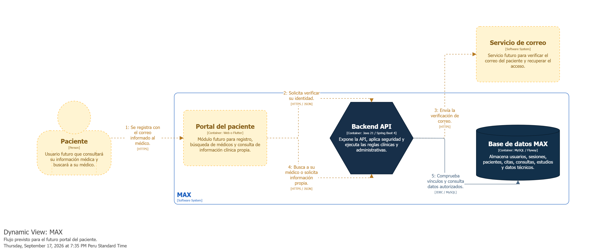
  
<em>Flujo propuesto para la futura experiencia del paciente.</em>

### 4.8.3. Software Architecture Components Diagrams

Los diagramas de componentes presentan la organización interna de los contenedores seleccionados de MAX. Su propósito es identificar las responsabilidades de sus elementos y explicar cómo colaboran para atender las operaciones de la plataforma.

Estas vistas permiten relacionar las funcionalidades del producto con su estructura de software y facilitan la comprensión de las dependencias entre componentes.

#### Componentes del backend

La vista de componentes del backend permite examinar la organización de los elementos que participan en el procesamiento de las solicitudes de MAX.

El diagrama sirve como referencia para comprender la distribución de responsabilidades y las relaciones entre los componentes que soportan las funcionalidades de la plataforma.

  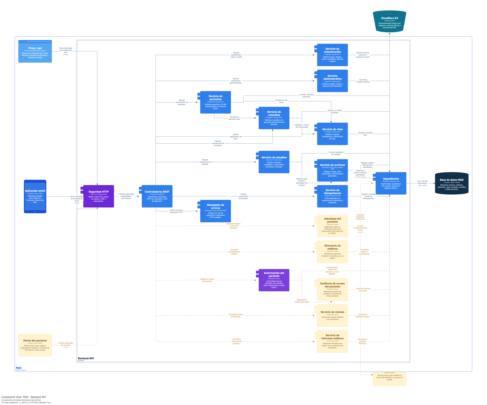
  
<em>Componentes del backend de MAX.</em>

#### Componentes de la aplicación web

La vista de componentes de la aplicación web presenta la organización interna de esta experiencia y las relaciones entre sus elementos.

Su propósito es facilitar la comprensión de cómo se distribuyen las responsabilidades de presentación e interacción, así como su relación con los servicios utilizados por la aplicación.

  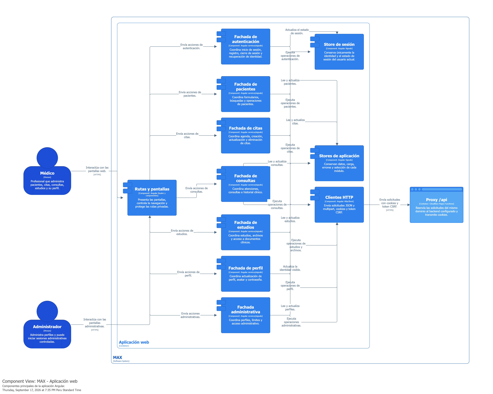
  
<em>Componentes de la aplicación web de MAX.</em>

#### Componentes de la aplicación móvil

La vista de componentes móviles documenta la organización interna de la aplicación móvil de MAX.

Esta representación permite reconocer los elementos que colaboran en sus funcionalidades y comprender sus relaciones con los servicios de la plataforma.

  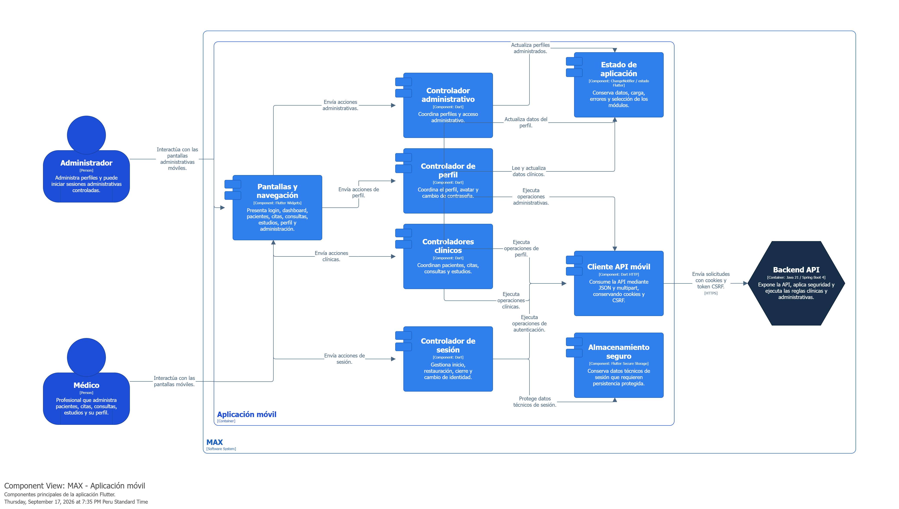
  
<em>Componentes de la aplicación móvil de MAX.</em>

#### Componentes propuestos para el portal del paciente

El diagrama del portal del paciente presenta una propuesta de organización para esta experiencia dentro de MAX.

Esta vista se utiliza como referencia de diseño para la evolución del producto. Su desarrollo deberá mantener coherencia con las funcionalidades y los permisos que se definan para el paciente.

  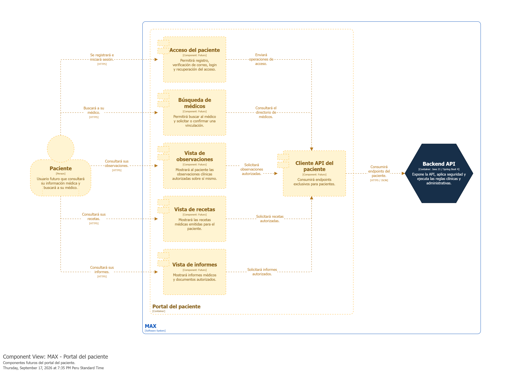
  
<em>Componentes propuestos para el portal del paciente.</em>

#### Flujo de componentes para el inicio de sesión web

El flujo de inicio de sesión complementa la vista estática de componentes al mostrar las interacciones relacionadas con el acceso del usuario a la aplicación web.

Esta representación permite seguir la colaboración entre los elementos que intervienen en el proceso y relacionarla con las funcionalidades de identidad y acceso de MAX.

  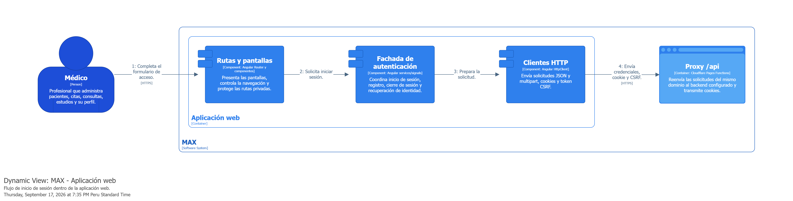
  
<em>Flujo de componentes para el inicio de sesión web.</em>

#### Flujo de procesamiento de solicitudes del backend

El siguiente diagrama presenta el recorrido de una solicitud dentro del backend.

Su propósito es facilitar la comprensión del orden de las interacciones y de la participación de los componentes involucrados en el procesamiento de una operación.

  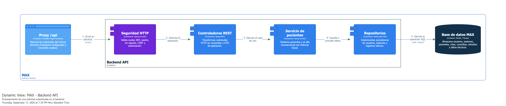
  
<em>Flujo de procesamiento de solicitudes del backend.</em>

#### Flujo de archivos de estudios médicos

El flujo de archivos de estudios complementa la documentación de la gestión de documentos médicos en MAX.

Esta representación permite analizar las interacciones asociadas al tratamiento de un archivo y su vinculación con los registros del sistema, conforme a las operaciones definidas para la gestión de estudios.

  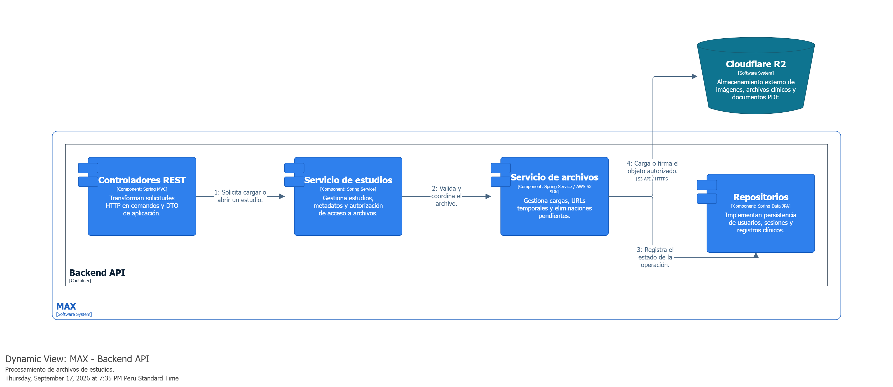
  
<em>Flujo de archivos de estudios médicos.</em>

#### Síntesis de los flujos web y móvil

El siguiente esquema se incluye como una representación complementaria de los flujos web y móvil.

Su propósito es facilitar una lectura conjunta de estas experiencias y apoyar la explicación de su relación con la arquitectura de MAX.

  
  
<em>Esquema de los flujos web y móvil.</em>

#### Síntesis del flujo del paciente

El esquema del paciente complementa la propuesta de esta experiencia dentro de MAX.

Se utiliza como apoyo para explicar el recorrido planteado y relacionarlo con los elementos que deberán participar en su implementación, una vez confirmado su alcance.

  
  
<em>Esquema del flujo propuesto para el paciente.</em>

## 4.9. Software Object-Oriented Design

El diseño orientado a objetos de MAX organiza los conceptos y responsabilidades del sistema mediante clases y relaciones.

Su propósito es mantener una estructura comprensible que permita vincular los requisitos del producto con los elementos que participan en su implementación. El modelo toma como referencia las funcionalidades de identidad y acceso, gestión de pacientes y administración de estudios y documentos.

La representación por objetos y capas permite explicar la distribución de responsabilidades y sirve como base para interpretar el diagrama de clases y su diccionario.

  
  
<em>Diseño orientado a objetos y organización por capas de MAX.</em>

### 4.9.1. Class Diagrams

El diagrama de clases documenta la estructura del modelo de MAX y las relaciones entre sus elementos.

Esta representación permite identificar las clases que participan en las funcionalidades del sistema y comprender sus asociaciones. Su interpretación deberá mantenerse alineada con las reglas de negocio y con los conceptos definidos en el lenguaje del dominio.

El diagrama constituye una referencia para la implementación y para la revisión de la coherencia entre los requisitos, la arquitectura y el modelo de datos.

  
  
<em>Diagrama de clases de MAX.</em>

### 4.9.2. Class Dictionary

El diccionario de clases complementa el diagrama mediante la descripción de los elementos del modelo.

Su propósito es establecer un significado común para cada clase y facilitar que los integrantes del equipo comprendan su responsabilidad dentro de MAX. Las denominaciones utilizadas deberán coincidir con las presentadas en los diagramas y conservar consistencia con la documentación del dominio.

Este recurso facilita la lectura del modelo y reduce ambigüedades durante la implementación y el mantenimiento del sistema.

  
  
<em>Diccionario de clases de MAX.</em>

## 4.10. Database Design

El diseño de la base de datos de MAX organiza la información necesaria para soportar las funcionalidades de la plataforma.

El modelo considera los datos relacionados con el acceso de los usuarios, la gestión de pacientes y la administración de estudios y documentos médicos. Su propósito es mantener relaciones claras entre los registros y facilitar las operaciones de consulta y actualización requeridas por el producto.

La estructura de persistencia debe conservar coherencia con las reglas del negocio y con el diseño orientado a objetos. El diagrama relacional se presenta en la siguiente sección como referencia de esta organización.

### 4.10.1. Relational/Non-Relational Database Diagram

Para MAX se presenta un diagrama relacional que permite visualizar la organización de los datos y las relaciones entre las entidades del sistema.

Esta representación sirve como referencia para comprender la estructura de almacenamiento y revisar la correspondencia entre los registros de usuarios, pacientes y estudios. También permite analizar las relaciones necesarias para mantener vinculada la información utilizada por las funcionalidades del producto.

El modelo deberá conservar consistencia con la implementación de la base de datos y actualizarse cuando se incorporen cambios en el alcance o en las reglas de negocio.

  
  
<em>Diagrama relacional de la base de datos de MAX.</em>

