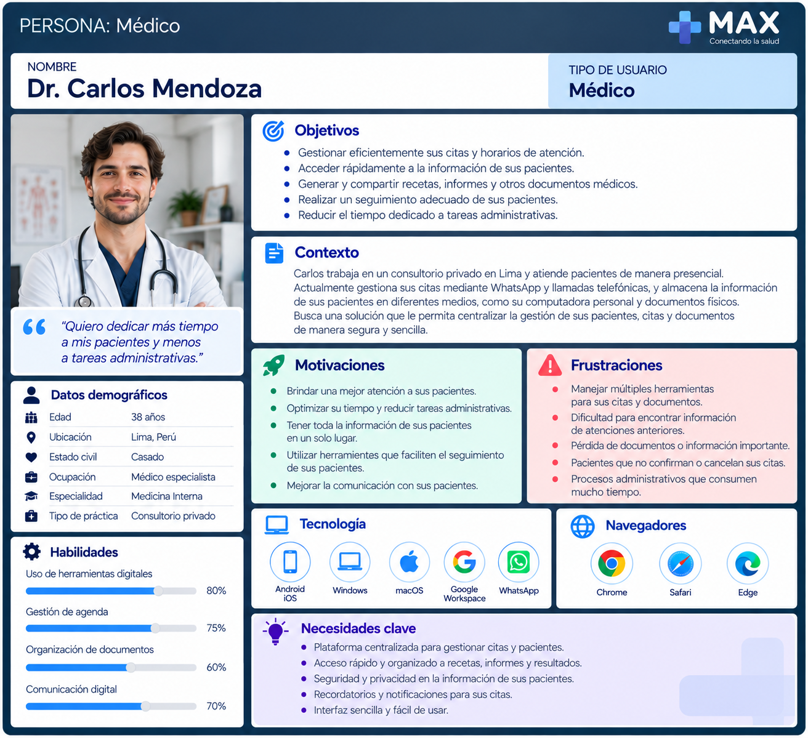
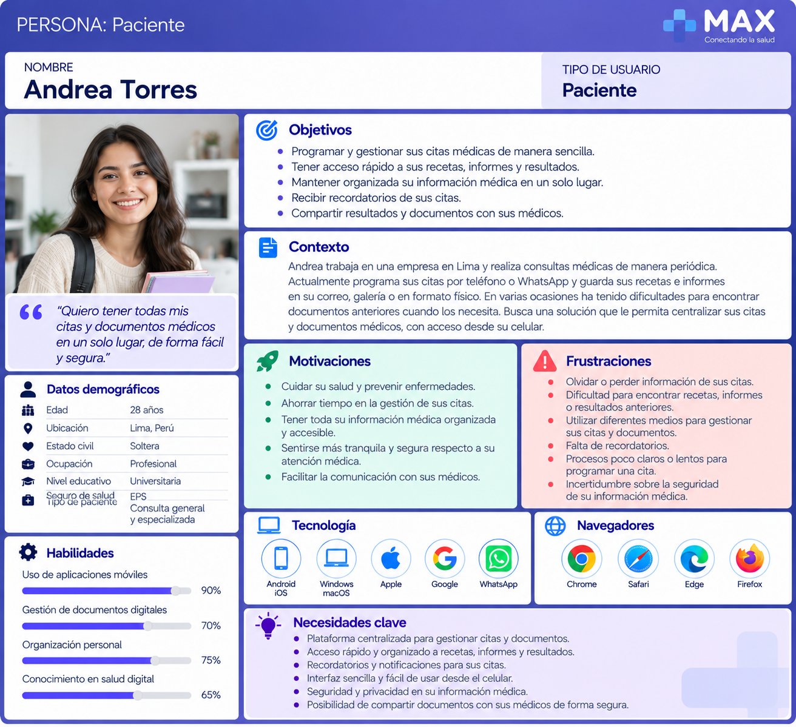
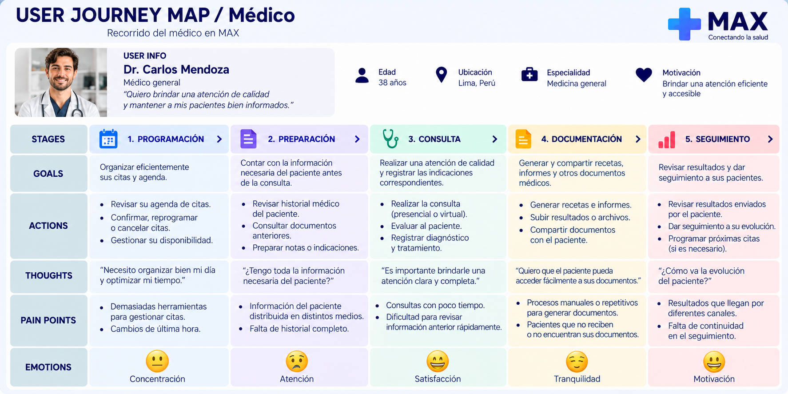
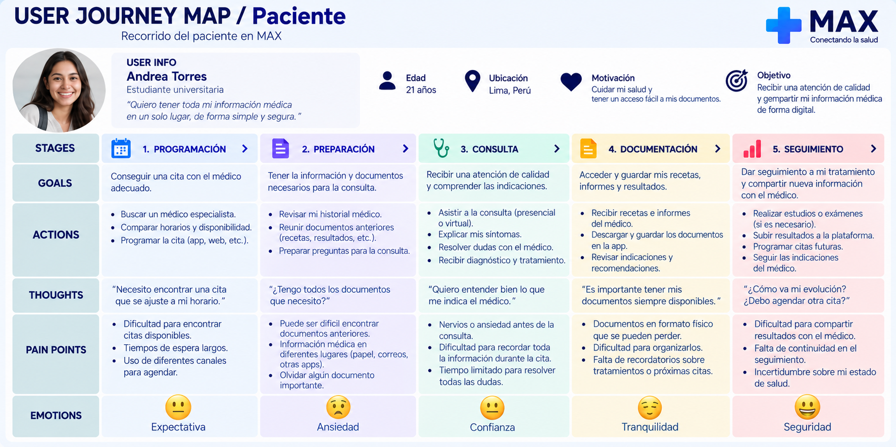
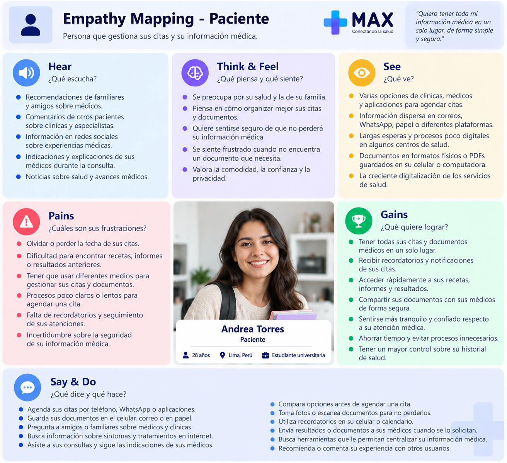
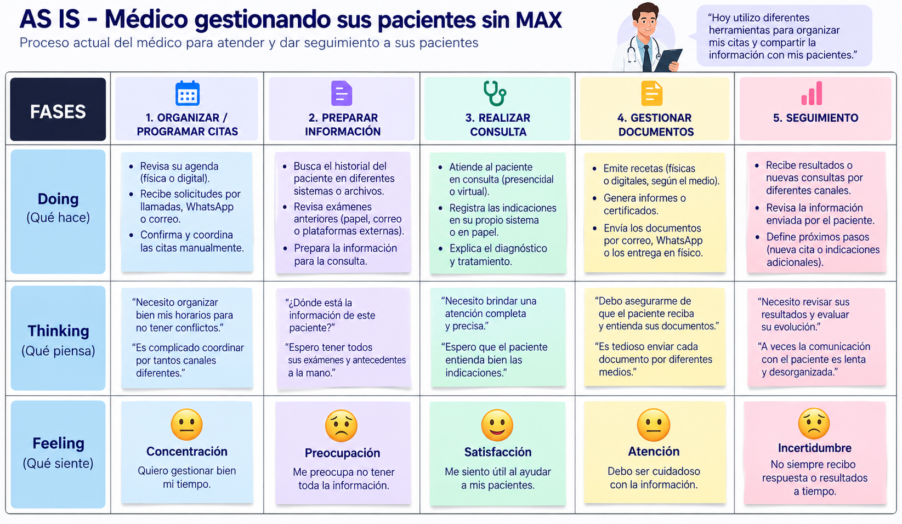
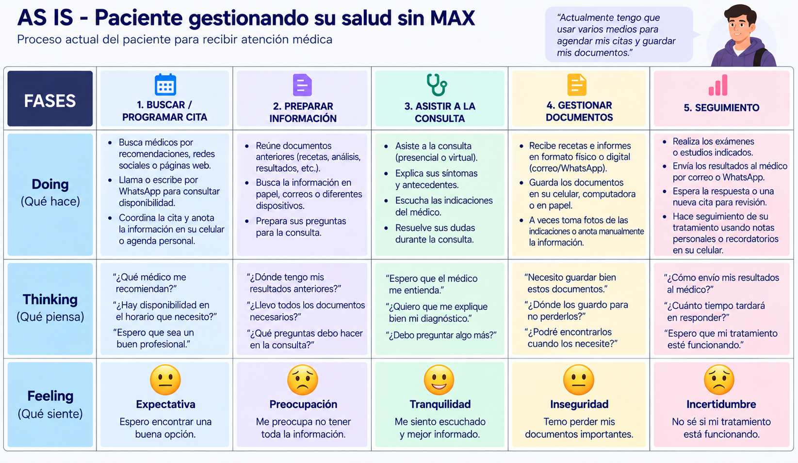

## Capítulo II: Requirements Elicitation & Analysis
### 2.1. Competidores

Para identificar oportunidades de diferenciación de la solución se analizaron plataformas digitales que actualmente ofrecen servicios relacionados con la interacción entre médicos y pacientes. Se seleccionaron Doctoralia, Auna y SANNA debido a que presentan funcionalidades relacionadas con búsqueda de especialistas, gestión de citas, teleconsultas y acceso a información médica.

#### 2.1.1. Análisis competitivo

| Sección | Subcategoría | MAX | Doctoralia | Mi Auna | SANNA |
| --- | --- | --- | --- | --- | --- |
| **Perfil** | **Overview** | Plataforma digital orientada a conectar médicos y pacientes mediante la gestión de citas y la centralización de documentos relacionados con la atención, como recetas, informes, resultados de exámenes y estudios médicos. | Plataforma que conecta pacientes con profesionales de la salud, permitiendo buscar especialistas, revisar perfiles y opiniones, reservar citas y acceder a consultas online. | Plataforma digital del ecosistema Auna que permite a sus pacientes gestionar citas y acceder a diferentes servicios e información relacionada con su atención. | Plataforma perteneciente a la red SANNA que permite a los pacientes gestionar citas y acceder a servicios ofrecidos por sus establecimientos y profesionales. |
| **Ventaja competitiva** | **¿Qué valor ofrece a los clientes?** | Integra en un mismo entorno la gestión de citas y el intercambio organizado de documentación entre médicos y pacientes, incluyendo recetas, informes, resultados y estudios. | Facilita encontrar profesionales de diferentes especialidades, comparar perfiles y opiniones, reservar citas y comunicarse con especialistas. | Integra diferentes servicios de Auna en un mismo entorno, incluyendo citas, teleconsultas, recetas y resultados de laboratorio. | Facilita la gestión digital de citas dentro de la red SANNA y permite administrar la atención de familiares desde una misma cuenta. |
| **Perfil de Marketing** | **Mercado objetivo** | Médicos independientes o pertenecientes a pequeños consultorios y pacientes que necesitan gestionar citas y documentación relacionada con su atención. | Pacientes que buscan profesionales de la salud y médicos o especialistas que desean ofrecer sus servicios y gestionar citas mediante una plataforma digital. | Pacientes atendidos dentro de las clínicas, programas y servicios pertenecientes al ecosistema Auna. | Pacientes que utilizan los establecimientos, médicos y servicios pertenecientes a la red SANNA. |
| | **Estrategias de marketing** | Posicionamiento como plataforma sencilla para centralizar la relación médico-paciente, inicialmente enfocada en gestión de citas y documentación relacionada con la atención. | Posicionamiento como marketplace de profesionales de salud basado en disponibilidad, perfiles profesionales, opiniones de pacientes y facilidad para reservar citas. | Integración de servicios digitales con la red de establecimientos y programas de salud de Auna para mantener al paciente dentro de su ecosistema de atención. | Integración de la experiencia digital con los establecimientos y profesionales pertenecientes a la red SANNA. |
| **Perfil de Producto** | **Productos & Servicios** | Gestión de citas, agenda médica, perfiles de pacientes, recetas, informes, carga y consulta de resultados o estudios, repositorio de documentos, recordatorios y notificaciones. | Búsqueda de especialistas, perfiles profesionales, opiniones, reserva y gestión de citas, recordatorios, mensajería y consultas online. | Gestión de citas, historial de citas, teleconsultas, recetas, resultados de laboratorio, información de coberturas, sedes y pagos. | Agendamiento, pago y reprogramación de citas, búsqueda de médicos y gestión de familiares asociados a la cuenta. |
| | **Precios & Costos** | El MVP tendrá inicialmente acceso gratuito para médicos y pacientes con el objetivo de validar la propuesta. El modelo de monetización será evaluado posteriormente. | La búsqueda y reserva de citas no tiene costos añadidos para el paciente. El precio de las consultas depende del profesional y servicio seleccionado. | El acceso a Mi Auna funciona como parte del ecosistema de servicios de Auna; los costos dependen de las consultas, programas, coberturas y servicios contratados. | El acceso a la plataforma forma parte de los servicios digitales de SANNA; los costos dependen de las consultas y servicios médicos utilizados. |
| | **Canales de distribución (Web/Móvil)** | Landing Page, aplicación web para médicos y aplicación móvil para pacientes, de acuerdo con el alcance inicial del producto. | Plataforma web y aplicación móvil para pacientes, además de herramientas digitales destinadas a profesionales. | Plataforma web Mi Auna y aplicación móvil Auna. | Plataforma web de agendamiento y aplicación móvil SANNA. |
| **Análisis SWOT** | **Fortalezas** | Centralización de citas y documentos, intercambio de información entre médico y paciente, orientación tanto a médicos independientes como a pacientes y posibilidad de construir una experiencia específica para cada segmento. | Amplia cantidad de especialistas, sistema de opiniones, facilidad de reserva, recordatorios, consultas online y presencia consolidada en el mercado digital de salud. | Integración de citas, teleconsultas, recetas, resultados y otros servicios dentro de un ecosistema de salud establecido. | Integración con una red de establecimientos y profesionales, gestión digital de citas y posibilidad de administrar familiares. |
| | **Debilidades** | Producto nuevo sin una base inicial de médicos y pacientes. Su valor dependerá de conseguir participación de ambos segmentos y gestionar adecuadamente información sensible. | Su propuesta está principalmente orientada al descubrimiento de especialistas y gestión de consultas, por lo que la centralización longitudinal de documentos médicos entre diferentes profesionales no constituye su enfoque principal. | Su utilización está principalmente relacionada con pacientes y servicios pertenecientes al ecosistema Auna. | Su utilización está principalmente vinculada a profesionales, establecimientos y servicios pertenecientes a la red SANNA. |
| | **Oportunidades** | Incorporar médicos independientes y pequeños consultorios, validar nuevas funcionalidades mediante experimentos, mejorar el seguimiento posterior a las consultas e incorporar progresivamente nuevas herramientas de comunicación y gestión documental. | Ampliar herramientas digitales para profesionales y pacientes e integrar nuevas funcionalidades relacionadas con el seguimiento de la atención. | Continuar integrando servicios médicos digitales y ampliar la experiencia del paciente dentro de su ecosistema. | Ampliar los servicios disponibles digitalmente y mejorar la integración entre pacientes, profesionales y establecimientos de su red. |
| | **Amenazas** | Competencia de plataformas consolidadas, dificultad para generar una masa inicial de usuarios, requisitos de privacidad y seguridad de información sensible y posibilidad de que competidores incorporen funcionalidades similares. | Competencia de otras plataformas de salud y crecimiento de soluciones digitales ofrecidas directamente por clínicas y establecimientos médicos. | Competencia de otros grupos de salud y plataformas digitales independientes que permitan atenderse con profesionales de diferentes instituciones. | Competencia de otras redes privadas de salud y plataformas independientes con mayor variedad de profesionales y servicios digitales. |
#### 2.1.2. Estrategias y tácticas frente a competidores

A partir del análisis competitivo realizado, se desarrolla una matriz FODA y C.A.M.E. para establecer las estrategias que MAX puede aplicar frente a sus competidores. La matriz relaciona las fortalezas y debilidades internas de MAX con las oportunidades y amenazas identificadas en el mercado de plataformas digitales orientadas a la interacción entre médicos y pacientes.

| MATRIZ FODA y C.A.M.E. | Oportunidades: Crecimiento de los servicios digitales de salud, mayor adopción de herramientas para la gestión de citas y oportunidad de centralizar la interacción y documentación entre médicos y pacientes. | Amenazas: Competidores consolidados, plataformas propias de clínicas y redes de salud, requisitos relacionados con privacidad y seguridad de información sensible y aparición de funcionalidades similares. |
| --- | --- | --- |
| **Fortalezas:** Centralización de citas y documentos relacionados con la atención, intercambio de información entre médicos y pacientes, experiencia diferenciada para ambos segmentos y orientación inicial hacia médicos independientes y pacientes. | **Estrategia Ofensiva (F + O):** Aprovechar la centralización de citas y documentos para ofrecer una experiencia enfocada en la continuidad de la interacción entre médico y paciente. La orientación hacia médicos independientes permitirá ampliar progresivamente la adopción de MAX sin limitar la solución a una red clínica específica. | **Estrategia Defensiva (F + A):** Diferenciar MAX frente a Doctoralia, Mi Auna, SANNA y otras plataformas mediante la integración de gestión de citas, recetas, informes, resultados y otros documentos dentro de un mismo entorno. Asimismo, implementar mecanismos de autenticación, autorización y control de acceso que permitan proteger la información gestionada. |
| **Debilidades:** Bajo reconocimiento de marca, ausencia de una comunidad inicial de médicos y pacientes, producto nuevo y necesidad de generar confianza para que los usuarios gestionen información relacionada con su atención mediante la plataforma. | **Estrategia de Reorientación (D + O):** Concentrar inicialmente la adopción en médicos independientes y pacientes que necesiten organizar sus citas y documentos. Realizar entrevistas, pruebas de usabilidad y experimentos permitirá validar las funcionalidades de mayor valor antes de ampliar progresivamente el alcance de MAX. | **Estrategia de Supervivencia (D + A):** Limitar inicialmente el alcance a las funcionalidades esenciales de gestión de citas y documentación, evitando competir directamente con ecosistemas clínicos completos. Implementar controles de seguridad, gestión de permisos y prácticas de protección de información desde el MVP para fortalecer progresivamente la confianza de médicos y pacientes. |

### 2.2. Entrevistas

Las entrevistas permitirán comprender cómo médicos y pacientes gestionan actualmente sus citas y documentación relacionada con la atención. Asimismo, permitirán identificar problemas, necesidades, comportamientos y expectativas que puedan ser utilizados para validar los supuestos planteados durante el desarrollo de MAX.

Para la investigación se consideran los dos segmentos objetivo definidos previamente: médicos y pacientes.

#### 2.2.1. Diseño de entrevistas

Para cada segmento se elaboró un conjunto de diez preguntas. Las entrevistas buscan explorar experiencias reales relacionadas con la gestión de citas, organización de documentos, intercambio de información entre médicos y pacientes y seguimiento posterior a una consulta.

#### Segmento 1: Médicos

**Objetivo de la entrevista:** Comprender cómo los médicos gestionan actualmente sus citas, pacientes y documentación relacionada con la atención, identificar las principales dificultades que experimentan al compartir o consultar información y conocer qué factores considerarían importantes para utilizar una plataforma digital como MAX.

1. ¿Cómo organizas actualmente las citas y horarios de atención de tus pacientes?

2. ¿Qué herramientas o medios utilizas para gestionar tus citas y por qué los utilizas?

3. ¿Qué dificultades encuentras actualmente al gestionar tu agenda o las citas de tus pacientes?

4. ¿Cómo entregas normalmente recetas, informes u otros documentos después de una consulta?

5. ¿Cómo recibes resultados de laboratorio, resonancias u otros estudios realizados por tus pacientes?

6. Cuando necesitas consultar información o documentos de una atención anterior, ¿cómo los buscas actualmente?

7. ¿Qué dificultades has experimentado al organizar o encontrar documentos relacionados con tus pacientes?

8. ¿Cómo realizas actualmente el seguimiento de un paciente después de una consulta?

9. ¿Qué información o funcionalidades considerarías más importantes en una plataforma para gestionar citas y documentos de tus pacientes?

10. ¿Qué necesitarías conocer sobre una plataforma como MAX para confiar en ella y utilizarla para gestionar información relacionada con tus pacientes?

#### Segmento 2: Pacientes

**Objetivo de la entrevista:** Comprender cómo los pacientes gestionan actualmente sus citas y documentos relacionados con su atención, identificar dificultades al acceder o compartir esta información y conocer qué factores consideran importantes para utilizar una plataforma digital que centralice su interacción con el médico.

1. ¿Cómo programas normalmente una cita con un médico?

2. ¿Qué herramientas o medios utilizas actualmente para recordar y organizar tus citas médicas?

3. ¿Alguna vez has tenido alguna dificultad relacionada con una cita médica, como olvidarla, reprogramarla o encontrar la información necesaria?

4. ¿Cómo recibes y dónde guardas normalmente tus recetas, informes y otros documentos entregados por un médico?

5. ¿Alguna vez has tenido dificultades para encontrar una receta, informe o resultado cuando lo necesitabas? ¿Qué ocurrió?

6. ¿Cómo compartes actualmente resultados de laboratorio, resonancias u otros estudios con tu médico?

7. Después de una consulta, ¿cómo realizas el seguimiento de las indicaciones o documentos que te proporciona el médico?

8. ¿Qué información relacionada con tus citas o documentos te gustaría poder consultar desde una aplicación?

9. Si pudieras tener tus citas, recetas, informes y resultados en un mismo lugar, ¿qué funcionalidades considerarías más importantes?

10. ¿Qué necesitarías conocer sobre una plataforma como MAX para confiar en ella y utilizarla para gestionar información relacionada con tu atención?

#### 2.2.2. Registro de entrevistas

#### Segmento 2: Pacientes

##### Entrevista 1

| Campo | Información |
| --- | --- |
| **Nombre** | Fernanda Valderrama |
| **Edad** | 20 años |
| **Ocupación** | Estudiante universitaria |
| **Duración** | 00:00 - 06:07 |
| **Resumen** | Fernanda Valderrama, de 20 años, programa normalmente sus citas médicas mediante aplicaciones o páginas web y, cuando necesita conseguir una cita con mayor urgencia, realiza llamadas para consultar disponibilidad. Indicó que actualmente no utiliza ninguna herramienta para recordar sus citas, por lo que algunas veces las olvida o debe reprogramarlas cuando coinciden con actividades universitarias, llegando a esperar aproximadamente una semana para obtener una nueva cita. Respecto a su documentación médica, señaló que suele guardar las recetas junto con los medicamentos, mientras que los informes son revisados y posteriormente pueden terminar extraviándose. Los estudios médicos, como resonancias u otros documentos, son almacenados físicamente en su clóset y deben ser entregados presencialmente cuando un médico los solicita. Después de una consulta, realiza el seguimiento principalmente cumpliendo el tratamiento hasta finalizar los medicamentos. Manifestó interés en poder consultar recetas anteriores para conocer los medicamentos utilizados previamente y considera importante disponer de un buscador que permita localizar información mediante el nombre de un medicamento. También valoró que las recetas incluyan información específica sobre medicamentos, cantidades y horarios. Finalmente, señaló que la existencia de alianzas con las clínicas que frecuenta contribuiría a su disposición para utilizar una plataforma como MAX. |

**Entrevista 1:** [Link a la entrevista]()

#### Segmento 1: Médicos

##### Entrevista 1

| Campo | Información |
| --- | --- |
| **Nombre** | Francesca Durand Alba |
| **Edad** | 25 años |
| **Ocupación** | Médica cirujana |
| **Duración** | 00:00 - 06:26 |
| **Resumen** | Francesca Durand Alba, médica cirujana de 25 años, organiza actualmente sus citas utilizando principalmente WhatsApp para coordinar con los pacientes y Google Calendar para registrar y organizar sus horarios. Señaló que una de las principales dificultades se presenta cuando existen cancelaciones, cambios o confirmaciones, debido a que la coordinación mediante WhatsApp dificulta visualizar rápidamente la disponibilidad y mantener organizada la agenda. Respecto a la documentación, explicó que las recetas e informes pueden entregarse físicamente durante una atención presencial o enviarse mediante WhatsApp cuando la consulta es virtual. Asimismo, recibe resultados de laboratorio, resonancias y otros estudios tanto físicamente como mediante fotografías, archivos PDF u otros documentos enviados por WhatsApp. Aunque dispone de una historia clínica virtual para consultar atenciones anteriores, los documentos complementarios pueden encontrarse distribuidos en diferentes chats y formatos, lo que dificulta localizarlos rápidamente. También señaló que algunos pacientes olvidan llevar sus resultados a las consultas. Considera importante que una plataforma permita realizar seguimiento del tratamiento, mantener la comunicación con el paciente y centralizar la historia clínica y los documentos en un solo lugar. Para confiar en una plataforma como MAX, considera fundamental conocer las medidas utilizadas para proteger la información, quién puede acceder a ella, cómo se realizan las copias de respaldo, cómo pueden recuperarse los datos y qué ocurre con la información si deja de utilizar el servicio. Además, considera importante que la plataforma sea fácil de utilizar y permita almacenar y adjuntar todos los documentos relacionados con cada paciente. |

**Entrevista 1:** [Link a la entrevista]()

#### 2.2.3. Análisis de entrevistas
### 2.3. Needfinding
#### 2.3.1. User Personas
#### User Persona - Médico

A partir de los segmentos objetivo definidos para MAX, se desarrollarán dos User Personas que representen a los principales tipos de usuarios de la solución. Los perfiles definitivos serán elaborados a partir de los patrones identificados durante las entrevistas.

#### User Persona - Paciente

Este User Persona representa a pacientes que realizan consultas médicas y necesitan gestionar sus citas y mantener organizada la documentación relacionada con su atención. Sus principales necesidades se relacionan con el acceso a recetas, informes, resultados y recordatorios, así como con la posibilidad de compartir información con sus médicos.

#### 2.3.2. User Task Matrix

La User Task Matrix permite identificar y comparar las principales actividades realizadas por médicos y pacientes relacionadas con la gestión de citas y documentación. Para cada tarea se considera la frecuencia con la que se realiza y su nivel de importancia para cada segmento.

| Tarea del usuario | Médico - Frecuencia | Médico - Importancia | Paciente - Frecuencia | Paciente - Importancia |
| --- | --- | --- | --- | --- |
| Consultar próximas citas | Alta | Alta | Media | Alta |
| Gestionar una cita | Alta | Alta | Media | Alta |
| Gestionar agenda | Alta | Alta | No aplica | No aplica |
| Consultar información relacionada con una atención | Alta | Alta | Media | Alta |
| Generar una receta | Alta | Alta | No aplica | No aplica |
| Consultar una receta | Media | Alta | Media | Alta |
| Generar un informe | Media | Alta | No aplica | No aplica |
| Consultar un informe | Media | Alta | Media | Alta |
| Subir resultados o estudios | Baja | Media | Media | Alta |
| Revisar resultados o estudios | Alta | Alta | Media | Alta |
| Compartir documentos | Alta | Alta | Media | Alta |
| Consultar documentos anteriores | Alta | Alta | Media | Alta |
| Recibir recordatorios de citas | Media | Media | Media | Alta |
| Consultar notificaciones | Media | Media | Media | Media |

A partir de la matriz se observa que ambos segmentos comparten actividades relacionadas con la gestión de citas, consulta de documentos y acceso a información relacionada con la atención. Sin embargo, las responsabilidades de cada usuario son diferentes.

El médico presenta una mayor frecuencia en actividades relacionadas con la administración de la agenda, generación de recetas e informes y revisión de resultados. Por otro lado, el paciente presenta una mayor necesidad de consultar documentos, recibir recordatorios y compartir resultados obtenidos después de una consulta.

Los valores definitivos de frecuencia e importancia deberán ser revisados después de analizar las entrevistas realizadas a ambos segmentos.

#### 2.3.3. User Journey Mapping

En esta sección se presenta el recorrido que realizan los principales usuarios de MAX, considerando los dos segmentos definidos: médicos y pacientes. El recorrido inicia con la programación de una cita y continúa con la preparación previa a la consulta, la realización de la atención, la gestión de los documentos generados y el seguimiento posterior.

Este análisis permite identificar las acciones, objetivos, pensamientos, dificultades y emociones que experimenta cada segmento durante las diferentes etapas de la atención. A partir de estos hallazgos, se pueden reconocer oportunidades para que MAX facilite la gestión de citas, centralice la documentación y mejore la interacción entre médicos y pacientes.

#### User Journey Mapping - Médico

El recorrido del médico comienza con la organización de sus citas y continúa con la revisión de la información disponible antes de atender al paciente. Durante la consulta, el médico evalúa al paciente y registra las indicaciones correspondientes. Posteriormente, genera o comparte documentos como recetas e informes y, finalmente, realiza el seguimiento mediante la revisión de resultados, estudios u otra información proporcionada por el paciente.

#### User Journey Mapping - Paciente

El recorrido del paciente comienza cuando necesita programar una cita con un médico. Antes de la consulta, organiza la información y documentos que podría necesitar. Durante la atención recibe las indicaciones correspondientes y, posteriormente, debe gestionar recetas, informes, resultados u otros documentos. Finalmente, realiza el seguimiento de su atención, pudiendo compartir nuevos resultados o estudios con su médico.

#### 2.3.4. Empathy Mapping

#### Empathy Mapping - Médico

#### Empathy Mapping - Paciente

#### 2.3.5. As-Is Scenario Mapping

En esta sección se presenta el As-Is Scenario Mapping de los dos segmentos objetivo de MAX: médicos y pacientes. Este análisis permite comprender cómo ambos usuarios realizan actualmente las actividades relacionadas con la gestión de citas, consultas y documentación médica sin utilizar MAX. A partir de este proceso se identifican las acciones que realizan, sus principales pensamientos y las emociones que experimentan durante cada etapa.

#### As-Is Scenario Mapping - Médico

El escenario actual del médico representa el proceso que realiza desde la organización de sus citas hasta el seguimiento posterior de sus pacientes. Actualmente, estas actividades pueden involucrar diferentes herramientas y medios para gestionar la agenda, consultar información, entregar documentos y recibir resultados.

#### As-Is Scenario Mapping - Paciente

El escenario actual del paciente representa el proceso que realiza desde que necesita programar una cita hasta el seguimiento posterior a la consulta. Durante este recorrido puede utilizar diferentes medios para coordinar citas, conservar recetas e informes y compartir resultados con su médico.

### 2.4. Ubiquitous Language

El Ubiquitous Language de MAX establece un vocabulario común para describir los principales conceptos del dominio de la solución. Su propósito es mantener una terminología consistente entre el equipo de desarrollo, los stakeholders, la documentación, los modelos de dominio y la implementación del software, reduciendo ambigüedades durante el desarrollo del proyecto.

| Término | Definición |
| --- | --- |
| **Usuario (User)** | Persona registrada en MAX que interactúa con la plataforma según los permisos asociados a su rol. |
| **Médico (Doctor)** | Profesional de la salud registrado en MAX que gestiona citas, pacientes y documentación relacionada con la atención. |
| **Paciente (Patient)** | Usuario que recibe atención de un médico y utiliza MAX para gestionar citas y consultar o compartir documentación. |
| **Rol (Role)** | Clasificación asignada a un usuario que determina las funcionalidades y recursos a los que puede acceder dentro de MAX. |
| **Perfil médico (Doctor Profile)** | Información profesional asociada a un médico registrado en MAX. |
| **Perfil del paciente (Patient Profile)** | Información asociada a un paciente registrado en MAX. |
| **Cita (Appointment)** | Encuentro programado entre un médico y un paciente para una fecha y hora determinadas. |
| **Estado de cita (Appointment Status)** | Situación actual de una cita dentro de su ciclo de gestión, como pendiente, confirmada, completada o cancelada. |
| **Agenda médica (Doctor Schedule)** | Conjunto de horarios y citas asociados a un médico. |
| **Disponibilidad (Availability)** | Periodos de tiempo definidos por el médico en los que puede programarse una cita. |
| **Atención (Medical Encounter)** | Interacción entre un médico y un paciente asociada a una cita realizada. |
| **Documento médico (Medical Document)** | Archivo relacionado con una atención que puede ser almacenado y consultado mediante MAX. |
| **Receta (Prescription)** | Documento generado por el médico que contiene las prescripciones o indicaciones correspondientes a una atención. |
| **Informe médico (Medical Report)** | Documento elaborado por el médico con información relacionada con una atención realizada. |
| **Resultado (Medical Result)** | Documento que contiene información obtenida a partir de un examen o estudio realizado al paciente. |
| **Estudio médico (Medical Study)** | Examen o procedimiento cuyos resultados pueden ser registrados o compartidos mediante MAX. |
| **Repositorio de documentos (Document Repository)** | Espacio de MAX utilizado para almacenar y organizar documentos relacionados con un paciente. |
| **Carga de documento (Document Upload)** | Proceso mediante el cual un usuario incorpora un documento autorizado a MAX. |
| **Compartir documento (Document Sharing)** | Acción mediante la cual un documento se pone a disposición de un usuario autorizado. |
| **Acceso a documento (Document Access)** | Permiso que permite a un usuario autorizado visualizar o consultar un documento disponible en MAX. |
| **Historial de citas (Appointment History)** | Registro de citas anteriores asociadas a un usuario. |
| **Notificación (Notification)** | Aviso generado por MAX para comunicar al usuario información relacionada con una cita, documento u otro evento relevante. |
| **Recordatorio de cita (Appointment Reminder)** | Notificación enviada antes de una cita programada. |
| **Seguimiento (Follow-up)** | Actividades posteriores a una atención destinadas a continuar la interacción entre médico y paciente. |
| **Autenticación (Authentication)** | Proceso mediante el cual MAX verifica la identidad de un usuario. |
| **Autorización (Authorization)** | Proceso mediante el cual MAX determina las acciones y recursos a los que puede acceder un usuario autenticado. |
| **Consentimiento (Consent)** | Autorización otorgada por el usuario para determinadas acciones relacionadas con el acceso y gestión de su información dentro del alcance definido por MAX. |
