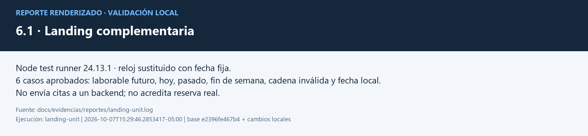
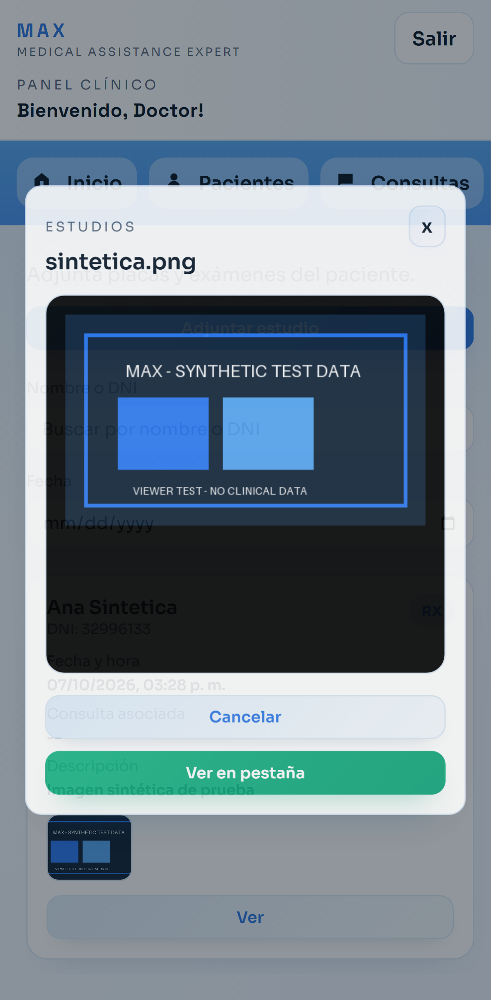
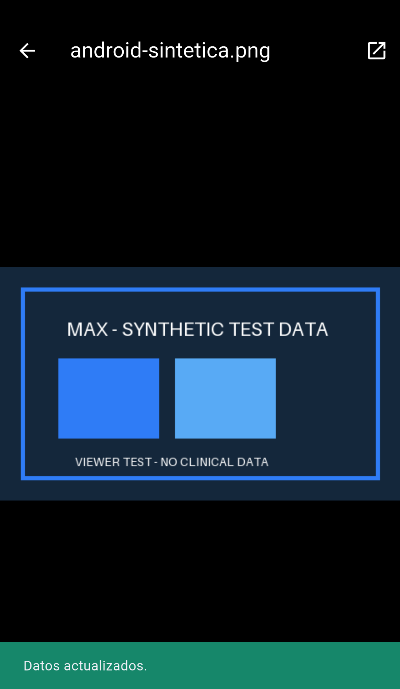

# MAX — Product Verification & Validation y DevOps Practices

Fecha de validación: **07/10/2026, America/Lima (UTC−05:00)**. Entorno: **LOCAL AISLADO**, datos sintéticos. No se modificó la BD de producción, no se hicieron commits/push y no se publicaron nuevas versiones.

Este documento integra los resultados de la entrega de evidencias del 7 de octubre de 2026. Sus rutas están preparadas para ubicar el Markdown en la raíz del repositorio del informe, junto con `assets/` y `docs/`. Se conserva la distinción entre pruebas locales, configuración preparada y observaciones de servicios publicados.

**Alcance de esta revisión:** se contrastaron los recuentos con los XML, JSON y logs recibidos y se revisaron las imágenes. No se volvieron a ejecutar las aplicaciones ni se accedió a los dashboards remotos. Los archivos fuente de pruebas, scripts y workflows se citan por su ubicación en los repositorios del equipo; no están incluidos en los ZIP de evidencias recibidos.

**Estado de la entrega:** hay validaciones locales documentadas. No se acredita ejecución remota de los nuevos workflows, un ambiente de staging ni un nuevo despliegue clínico a producción. El paquete conserva los reportes y capturas originales; los binarios JAR/APK y bundles de aplicación se mantienen en la entrega original de Codex.

## Stack, arquitectura y versiones comprobadas

| Componente | Stack y arquitectura observados | Versión base evaluada |
|---|---|---|
| Backend | Monolito Spring Boot, contextos `auth`, `admin`, `pacientes`, `citas`, `consultas`, `estudios`; capas application/domain/infrastructure/interfaces; JPA, autenticación mediante cookie HttpOnly y control de sesiones | Java 21.0.10, Boot 4.0.8, Maven Wrapper 3.9.12; `17e93c08b92cad83fdb4ea232b06c21eb70c260f` + cambios locales |
| BD local | MySQL nativo con datadir independiente, puerto 33307. Flyway valida V1–V11. H2 complementa las pruebas HTTP | MySQL servidor 8.0.45; Flyway 11.14.1; H2 2.4.240 |
| Web clínica | Angular standalone, organización por contextos, componentes/fachadas/servicios/stores/clientes; `/api` mediante proxy | Angular 21.2.23, CLI/build 21.2.24, CDK 21.2.14, TS 5.9.3; `63ed173284647024a7612d5a1cf8f8b0290eff35` + cambios locales |
| Android | Flutter/Dart; `AppController` coordina operaciones, modelos y `MaxApi`; Dio y almacenamiento seguro para cookies | Flutter 3.41.9, Dart 3.11.5, Dio 5.11.1, app 1.0.0+1; `601fc357b9522e8782f8eae3498c7b98c6638673` + cambios locales |
| Landing local | React, componentes/secciones y reglas de formulario públicas. No envía citas a un servicio | React 19.2.8, Vite 8.3.1, TS 6.0.2, oxlint 1.81.0; `e2396fe467b47ea3659802a99d334e13436d2573` + cambios locales |
| Landing académica remota | HTML estático publicado en GitHub Pages; repositorio distinto de la landing React local | `1ASI0732-2620-9086/LANDING-PAGE`, historial de ejecuciones del 17/09/2026 |
| Informe | README consultado sin editar el remoto; contiene US/TS reales en 3.2 y llega hasta capítulo V | `REPORT`, commit `9892066480a9fac7fe0dc75f2878700266f0f517` |

La versión probada **incluye cambios sin commit**: no atribuir las pruebas nuevas únicamente al SHA base. [Estado de fuentes](docs/evidencias/reportes/source-state-final.json) registra las rutas y el estado Git; [inventario de archivos](docs/evidencias/reportes/changed-files.json) identifica las modificaciones concretas. Se recomienda una rama por proyecto antes de integrar esta entrega; no se cambió la rama actual.

Flujo implementado: Angular y Flutter → misma API Spring → MySQL; la web usa `/api` y un proxy, el emulador usa `http://10.0.2.2:18080/api`. Configuración: `MAX_FRONT/MAX/proxy.evidence.json`, `MAX_MOBILE/lib/core/config/app_config.dart` y `scripts/Start-MaxTestApi.ps1`. No se conectó Flutter directamente con MySQL.

IAM, Patients y Studies son **áreas funcionales del informe**, no nombres nuevos de paquetes. Consultas/citas se conservaron y se comprobaron en pruebas relacionadas con el historial. El futuro portal del paciente no está implementado ni se acredita aquí. No se creó una arquitectura de microservicios ni se dockerizó el backend o la BD.

# Capítulo VI: Product Verification & Validation

## 6.1. Testing Suites & Validation

La verificación y validación de MAX se documenta mediante suites unitarias y de integración, escenarios BDD y recorridos de sistema. Se evaluaron la lógica de los componentes y las interacciones de los clientes con la API y la base de datos en un entorno local aislado. Los resultados siguientes acreditan exclusivamente los casos y ambientes descritos.

| Suite final | Alcance y entorno | Ejecutadas | Aprobadas | Fallidas | Omitidas | Fuente |
|---|---|---:|---:|---:|---:|---|
| Backend JUnit | 26 unidades con dependencias sustituidas + 37 integración/contexto, H2 y MySQL nativo | 63 | 63 | 0 | 0 | `backend-final-isolated.log`, `backend-final-surefire/` |
| Web Vitest | Validadores, stores, coordinación y cliente HTTP con transporte sustituido | 24 | 24 | 0 | 0 | `web-expanded-unit.log`, `web-vitest.json` |
| Flutter unidades | Dart en VM Windows; fake API y transporte sustituido; no requiere servidor | 22 | 22 | 0 | 0 | `android-unit-final.log` |
| Landing unidades | Node test runner; reloj sustituido; reglas existentes de fechas | 6 | 6 | 0 | 0 | `landing-unit.log` |
| BDD Cucumber | API, CSRF, MySQL y archivo embebido reales; 9 escenarios | 9 escenarios | 9 | 0 | 0 | `bdd-final.log`, `bdd.json`, `bdd.html` |
| Sistema web | UI Angular + API + MySQL; Chromium escritorio y viewport móvil | 2 recorridos | 2 | 0 | 0 | `web-system-final.log`, `system-web.json` |
| Sistema Android | Flutter en emulador Android 14 + API + MySQL | 1 recorrido | 1 | 0 | 0 | `android-system-evidence-final.log` |
| Navegador con API sustituida | Login, política de contraseña y recarga protegida, dos viewports | 6 | 6 | 0 | 0 | `web-browser-mocked.log`, `browser-mocked.json` |
| iOS | No hay plataforma iOS activa en este proyecto | No aplica | — | — | — | `.metadata` y ausencia de carpeta iOS |

Las **115 pruebas JUnit/Vitest/Flutter/Node** no incluyen BDD ni recorridos de sistema. Los 6 casos de Playwright con `page.route` no acreditan integración real. No se midió cobertura con JaCoCo/Istanbul: no interpretar el número de casos como porcentaje de cobertura.

Las pruebas iniciales existentes se conservaron: backend 19, web 15, Flutter 6. Las ejecuciones iniciales están en `baseline-*`. No se validó todo MAX: no se recorrieron exhaustivamente administración/suplantación, agenda, configuración, todos los formatos/visores, dispositivos físicos, R2 ni producción.

## 6.1.1. Core Entities Unit Tests

Herramientas: backend JUnit Jupiter 6.0.3/Mockito 5.20.0; web Vitest 4.1.11 con Angular TestBed/HttpTestingController y jsdom; Android `flutter_test` del SDK 3.41.9. Arrange–Act–Assert se refleja en configuración de dependencias, operación y aserciones. Los clientes HTTP que usan dobles se clasifican como pruebas de unidad/componente, no como integración contra una API real.

Los IDs UT de este documento identifican evidencia, no historias nuevas. Cada caso conserva su nombre original y resultado. Las tablas completas también están en [MAX-Casos-Ejecutados.md](docs/evidencias/MAX-Casos-Ejecutados.md). Los validadores de búsqueda y `ClinicalDataService` se contabilizan una sola vez en Patients por coordinar sus listados; también prestan servicio a otras pantallas.

### 6.1.1.1. IAM

#### 6.1.1.1.1. Backend

Unidades: **AuthService; AvatarValidator; PasswordPolicy**. Archivos: `AuthServiceUnitTest.java, AvatarValidatorUnitTest.java, shared/security/PasswordPolicyTest.java`; raíz de pruebas backend `MAX_BACK/max-backend/src/test/java/com/max/maxbackend/`, web `MAX_FRONT/MAX/src/app/`, Android `MAX_MOBILE/`. El archivo completo representativo es `MAX_BACK/max-backend/src/test/java/com/max/maxbackend/contexts/auth/application/AuthServiceUnitTest.java`.

Fragmento real:

```java
  @Test void rejectsUnknownAccountWithoutIssuingSession() {
    when(users.findByEmail("missing@example.test")).thenReturn(Optional.empty());
    assertThatThrownBy(() -> service.login(new LoginRequest("missing@example.test", "wrong"))).isInstanceOf(ApiException.class).hasMessage("Invalid credentials");
    verifyNoInteractions(tokens, passwords);
  }
  @Test void rejectsWrongPasswordWithoutChangingUserOrSession() {
    when(users.findByEmail(user.email())).thenReturn(Optional.of(user));
    when(passwords.matches("wrong", "hash")).thenReturn(false);
    assertThatThrownBy(() -> service.login(new LoginRequest(user.email(), "wrong"))).isInstanceOf(ApiException.class);
    verify(users, never()).save(any());
    verifyNoInteractions(tokens);
  }
  @Test void loginNormalizesEmailAndPreservesIdentityAndCreatedAt() {
    when(users.findByEmail(user.email())).thenReturn(Optional.of(user));
    when(passwords.matches("correct", "hash")).thenReturn(true);
    when(users.save(any())).thenAnswer(call -> call.getArgument(0));
    when(tokens.generateToken(7L, user.email(), "MEDICO")).thenReturn("synthetic-session");
```

| ID | Unidad | Caso | Resultado esperado | Resultado obtenido | Estado |
|---|---|---|---|---|---|
| UT-IAM-Backend-01 | AuthServiceUnitTest | duplicateRegistrationDoesNotHashOrSave | Correo duplicado: conflicto; no calcular hash ni guardar. | Aserciones verificadas en el reporte original | Aprobada |
| UT-IAM-Backend-02 | AuthServiceUnitTest | wrongCurrentPasswordDoesNotRevokeSessions | Contraseña actual incorrecta: rechazo sin revocar sesiones. | Aserciones verificadas en el reporte original | Aprobada |
| UT-IAM-Backend-03 | AuthServiceUnitTest | rejectsUnknownAccountWithoutIssuingSession | Cuenta desconocida: 401 y ninguna sesión nueva. | Aserciones verificadas en el reporte original | Aprobada |
| UT-IAM-Backend-04 | AuthServiceUnitTest | loginNormalizesEmailAndPreservesIdentityAndCreatedAt | Correo normalizado; conservar ID y createdAt al acceder. | Aserciones verificadas en el reporte original | Aprobada |
| UT-IAM-Backend-05 | AuthServiceUnitTest | rejectsWrongPasswordWithoutChangingUserOrSession | Contraseña incorrecta: 401 sin modificar usuario ni sesión. | Aserciones verificadas en el reporte original | Aprobada |
| UT-IAM-Backend-06 | AvatarValidatorUnitTest | rejectsInvalidBase64UnsupportedTypeAndOversize | Rechazar avatar inválido, tipo no permitido y exceso de 5 MiB. | Aserciones verificadas en el reporte original | Aprobada |
| UT-IAM-Backend-07 | AvatarValidatorUnitTest | acceptsPngSignatureAndRejectsMimeMismatch | Aceptar PNG válido y rechazar MIME incompatible con contenido. | Aserciones verificadas en el reporte original | Aprobada |
| UT-IAM-Backend-08 | AvatarValidatorUnitTest | historicalUnchangedValueIsPreserved | Conservar la referencia histórica de avatar sin alteración. | Aserciones verificadas en el reporte original | Aprobada |
| UT-IAM-Backend-09 | AvatarValidatorUnitTest | emptyValueRemovesAvatar | Valor vacío elimina la referencia del avatar. | Aserciones verificadas en el reporte original | Aprobada |
| UT-IAM-Backend-10 | PasswordPolicyTest | acceptsTheCompletePolicy | Aceptar más de ocho caracteres, mayúscula, número y signo. | Aserciones verificadas en el reporte original | Aprobada |
| UT-IAM-Backend-11 | PasswordPolicyTest | rejectsEveryMissingRequirement | Rechazar cada requisito faltante de contraseña. | Aserciones verificadas en el reporte original | Aprobada |

Comando: `cd MAX_BACK\max-backend; .\mvnw.cmd -B verify`. Reportes: `docs/evidencias/reportes/backend-final-isolated.log y backend-final-surefire/`. Metadatos con fecha, comando y versión base en los JSON del mismo ID de ejecución.

<p align="center">
  
</p>

<p align="center"><em>Figura 1. Reporte de resultados: UT IAM Backend.</em></p>

#### 6.1.1.1.2. iOS

**No aplica:** no hay implementación iOS activa. No se generó imagen iOS ni se reutilizaron resultados Android.

#### 6.1.1.1.3. Android

Unidades: **AppController; MaxValidators.password; API sustituida**. Archivos: `test/iam_test.dart; test/validators_test.dart`; raíz de pruebas backend `MAX_BACK/max-backend/src/test/java/com/max/maxbackend/`, web `MAX_FRONT/MAX/src/app/`, Android `MAX_MOBILE/`. El archivo completo representativo es `MAX_MOBILE/test/iam_test.dart`.

Fragmento real:

```dart
    test('rechaza correo inválido y exige correo al registrarse', () {
      expect(MaxValidators.email('bad', required: true), isNotNull);
      expect(MaxValidators.email('', required: true), isNotNull);
      expect(MaxValidators.email('ana@example.test', required: true), isNull);
    });
    test('credenciales inválidas no crean identidad autenticada', () async {
      final api = FakeApi()..loginError = const ApiException('Credenciales incorrectas', statusCode: 401);
      final controller = AppController(api: api);
      expect(await controller.login('ana@example.test', 'wrong'), contains('incorrectas'));
      expect(controller.isAuthenticated, isFalse);
      expect(controller.actionLoading, isFalse);
      controller.dispose();
    });
    test('login y logout limpian datos e identidad', () async {
      final api = FakeApi()..records = [syntheticPatient];
      final controller = AppController(api: api);
      expect(await controller.login('ana@example.test', 'synthetic'), isNull);
```

| ID | Unidad | Caso | Resultado esperado | Resultado obtenido | Estado |
|---|---|---|---|---|---|
| UT-IAM-Android-01 | iam_test.dart | IAM rechaza correo inválido y exige correo al registrarse | IAM rechaza correo inválido y exige correo al registrarse | Aserciones verificadas en el reporte original | Aprobada |
| UT-IAM-Android-02 | iam_test.dart | IAM credenciales inválidas no crean identidad autenticada | IAM credenciales inválidas no crean identidad autenticada | Aserciones verificadas en el reporte original | Aprobada |
| UT-IAM-Android-03 | iam_test.dart | IAM login y logout limpian datos e identidad | IAM login y logout limpian datos e identidad | Aserciones verificadas en el reporte original | Aprobada |
| UT-IAM-Android-04 | iam_test.dart | IAM contraseña actual incorrecta conserva la sesión | IAM contraseña actual incorrecta conserva la sesión | Aserciones verificadas en el reporte original | Aprobada |
| UT-IAM-Android-05 | validators_test.dart | seguridad de contraseña exige longitud, mayúscula, número y signo | seguridad de contraseña exige longitud, mayúscula, número y signo | Aserciones verificadas en el reporte original | Aprobada |

Comando: `cd MAX_MOBILE; C:\src\flutter\bin\flutter.bat test --reporter=json`. Reportes: `docs/evidencias/reportes/android-unit-final.log (eventos JSON originales)`. Metadatos con fecha, comando y versión base en los JSON del mismo ID de ejecución.

<p align="center">
  
</p>

<p align="center"><em>Figura 2. Reporte de resultados: UT IAM Android.</em></p>

#### 6.1.1.1.4. Web

Unidades: **AuthStore; validación de contraseña y confirmación**. Archivos: `contexts/usuarios/application/auth-store.spec.ts; core/validation/password.validation.spec.ts`; raíz de pruebas backend `MAX_BACK/max-backend/src/test/java/com/max/maxbackend/`, web `MAX_FRONT/MAX/src/app/`, Android `MAX_MOBILE/`. El archivo completo representativo es `MAX_FRONT/MAX/src/app/contexts/usuarios/application/auth-store.spec.ts`.

Fragmento real:

```typescript
  it('elimina credenciales antiguas sin borrar preferencias ajenas a la sesión', () => {
    localStorage.setItem('max_users', '[{"token":"legacy"}]');
    localStorage.setItem('max_access_token', 'legacy-token');
    localStorage.setItem('language', 'es');

    clearLegacyAuthStorage();

    expect(localStorage.getItem('max_users')).toBeNull();
    expect(localStorage.getItem('max_access_token')).toBeNull();
    expect(localStorage.getItem('language')).toBe('es');
  });
});
```

| ID | Unidad | Caso | Resultado esperado | Resultado obtenido | Estado |
|---|---|---|---|---|---|
| UT-IAM-Web-01 | app/core/validation/password.validation.spec.ts | accepts a password with more than eight characters, uppercase, number and sign | accepts a password with more than eight characters, uppercase, number and sign | Aserciones verificadas en el reporte original | Aprobada |
| UT-IAM-Web-02 | app/core/validation/password.validation.spec.ts | rejects a password that does not satisfy the full policy: clave#123 | rejects a password that does not satisfy the full policy: clave#123 | Aserciones verificadas en el reporte original | Aprobada |
| UT-IAM-Web-03 | app/core/validation/password.validation.spec.ts | rejects a password that does not satisfy the full policy: Clave#abc | rejects a password that does not satisfy the full policy: Clave#abc | Aserciones verificadas en el reporte original | Aprobada |
| UT-IAM-Web-04 | app/core/validation/password.validation.spec.ts | rejects a password that does not satisfy the full policy: Clave1234 | rejects a password that does not satisfy the full policy: Clave1234 | Aserciones verificadas en el reporte original | Aprobada |
| UT-IAM-Web-05 | app/core/validation/password.validation.spec.ts | rejects a password that does not satisfy the full policy: Cla#1234 | rejects a password that does not satisfy the full policy: Cla#1234 | Aserciones verificadas en el reporte original | Aprobada |
| UT-IAM-Web-06 | app/core/validation/password.validation.spec.ts | rejects a password that does not satisfy the full policy: Clave #123 | rejects a password that does not satisfy the full policy: Clave #123 | Aserciones verificadas en el reporte original | Aprobada |
| UT-IAM-Web-07 | app/core/validation/password.validation.spec.ts | detects different confirmation values | detects different confirmation values | Aserciones verificadas en el reporte original | Aprobada |
| UT-IAM-Web-08 | app/contexts/usuarios/application/auth-store.spec.ts | elimina credenciales antiguas sin borrar preferencias ajenas a la sesión | elimina credenciales antiguas sin borrar preferencias ajenas a la sesión | Aserciones verificadas en el reporte original | Aprobada |

Comando: `cd MAX_FRONT\MAX; npm.cmd run test:ci`. Reportes: `docs/evidencias/reportes/web-expanded-unit.log y web-vitest.json`. Metadatos con fecha, comando y versión base en los JSON del mismo ID de ejecución.

<p align="center">
  
</p>

<p align="center"><em>Figura 3. Reporte de resultados: UT IAM Web.</em></p>

#### 6.1.1.1.5. Resumen agregado de IAM

| Plataforma | Ejecutadas | Aprobadas | Fallidas | Omitidas | Evidencia |
|---|---:|---:|---:|---:|---|
| Backend | 11 | 11 | 0 | 0 | `MAX-UT-IAM-Backend.png` |
| Android | 5 | 5 | 0 | 0 | `MAX-UT-IAM-Android.png` |
| Web | 8 | 8 | 0 | 0 | `MAX-UT-IAM-Web.png` |
| iOS | No aplica | — | — | — | Sin implementación |

### 6.1.1.2. Patients

#### 6.1.1.2.1. Backend

Unidades: **PacienteService y validación Bean Validation**. Archivos: `contexts/pacientes/application/PacienteServiceUnitTest.java`; raíz de pruebas backend `MAX_BACK/max-backend/src/test/java/com/max/maxbackend/`, web `MAX_FRONT/MAX/src/app/`, Android `MAX_MOBILE/`. El archivo completo representativo es `MAX_BACK/max-backend/src/test/java/com/max/maxbackend/contexts/pacientes/application/PacienteServiceUnitTest.java`.

Fragmento real:

```java
  @Test void updateKeepsPathIdentityAndAuthenticatedOwner() {
    when(patients.findByIdAndOwnerUserId(10L, 7L)).thenReturn(Optional.of(patient()));
    when(patients.save(any())).thenAnswer(call -> call.getArgument(0));
    var saved = service.update(7L, 10L, request(PATIENT_JSON.replace("\"version\":0", "\"id\":999,\"version\":0")));
    assertThat(saved.id()).isEqualTo(10L);
    assertThat(saved.ownerUserId()).isEqualTo(7L);
  }
  @Test void missingRecordCannotBeUpdated() {
    when(patients.findByIdAndOwnerUserId(99L, 7L)).thenReturn(Optional.empty());
    assertThatThrownBy(() -> service.update(7L, 99L, request(PATIENT_JSON))).isInstanceOf(ResourceNotFoundException.class);
    verify(patients, never()).save(any());
  }
  @Test void staleVersionCannotOverwrite() {
    when(patients.findByIdAndOwnerUserId(10L, 7L)).thenReturn(Optional.of(patient()));
    assertThatThrownBy(() -> service.update(7L, 10L, request(PATIENT_JSON.replace("\"version\":0", "\"version\":4")))).isInstanceOf(ApiException.class);
    verify(patients, never()).save(any());
  }
```

| ID | Unidad | Caso | Resultado esperado | Resultado obtenido | Estado |
|---|---|---|---|---|---|
| UT-Patients-Backend-01 | PacienteServiceUnitTest | missingRecordCannotBeUpdated | ID inexistente: rechazar actualización sin guardar. | Aserciones verificadas en el reporte original | Aprobada |
| UT-Patients-Backend-02 | PacienteServiceUnitTest | validatesRequiredNamesDniEmailAndPhone | Validar nombres obligatorios y formatos DNI, correo y teléfono. | Aserciones verificadas en el reporte original | Aprobada |
| UT-Patients-Backend-03 | PacienteServiceUnitTest | invalidBirthDateIsRejectedBeforeSave | Rechazar fecha inválida/futura antes de guardar. | Aserciones verificadas en el reporte original | Aprobada |
| UT-Patients-Backend-04 | PacienteServiceUnitTest | emptyCollectionIsAnEmptyResult | Listado vacío devuelve una colección vacía. | Aserciones verificadas en el reporte original | Aprobada |
| UT-Patients-Backend-05 | PacienteServiceUnitTest | staleVersionCannotOverwrite | Versión antigua: conflicto; no sobrescribir datos. | Aserciones verificadas en el reporte original | Aprobada |
| UT-Patients-Backend-06 | PacienteServiceUnitTest | updateKeepsPathIdentityAndAuthenticatedOwner | Conservar ID de la ruta y propietario autenticado. | Aserciones verificadas en el reporte original | Aprobada |
| UT-Patients-Backend-07 | PacienteServiceUnitTest | creationUsesAuthenticatedOwnerAndNormalizesOptionalFields | Asignar propietario autenticado y normalizar campos opcionales. | Aserciones verificadas en el reporte original | Aprobada |

Comando: `cd MAX_BACK\max-backend; .\mvnw.cmd -B verify`. Reportes: `docs/evidencias/reportes/backend-final-isolated.log y backend-final-surefire/`. Metadatos con fecha, comando y versión base en los JSON del mismo ID de ejecución.

<p align="center">
  
</p>

<p align="center"><em>Figura 4. Reporte de resultados: UT Patients Backend.</em></p>

#### 6.1.1.2.2. iOS

**No aplica:** no hay implementación iOS activa. No se generó imagen iOS ni se reutilizaron resultados Android.

#### 6.1.1.2.3. Android

Unidades: **Patient, AppController y MaxValidators**. Archivos: `test/patients_test.dart; test/models_test.dart; test/validators_test.dart`; raíz de pruebas backend `MAX_BACK/max-backend/src/test/java/com/max/maxbackend/`, web `MAX_FRONT/MAX/src/app/`, Android `MAX_MOBILE/`. El archivo completo representativo es `MAX_MOBILE/test/patients_test.dart`.

Fragmento real:

```dart
    test('nombres y DNI se normalizan sin cambiar identidad o versión', () {
      final patient = Patient.fromJson({'id': 10, 'firstName': ' Ana ', 'lastName': ' Prueba ', 'dni': ' 87654321 ', 'version': 3});
      final json = patient.toJson();
      expect(json['id'], 10);
      expect(json['version'], 3);
      expect(json['firstName'], 'Ana');
      expect(json['dni'], '87654321');
    });
    test('registro inexistente y listado vacío mantienen estado vacío', () {
      final controller = AppController(api: FakeApi());
      expect(controller.patientById(99), isNull);
      expect(controller.patients, isEmpty);
      controller.dispose();
    });
    test('un fallo de persistencia no agrega pacientes ficticios', () async {
      final api = FakeApi()..saveError = const ApiException('Fallo de red', statusCode: 503);
      final controller = AppController(api: api)..user = syntheticUser;
```

| ID | Unidad | Caso | Resultado esperado | Resultado obtenido | Estado |
|---|---|---|---|---|---|
| UT-Patients-Android-01 | models_test.dart | paciente conserva contrato JSON del backend | paciente conserva contrato JSON del backend | Aserciones verificadas en el reporte original | Aprobada |
| UT-Patients-Android-02 | patients_test.dart | Patients nombres y DNI se normalizan sin cambiar identidad o versión | Patients nombres y DNI se normalizan sin cambiar identidad o versión | Aserciones verificadas en el reporte original | Aprobada |
| UT-Patients-Android-03 | patients_test.dart | Patients registro inexistente y listado vacío mantienen estado vacío | Patients registro inexistente y listado vacío mantienen estado vacío | Aserciones verificadas en el reporte original | Aprobada |
| UT-Patients-Android-04 | patients_test.dart | Patients un fallo de persistencia no agrega pacientes ficticios | Patients un fallo de persistencia no agrega pacientes ficticios | Aserciones verificadas en el reporte original | Aprobada |
| UT-Patients-Android-05 | patients_test.dart | Patients bloquea doble envío mientras la operación está pendiente | Patients bloquea doble envío mientras la operación está pendiente | Aserciones verificadas en el reporte original | Aprobada |
| UT-Patients-Android-06 | patients_test.dart | Patients descarta pacientes recibidos después del logout | Patients descarta pacientes recibidos después del logout | Aserciones verificadas en el reporte original | Aprobada |
| UT-Patients-Android-07 | validators_test.dart | validaciones de paciente DNI acepta exactamente ocho dígitos | validaciones de paciente DNI acepta exactamente ocho dígitos | Aserciones verificadas en el reporte original | Aprobada |
| UT-Patients-Android-08 | validators_test.dart | validaciones de paciente nombres no aceptan números ni signos arbitrarios | validaciones de paciente nombres no aceptan números ni signos arbitrarios | Aserciones verificadas en el reporte original | Aprobada |
| UT-Patients-Android-09 | validators_test.dart | validaciones de paciente teléfono acepta entre siete y quince dígitos | validaciones de paciente teléfono acepta entre siete y quince dígitos | Aserciones verificadas en el reporte original | Aprobada |

Comando: `cd MAX_MOBILE; C:\src\flutter\bin\flutter.bat test --reporter=json`. Reportes: `docs/evidencias/reportes/android-unit-final.log (eventos JSON originales)`. Metadatos con fecha, comando y versión base en los JSON del mismo ID de ejecución.

<p align="center">
  
</p>

<p align="center"><em>Figura 5. Reporte de resultados: UT Patients Android.</em></p>

#### 6.1.1.2.4. Web

Unidades: **PacientesStore; campos y búsquedas; ClinicalDataService**. Archivos: `contexts/pacientes/application/*.spec.ts; core/validation/search-input.validation.spec.ts; core/state/clinical-data.service.spec.ts`; raíz de pruebas backend `MAX_BACK/max-backend/src/test/java/com/max/maxbackend/`, web `MAX_FRONT/MAX/src/app/`, Android `MAX_MOBILE/`. El archivo completo representativo es `MAX_FRONT/MAX/src/app/core/state/clinical-data.service.spec.ts`.

Fragmento real:

```typescript
  it('descarta la respuesta de la sesión anterior después de reset', async () => {
    const pending = new Subject<any[]>();
    const { service, patientsStore } = setup(pending);
    const load = service.ensureLoaded();
    service.reset();
    pending.next([{ id: 99, name: 'Anterior' }]); pending.complete();
    await load;
    expect(patientsStore.pacientes()).toEqual([]);
    expect(patientsStore.loadState()).toBe('pending');
  });
  it('expone fallo de pacientes y permite que otros módulos terminen', async () => {
    const { service, patientsStore, studiesStore } = setup(throwError(() => new Error('Synthetic')));
    await service.ensureLoaded();
    expect(patientsStore.loadState()).toBe('error');
    expect(patientsStore.error()).toContain('pacientes');
    expect(studiesStore.loadState()).toBe('loaded');
  });
```

| ID | Unidad | Caso | Resultado esperado | Resultado obtenido | Estado |
|---|---|---|---|---|---|
| UT-Patients-Web-01 | app/core/state/clinical-data.service.spec.ts | reutiliza la carga pendiente y evita llamadas duplicadas | reutiliza la carga pendiente y evita llamadas duplicadas | Aserciones verificadas en el reporte original | Aprobada |
| UT-Patients-Web-02 | app/core/state/clinical-data.service.spec.ts | descarta la respuesta de la sesión anterior después de reset | descarta la respuesta de la sesión anterior después de reset | Aserciones verificadas en el reporte original | Aprobada |
| UT-Patients-Web-03 | app/core/state/clinical-data.service.spec.ts | expone fallo de pacientes y permite que otros módulos terminen | expone fallo de pacientes y permite que otros módulos terminen | Aserciones verificadas en el reporte original | Aprobada |
| UT-Patients-Web-04 | app/core/validation/search-input.validation.spec.ts | allows only letters and spaces in name searches | allows only letters and spaces in name searches | Aserciones verificadas en el reporte original | Aprobada |
| UT-Patients-Web-05 | app/core/validation/search-input.validation.spec.ts | allows at most eight digits in DNI searches | allows at most eight digits in DNI searches | Aserciones verificadas en el reporte original | Aprobada |
| UT-Patients-Web-06 | app/core/validation/search-input.validation.spec.ts | allows letters, digits and spaces in combined searches | allows letters, digits and spaces in combined searches | Aserciones verificadas en el reporte original | Aprobada |
| UT-Patients-Web-07 | app/contexts/pacientes/application/pacientes.store.spec.ts | expone estados explícitos y elimina los datos al cambiar de sesión | expone estados explícitos y elimina los datos al cambiar de sesión | Aserciones verificadas en el reporte original | Aprobada |
| UT-Patients-Web-08 | app/contexts/pacientes/application/patient-input.validation.spec.ts | keeps only letters and spaces in names | keeps only letters and spaces in names | Aserciones verificadas en el reporte original | Aprobada |
| UT-Patients-Web-09 | app/contexts/pacientes/application/patient-input.validation.spec.ts | keeps only the allowed amount of digits | keeps only the allowed amount of digits | Aserciones verificadas en el reporte original | Aprobada |
| UT-Patients-Web-10 | app/contexts/pacientes/application/patient-input.validation.spec.ts | accepts only real, non-future birth dates within 120 years | accepts only real, non-future birth dates within 120 years | Aserciones verificadas en el reporte original | Aprobada |

Comando: `cd MAX_FRONT\MAX; npm.cmd run test:ci`. Reportes: `docs/evidencias/reportes/web-expanded-unit.log y web-vitest.json`. Metadatos con fecha, comando y versión base en los JSON del mismo ID de ejecución.

<p align="center">
  
</p>

<p align="center"><em>Figura 6. Reporte de resultados: UT Patients Web.</em></p>

#### 6.1.1.2.5. Resumen agregado de Patients

| Plataforma | Ejecutadas | Aprobadas | Fallidas | Omitidas | Evidencia |
|---|---:|---:|---:|---:|---|
| Backend | 7 | 7 | 0 | 0 | `MAX-UT-Patients-Backend.png` |
| Android | 9 | 9 | 0 | 0 | `MAX-UT-Patients-Android.png` |
| Web | 10 | 10 | 0 | 0 | `MAX-UT-Patients-Web.png` |
| iOS | No aplica | — | — | — | Sin implementación |

### 6.1.1.3. Studies

#### 6.1.1.3.1. Backend

Unidades: **EstudioService, FileUpload y contrato de almacenamiento**. Archivos: `contexts/estudios/application/EstudioServiceUnitTest.java`; raíz de pruebas backend `MAX_BACK/max-backend/src/test/java/com/max/maxbackend/`, web `MAX_FRONT/MAX/src/app/`, Android `MAX_MOBILE/`. El archivo completo representativo es `MAX_BACK/max-backend/src/test/java/com/max/maxbackend/contexts/estudios/application/EstudioServiceUnitTest.java`.

Fragmento real:

```java
  @Test void storageFailureDoesNotSaveStudyMetadata() {
    ownPatient();
    when(storage.isConfigured()).thenReturn(true);
    when(storage.uploadObject(anyString(), anyString(), any(), anyLong())).thenThrow(new ApiException(org.springframework.http.HttpStatus.BAD_GATEWAY, "Synthetic failure"));
    assertThatThrownBy(() -> upload("test.pdf", "application/pdf", pdf.length, new ByteArrayInputStream(pdf))).hasMessage("Synthetic failure");
    verify(studies, never()).save(any());
    verify(lifecycle, never()).markLinked(any());
  }
  @Test void unauthorizedAccessNeverSignsOrDeletesAnObject() {
    when(studies.findByIdAndOwnerUserId(55L, 7L)).thenReturn(Optional.empty());
    assertThatThrownBy(() -> service.accessUrl(7L, 55L)).isInstanceOf(ResourceNotFoundException.class);
    assertThatThrownBy(() -> service.delete(7L, 55L)).isInstanceOf(ResourceNotFoundException.class);
    verifyNoInteractions(storage, lifecycle);
  }
  @Test void createCannotAdoptAnArbitraryObjectKey() {
    ownPatient();
    var request = new EstudioUpsertRequest(null, 10L, null, EstudioTipo.PDF, "", "2026-10-07T10:00:00", "test.pdf", "application/pdf", "url", "another-owner/key.pdf", null, null);
```

| ID | Unidad | Caso | Resultado esperado | Resultado obtenido | Estado |
|---|---|---|---|---|---|
| UT-Studies-Backend-01 | EstudioServiceUnitTest | rejectsOversizeBeforeReadingContent | Rechazar más de 20 MiB antes de leer el contenido. | Aserciones verificadas en el reporte original | Aprobada |
| UT-Studies-Backend-02 | EstudioServiceUnitTest | nonexistentOrForeignPatientNeverUploads | Paciente ajeno/inexistente: no ejecutar carga del objeto. | Aserciones verificadas en el reporte original | Aprobada |
| UT-Studies-Backend-03 | EstudioServiceUnitTest | acceptsExactly20MiBAndGeneratesServerOwnedKey | Aceptar exactamente 20 MiB; generar clave desde servidor. | Aserciones verificadas en el reporte original | Aprobada |
| UT-Studies-Backend-04 | EstudioServiceUnitTest | createCannotAdoptAnArbitraryObjectKey | Rechazar claves arbitrarias al crear un estudio. | Aserciones verificadas en el reporte original | Aprobada |
| UT-Studies-Backend-05 | EstudioServiceUnitTest | rejectsUnsupportedExtensionAndForgedContent | Rechazar extensión no admitida y firma de contenido inválida. | Aserciones verificadas en el reporte original | Aprobada |
| UT-Studies-Backend-06 | EstudioServiceUnitTest | storageFailureDoesNotSaveStudyMetadata | Fallo de almacenamiento: no guardar metadatos ficticios. | Aserciones verificadas en el reporte original | Aprobada |
| UT-Studies-Backend-07 | EstudioServiceUnitTest | localStoragePreservesBytesAndMetadata | Conservar bytes, paciente y metadatos en modo embebido. | Aserciones verificadas en el reporte original | Aprobada |
| UT-Studies-Backend-08 | EstudioServiceUnitTest | unauthorizedAccessNeverSignsOrDeletesAnObject | Acceso ajeno: no firmar ni eliminar objetos. | Aserciones verificadas en el reporte original | Aprobada |

Comando: `cd MAX_BACK\max-backend; .\mvnw.cmd -B verify`. Reportes: `docs/evidencias/reportes/backend-final-isolated.log y backend-final-surefire/`. Metadatos con fecha, comando y versión base en los JSON del mismo ID de ejecución.

<p align="center">
  
</p>

<p align="center"><em>Figura 7. Reporte de resultados: UT Studies Backend.</em></p>

#### 6.1.1.3.2. iOS

**No aplica:** no hay implementación iOS activa. No se generó imagen iOS ni se reutilizaron resultados Android.

#### 6.1.1.3.3. Android

Unidades: **Study, MaxApi.uploadStudy, AppController y StudyImage**. Archivos: `test/studies_test.dart; test/study_transport_test.dart; test/study_viewer_test.dart`; raíz de pruebas backend `MAX_BACK/max-backend/src/test/java/com/max/maxbackend/`, web `MAX_FRONT/MAX/src/app/`, Android `MAX_MOBILE/`. El archivo completo representativo es `MAX_MOBILE/test/study_transport_test.dart`.

Fragmento real:

```dart
    test('multipart conserva el día y el contrato de fecha/hora: ${entry.key}', () async {
      final dio = Dio(BaseOptions(baseUrl: 'http://localhost:18080/api'));
      final api = MaxApi(ApiClient(dio: dio));
      FormData? sent;
      dio.interceptors.add(InterceptorsWrapper(onRequest: (request, handler) {
        sent = request.data as FormData;
        handler.resolve(Response(requestOptions: request, statusCode: 201, data: {
          'id': 1, 'pacienteId': 10, 'tipo': 'PDF', 'fecha': entry.value,
        }));
      }));
      final study = await api.uploadStudy(patientId: 10, type: 'PDF', date: entry.key,
        description: 'Documento sintético', fileName: 'synthetic.pdf',
        bytes: Uint8List.fromList('%PDF-1.7\n%%EOF'.codeUnits));
      expect(sent!.fields.singleWhere((field) => field.key == 'fecha').value, entry.value);
      expect(sent!.fields.singleWhere((field) => field.key == 'pacienteId').value, '10');
      expect(study.patientId, 10);
      expect(sent!.files.single.value.contentType.toString(), 'application/pdf');
```

| ID | Unidad | Caso | Resultado esperado | Resultado obtenido | Estado |
|---|---|---|---|---|---|
| UT-Studies-Android-01 | studies_test.dart | Studies conserva relaciones y metadatos del contrato JSON | Studies conserva relaciones y metadatos del contrato JSON | Aserciones verificadas en el reporte original | Aprobada |
| UT-Studies-Android-02 | studies_test.dart | Studies identifica imágenes y PDF histórico por extensión | Studies identifica imágenes y PDF histórico por extensión | Aserciones verificadas en el reporte original | Aprobada |
| UT-Studies-Android-03 | studies_test.dart | Studies informa archivos fallidos y reintenta sin duplicar atención | Studies informa archivos fallidos y reintenta sin duplicar atención | Aserciones verificadas en el reporte original | Aprobada |
| UT-Studies-Android-04 | study_transport_test.dart | multipart conserva el día y el contrato de fecha/hora: 2026-10-07 | multipart conserva el día y el contrato de fecha/hora: 2026-10-07 | Aserciones verificadas en el reporte original | Aprobada |
| UT-Studies-Android-05 | study_transport_test.dart | multipart conserva el día y el contrato de fecha/hora: 2026-10-07T16:45:00 | multipart conserva el día y el contrato de fecha/hora: 2026-10-07T16:45:00 | Aserciones verificadas en el reporte original | Aprobada |
| UT-Studies-Android-06 | study_viewer_test.dart | la imagen histórica embebida usa bytes y conserva el visor | la imagen histórica embebida usa bytes y conserva el visor | Aserciones verificadas en el reporte original | Aprobada |
| UT-Studies-Android-07 | study_viewer_test.dart | referencia embebida no imagen muestra un error accionable | referencia embebida no imagen muestra un error accionable | Aserciones verificadas en el reporte original | Aprobada |

Comando: `cd MAX_MOBILE; C:\src\flutter\bin\flutter.bat test --reporter=json`. Reportes: `docs/evidencias/reportes/android-unit-final.log (eventos JSON originales)`. Metadatos con fecha, comando y versión base en los JSON del mismo ID de ejecución.

<p align="center">
  
</p>

<p align="center"><em>Figura 8. Reporte de resultados: UT Studies Android.</em></p>

#### 6.1.1.3.4. Web

Unidades: **EstudiosStore y EstudiosApiClient**. Archivos: `contexts/estudios/application/estudios.store.spec.ts; contexts/estudios/infrastructure/estudios.api-client.spec.ts`; raíz de pruebas backend `MAX_BACK/max-backend/src/test/java/com/max/maxbackend/`, web `MAX_FRONT/MAX/src/app/`, Android `MAX_MOBILE/`. El archivo completo representativo es `MAX_FRONT/MAX/src/app/contexts/estudios/infrastructure/estudios.api-client.spec.ts`.

Fragmento real:

```typescript
  it('propaga un fallo HTTP sin devolver un estudio ficticio', () => {
    let errorStatus = 0;
    client.findAll().subscribe({ next: () => { throw new Error('No debe simular éxito'); }, error: error => errorStatus = error.status });
    http.expectOne('/api/estudios').flush({}, { status: 503, statusText: 'Unavailable' });
    expect(errorStatus).toBe(503);
  });
  it('solicita una URL vigente al abrir un estudio', () => {
    let url = '';
    client.accessUrl(42).subscribe(result => url = result.url);
    http.expectOne('/api/estudios/42/access-url').flush({ url: 'https://example.test/current', expiresAt: '2026-10-07T11:00:00Z' });
    expect(url).toBe('https://example.test/current');
  });
});
```

| ID | Unidad | Caso | Resultado esperado | Resultado obtenido | Estado |
|---|---|---|---|---|---|
| UT-Studies-Web-01 | app/contexts/estudios/application/estudios.store.spec.ts | conserva el error y los datos sin simular un guardado | conserva el error y los datos sin simular un guardado | Aserciones verificadas en el reporte original | Aprobada |
| UT-Studies-Web-02 | app/contexts/estudios/application/estudios.store.spec.ts | revoca URLs temporales y vacía datos al cerrar sesión | revoca URLs temporales y vacía datos al cerrar sesión | Aserciones verificadas en el reporte original | Aprobada |
| UT-Studies-Web-03 | app/contexts/estudios/application/estudios.store.spec.ts | elimina únicamente los estudios del paciente seleccionado | elimina únicamente los estudios del paciente seleccionado | Aserciones verificadas en el reporte original | Aprobada |
| UT-Studies-Web-04 | app/contexts/estudios/infrastructure/estudios.api-client.spec.ts | envía un multipart asociado al paciente sin inventar consulta | envía un multipart asociado al paciente sin inventar consulta | Aserciones verificadas en el reporte original | Aprobada |
| UT-Studies-Web-05 | app/contexts/estudios/infrastructure/estudios.api-client.spec.ts | propaga un fallo HTTP sin devolver un estudio ficticio | propaga un fallo HTTP sin devolver un estudio ficticio | Aserciones verificadas en el reporte original | Aprobada |
| UT-Studies-Web-06 | app/contexts/estudios/infrastructure/estudios.api-client.spec.ts | solicita una URL vigente al abrir un estudio | solicita una URL vigente al abrir un estudio | Aserciones verificadas en el reporte original | Aprobada |

Comando: `cd MAX_FRONT\MAX; npm.cmd run test:ci`. Reportes: `docs/evidencias/reportes/web-expanded-unit.log y web-vitest.json`. Metadatos con fecha, comando y versión base en los JSON del mismo ID de ejecución.

<p align="center">
  
</p>

<p align="center"><em>Figura 9. Reporte de resultados: UT Studies Web.</em></p>

#### 6.1.1.3.5. Resumen agregado de Studies

| Plataforma | Ejecutadas | Aprobadas | Fallidas | Omitidas | Evidencia |
|---|---:|---:|---:|---:|---|
| Backend | 8 | 8 | 0 | 0 | `MAX-UT-Studies-Backend.png` |
| Android | 7 | 7 | 0 | 0 | `MAX-UT-Studies-Android.png` |
| Web | 6 | 6 | 0 | 0 | `MAX-UT-Studies-Web.png` |
| iOS | No aplica | — | — | — | Sin implementación |

### 6.1.1.4. Pruebas complementarias de la landing y del cliente móvil

La landing React local incluye seis pruebas con Node test runner sobre las reglas de fecha del formulario. Se verificaron fechas laborables futuras, el día actual cuando es laborable, fechas pasadas, fines de semana, entradas inválidas y la representación de la fecha local. El reporte `landing-unit.log` registra seis casos aprobados. Estas comprobaciones no acreditan el envío de citas a un backend ni corresponden a la landing HTML académica publicada.

<p align="center">
  
</p>

<p align="center"><em>Figura 10. Reporte de seis pruebas de fechas de la landing React local.</em></p>

La suite Flutter incluye además el caso `perfil administrativo usa id como userId compatible`, aprobado en `android-unit-final.log`. Este caso de compatibilidad de modelo se contabiliza por separado de los tres grupos funcionales, sin acreditar un recorrido completo de administración.

### 6.1.1.5. Resumen consolidado de unidades y componentes

| Área funcional | Backend | Web | Flutter/Dart | Total aprobado |
|---|---:|---:|---:|---:|
| IAM | 11 | 8 | 5 | 24 |
| Patients | 7 | 10 | 9 | 26 |
| Studies | 8 | 6 | 7 | 21 |
| Modelo administrativo complementario | 0 | 0 | 1 | 1 |
| **Subtotal** | **26** | **24** | **22** | **72** |

A estos 72 casos se agregan **6 pruebas de la landing React**, para un total de **78 pruebas unitarias o de componente**. El total de 115 de la tabla general añade las **37 pruebas de integración/contexto del backend**. BDD, recorridos de sistema y las seis pruebas de navegador con API sustituida se informan por separado. No se calculó un porcentaje de cobertura de código.

## 6.1.2. Core Integration Tests

Límites reales: servidor HTTP Spring y seguridad, repositorios JPA y BD; MySQL nativo 8.0.45 en esquemas efímeros por suite, además de H2. No hay Testcontainers ni Docker. Se usó la instalación nativa para respetar la condición del proyecto. `MySqlWorkflowIntegrationTest` hereda los 16 contratos HTTP existentes y añade bcrypt persistido; `MySqlMigrationIntegrationTest` ejecuta tres pruebas de esquema. Los esquemas creados por estas clases se eliminan al finalizar. La API de BDD/sistema conserva datos sintéticos solo en su instancia independiente para inspección.

El total de integración/contexto del backend es **37**: 19 casos de IAM, 12 de Patients, 2 de Studies, 3 de migraciones MySQL y 1 de inicio del contexto de aplicación. Los últimos cuatro son comprobaciones compartidas y no se duplican dentro de las áreas funcionales.

### 6.1.2.1. Integración de IAM

19 casos JUnit: nueve contratos con H2 y los mismos nueve con MySQL, más el caso MySQL de bcrypt. Registro/cookie, CSRF, contraseñas débiles, logout, revocación por cambio de contraseña, contraseña actual incorrecta, avatar y limitación de acceso. El bcrypt se leyó desde `usuarios.password_hash`, se comprobó que no contiene texto plano y se verificaron claves correcta/incorrecta con el encoder real. Los casos HTTP de credenciales correctas/incorrectas también están en BDD y no se suman nuevamente a JUnit.

Archivos: `AuthIntegrationTest.java`, `MySqlWorkflowIntegrationTest.java`. Resultados por caso en [tabla de integración](docs/evidencias/MAX-Casos-Ejecutados.md#integración-junit-api-y-bd).
<p align="center">
  
</p>

<p align="center"><em>Figura 11. Reporte de resultados: IT IAM.</em></p>

### 6.1.2.2. Integración de Patients

12 casos JUnit (seis H2 y seis MySQL): alta con historial atómica/idempotente, validaciones, versiones, cascadas, atención/cita/ultimaConsulta y desvinculación de consulta al eliminar una cita. BDD complementa creación/listado/edición e ID ajeno. El recorrido web demuestra búsqueda por DNI desde la UI y lectura posterior real.

No se afirma que la API implemente un endpoint separado de búsqueda: Angular/Flutter filtran sus listados autorizados. El caso BDD localiza el DNI en el listado; no acredita por sí solo el buscador visual.
<p align="center">
  
</p>

<p align="center"><em>Figura 12. Reporte de resultados: IT Patients.</em></p>

### 6.1.2.3. Integración de Studies

Dos casos JUnit (uno H2 y uno MySQL) comprueban el aislamiento de registros y acceso al archivo entre perfiles. Los tres escenarios BDD de Estudios complementan multipart PDF, recuperación exacta de bytes, extensión prohibida y paciente inexistente. El recorrido web carga PNG y comprueba `naturalWidth=480`; Android usa el cliente nativo para cargar y el visor UI para mostrarlo. La prueba unitaria de fallo de almacenamiento comprueba que no se persisten metadatos cuando el doble de R2 falla.

**R2 no fue integrado realmente:** proveedor `none`, archivo embebido en BD. El límite de 20 MiB se probó a nivel unitario; no se realizó un multipart real de ese tamaño. No se acredita recuperación ante un fallo real de red de R2, permisos del bucket, procesador de eliminaciones ni reintentos físicos. Hace falta un bucket de prueba y credenciales limitadas, sin usar el bucket clínico.
<p align="center">
  
</p>

<p align="center"><em>Figura 13. Reporte de resultados: IT Studies.</em></p>

### 6.1.2.4. Comandos de ejecución

Desde la raíz del workspace local de MAX, en PowerShell. Requisitos: Java 21, MySQL 8 nativo, Node 24, SDK Flutter y Android SDK/emulador para la parte móvil. Puertos 33307, 18080, 14200 y 4200 libres. No usar URLs/credenciales de producción.

```powershell
# Crea un datadir nuevo y una instancia MySQL loopback; no usa MySQL de 3306.
.\scripts\Start-MaxTestMySQL.ps1
$env:JAVA_HOME='C:\Users\oscar\AppData\Local\Programs\Android Studio\jbr'
$env:PATH="$env:JAVA_HOME\bin;$env:PATH"
$state=Get-Content .max-test-runtime\mysql-state.json -Raw | ConvertFrom-Json
$env:MAX_TEST_MYSQL_URL=$state.url
$env:MAX_TEST_MYSQL_USER='root'
$env:MAX_TEST_MYSQL_PASSWORD='' # Solo instancia sintética recién creada.
Push-Location MAX_BACK\max-backend
.\mvnw.cmd -B verify
Pop-Location
.\scripts\Start-MaxTestApi.ps1

Push-Location MAX_FRONT\MAX
npm.cmd ci
npm.cmd run test:ci
npm.cmd run build
npx.cmd playwright install chromium
npm.cmd run test:e2e       # API sustituida, 6 casos.
npm.cmd run test:bdd       # API 18080/MySQL reales.
npm.cmd run test:system    # Angular 14200/API 18080/MySQL reales.
Pop-Location

Push-Location MAX_MOBILE
C:\src\flutter\bin\flutter.bat pub get --enforce-lockfile
C:\src\flutter\bin\flutter.bat analyze
C:\src\flutter\bin\flutter.bat test --reporter=json
C:\src\flutter\bin\flutter.bat drive --driver=test_driver/integration_test.dart --target=integration_test/max_system_test.dart -d emulator-5554 --dart-define=API_BASE_URL=http://10.0.2.2:18080/api
Pop-Location
```

Variables de la suite backend: `MAX_TEST_MYSQL_URL`, `MAX_TEST_MYSQL_USER`, `MAX_TEST_MYSQL_PASSWORD`; URL protegida por guardas de localhost/esquema `max_evidence`. La API se inicia con perfil `test`, cookies locales, CORS explícito de 14200, JWT sintético, administrador bootstrap desactivado y sin R2. `API_BASE_URL` móvil se proporciona por `--dart-define`; el HTTP permitido es exclusivamente local. El número de serie del emulador puede variar: comprobarlo con `flutter devices`. Al terminar se ejecutó `scripts/Stop-MaxTestEnvironment.ps1`: solo detuvo API 18080 y MySQL sintético 33307, conservando datadir, MySQL habitual 3306 y emulador. Fuente: `local-test-teardown.json`.

Para generar log y metadatos como en esta entrega:

```powershell
.\scripts\Invoke-MaxEvidence.ps1 -Id mi-verificacion -Component Backend -Section 6.1.2 -WorkingDirectory "$PWD\MAX_BACK\max-backend" -Executable .\mvnw.cmd -Arguments @('-B','verify')
```

Usar un ID nuevo por ejecución. `Collect-MaxEvidence.ps1` conserva los resultados finales; filtra XML de Surefire por las clases del log final, porque Surefire deja archivos antiguos. El renderizador requiere Pillow y las fuentes Segoe UI de Windows. Los informes/imágenes entregados ya están generados; no es necesario repetir pruebas para leerlos.

### 6.1.2.5. Evidencias de ejecución

Originales: XML/txt de Surefire, JSON de Vitest, eventos JSON de Flutter, JSON/HTML de Cucumber y Playwright, trazas ZIP y logs completos. Los PNG de resultados son **reportes renderizados desde esos originales**, no capturas ficticias de terminal. Los PNG de recorrido proceden de la aplicación real.
<p align="center">
  
</p>

<p align="center"><em>Figura 14. Reporte de resultados: IT Ejecucion Backend.</em></p>

<p align="center">
  
</p>

<p align="center"><em>Figura 15. Reporte de resultados: IT Ejecucion Web.</em></p>

## 6.1.3. Core Behavior-Driven Development

Herramientas: Cucumber 13.3.0, Playwright APIRequestContext 1.55.1, Node 24.13.1. Archivos: `MAX_FRONT/MAX/cucumber.cjs`, `bdd/run.cjs`, `bdd/features/*.feature`, `bdd/steps/max.steps.cjs`. Los pasos llaman endpoints reales, crean cuentas/pacientes sintéticos, inicializan CSRF y comprueban datos posteriores; no usan `page.route`. La guarda bloquea destinos que no sean loopback de pruebas. La limpieza por escenario elimina los pacientes accesibles del usuario activo; el caso de propietario ajeno queda aislado en el datadir sintético hasta su eliminación manual controlada.

### 6.1.3.1. IAM

`bdd/features/iam.feature`: credenciales válidas/identidad, credenciales incorrectas y login sin CSRF. Tres escenarios aprobados. US-01 se acredita a nivel HTTP; la redirección visual es un criterio de UI separado.


**Escenarios registrados en el reporte**

El siguiente bloque reconstruye de forma legible los nombres, etiquetas y pasos de `bdd.json`. El archivo `.feature` original debe consultarse en el repositorio indicado; no se presenta esta transcripción como una copia íntegra de ese archivo.

```gherkin
Feature: IAM - acceso a MAX

  @US-01
  Scenario: Credenciales válidas permiten consultar la identidad
    Given una cuenta médica registrada
    When inicio sesión con la contraseña correcta
    Then recibo estado HTTP 200
    And puedo consultar mi identidad

  @US-01
  Scenario: Credenciales incorrectas son rechazadas
    Given una cuenta médica registrada
    When inicio sesión con una contraseña incorrecta
    Then recibo estado HTTP 401

  @security-csrf
  Scenario: Login sin CSRF es rechazado
    Given una cuenta médica registrada
    When envío login sin token CSRF
    Then recibo estado HTTP 403
```

**Definiciones de pasos**

El reporte identifica implementaciones en `MAX_FRONT/MAX/bdd/steps/max.steps.cjs`. Los pasos preparan cuentas o pacientes sintéticos, ejecutan solicitudes HTTP y comprueban códigos de respuesta y datos posteriores. Las implementaciones JavaScript completas no están adjuntas en este paquete; deben incorporarse desde el repositorio para mostrar un ejemplo de código reproducible.

**Evidencia de ejecución**

<p align="center">
  
</p>

<p align="center"><em>Figura 16. Reporte de resultados: BDD IAM Resultados. El conteo gráfico incluye los hooks de preparación y limpieza; el consolidado distingue 32 pasos y 18 hooks.</em></p>

### 6.1.3.2. Patients

`bdd/features/patients.feature`: registrar/listar por DNI, editar/reconsultar y rechazo de ID ajeno. Tres escenarios aprobados. Los escenarios llevan tags de las historias verificadas; solo se acredita la parte HTTP, no todo el modal o búsqueda visual.


**Escenarios registrados en el reporte**

El siguiente bloque reconstruye de forma legible los nombres, etiquetas y pasos de `bdd.json`. El archivo `.feature` original debe consultarse en el repositorio indicado; no se presenta esta transcripción como una copia íntegra de ese archivo.

```gherkin
Feature: Patients - persistencia de pacientes

  @US-06 @US-08 @US-09
  Scenario: Registrar y consultar un paciente
    Given una cuenta médica registrada
    When registro un paciente con datos válidos
    Then recibo estado HTTP 201
    And el listado contiene al paciente con su DNI

  @US-10
  Scenario: Editar mantiene identidad y datos actualizados
    Given un paciente registrado por mi cuenta
    When actualizo sus observaciones con la versión vigente
    Then recibo estado HTTP 200
    And una nueva consulta conserva el ID y las observaciones

  @security-owner
  Scenario: Otra cuenta no puede modificar mi paciente
    Given un paciente registrado por otra cuenta
    When intento modificar ese paciente
    Then recibo estado HTTP 404
```

**Definiciones de pasos**

El reporte identifica implementaciones en `MAX_FRONT/MAX/bdd/steps/max.steps.cjs`. Los pasos preparan cuentas o pacientes sintéticos, ejecutan solicitudes HTTP y comprueban códigos de respuesta y datos posteriores. Las implementaciones JavaScript completas no están adjuntas en este paquete; deben incorporarse desde el repositorio para mostrar un ejemplo de código reproducible.

**Evidencia de ejecución**

<p align="center">
  
</p>

<p align="center"><em>Figura 17. Reporte de resultados: BDD Patients Resultados. El conteo gráfico incluye los hooks de preparación y limpieza; el consolidado distingue 32 pasos y 18 hooks.</em></p>

### 6.1.3.3. Studies

`bdd/features/studies.feature`: cargar/recuperar PDF permitido, rechazar `.exe` sin persistir estudio y rechazar paciente inexistente. Tres escenarios aprobados.

Comando: desde `MAX_FRONT/MAX`, `npm.cmd run test:bdd`, API de pruebas activa. Resultado final: **9 escenarios aprobados**. El log informa «50 steps»; el JSON contiene 50 entradas aprobadas, de las cuales **32 son pasos Given/When/Then/And y 18 son hooks Before/After**. Esta distinción evita contar preparación y limpieza como comportamientos adicionales. [Reporte HTML original](docs/evidencias/reportes/bdd.html), [JSON](docs/evidencias/reportes/bdd.json), [log/metadatos](docs/evidencias/reportes/bdd-final.log).


**Escenarios registrados en el reporte**

El siguiente bloque reconstruye de forma legible los nombres, etiquetas y pasos de `bdd.json`. El archivo `.feature` original debe consultarse en el repositorio indicado; no se presenta esta transcripción como una copia íntegra de ese archivo.

```gherkin
Feature: Studies - documentos del paciente

  @US-12 @US-15 @TS-04
  Scenario: Adjuntar y recuperar un PDF permitido
    Given un paciente registrado por mi cuenta
    When adjunto un PDF sintético válido
    Then recibo estado HTTP 201
    And puedo recuperar exactamente los bytes del estudio

  @TS-05
  Scenario: Rechazar extensión no admitida
    Given un paciente registrado por mi cuenta
    When adjunto un archivo con extensión exe
    Then recibo estado HTTP 400
    And ningún estudio fue persistido

  @study-association
  Scenario: Rechazar paciente inexistente
    Given una cuenta médica registrada
    When adjunto un PDF a un paciente inexistente
    Then recibo estado HTTP 404
```

**Definiciones de pasos**

El reporte identifica implementaciones en `MAX_FRONT/MAX/bdd/steps/max.steps.cjs`. Los pasos preparan cuentas o pacientes sintéticos, ejecutan solicitudes HTTP y comprueban códigos de respuesta y datos posteriores. Las implementaciones JavaScript completas no están adjuntas en este paquete; deben incorporarse desde el repositorio para mostrar un ejemplo de código reproducible.

**Evidencia de ejecución**

<p align="center">
  
</p>

<p align="center"><em>Figura 18. Reporte de resultados: BDD Studies Resultados. El conteo gráfico incluye los hooks de preparación y limpieza; el consolidado distingue 32 pasos y 18 hooks.</em></p>

### 6.1.3.4. Trazabilidad

Identificadores comprobados en [REPORT, sección 3.2](https://github.com/1ASI0732-2620-9086/REPORT/blob/9892066480a9fac7fe0dc75f2878700266f0f517/README.md#32-user-stories). Snapshot original: `REPORT-README-referencia.md`; metadatos: `report-reference.json`. Las condiciones de seguridad adicionales vienen del alcance solicitado y no se les inventó una historia US.

| Historia o requisito | Escenario/caso | Archivo | Plataforma/límite | Resultado y cobertura parcial | Evidencia |
|---|---|---|---|---|---|
| US-01 | Acceso correcto e incorrecto | `iam.feature` | HTTP API/MySQL | Aprobado: identidad/401; redirección de login no acreditada por este BDD | `bdd.json`, BDD IAM PNG |
| US-02 | Crear cuenta | Given de las nueve features; recorrido UI | Web/Android + API/MySQL | Registro real aprobado; no todos los errores posibles | `system-web.json`, Android log |
| US-03 | Logout | Integración y recorridos completos | HTTP/Web/Android | Revocación y retorno al acceso aprobados | Surefire y PNG sistema |
| TS-01 | Credencial JWT transportada en cookie | Cookie /me/CSRF; sin JWT en JSON/localStorage | Backend/Web | Aprobado: cookie HttpOnly; sin token en JSON/localStorage en los casos evaluados | IAM integración y sistema web |
| TS-02 | Bcrypt persistido | `registeredPasswordIsPersistedAsBcryptInsteadOfPlaintext` | Aplicación/JPA/MySQL | Hash real distinto del texto plano, matches correcto/incorrecto | XML MySqlWorkflowIntegrationTest |
| US-06/US-09 | Registrar y consultar paciente | `patients.feature`; UI | HTTP/Web/Android | Persistencia/lectura aprobadas; modal completo en web/native | Patients BDD y sistema |
| US-08 | Buscar por DNI/nombre | Listado por DNI BDD; filtro DNI UI web | HTTP y UI web | DNI aprobado; búsqueda visual por nombre no recorrida end-to-end | Patients BDD; web trace |
| US-10 | Editar paciente | Editar/reconsultar | HTTP/Web/Android | ID y observaciones conservados | BDD Patients; sistema |
| US-12/US-15 | Adjuntar/visualizar | PDF BDD; PNG UI web/native | API/BD, visor UI | Aprobado en almacenamiento embebido; PDF externo y picker nativo pendientes | Studies BDD; visores PNG |
| TS-04 | Archivo y referencia | Recuperar bytes exactos | API/MySQL | Aprobado local; integración R2 no acreditada | BDD Studies |
| TS-05 | Formatos | Rechazo .exe y firma/MIME unitarios | API + unidades | Aprobado para casos enumerados | BDD Studies; UT Studies |
| Aislamiento por propietario (alcance) | Cuenta ajena / archivo ajeno | Patients feature + HTTP integración | API/MySQL/H2 | Rechazo aprobado | Surefire, BDD Patients |
| CSRF (alcance) | Login sin token | IAM feature | API/MySQL | 403 aprobado | BDD IAM |
| Asociación válida (alcance) | Paciente inexistente | Studies feature | API/MySQL | 404 sin estudio aprobado | BDD Studies |

US-19/US-20 tienen comprobaciones HTTP de atención/cita; no se acredita aquí todo su recorrido UI ni la historia US-17 de cruces de horario. Las pruebas no cubren automáticamente todos los criterios de una historia solo por llevar su tag.

## 6.1.4. Core System Tests

### 6.1.4.1. Aplicación web

`MAX_FRONT/MAX/e2e-system/clinical-workflow.spec.ts`, configuración `playwright.system.config.ts`. Playwright 1.55.1, Chromium **140.0.7339.186**, escritorio **1280×720** y viewport móvil **412×839** (Pixel 7 emulado en navegador). Ambas ejecuciones aprobaron. El navegador móvil es evidencia web, no Android nativo.

| ID | Acción | Esperado | Obtenido | Estado |
|---|---|---|---|---|
| SYS-W-01 | Registro desde formulario | Cookie y acceso a Inicio | `/inicio`; cookie HttpOnly | Aprobado en ambos viewports |
| SYS-W-02 | Alta de paciente con historial | Paciente/cita/consulta persistidos | 201; un registro de cada relación | Aprobado |
| SYS-W-03 | Buscar DNI y consultar | Tarjeta correcta y datos del modal | DNI esperado en vista | Aprobado |
| SYS-W-04 | Editar observaciones y recargar | Nueva lectura conserva ID/cambio | API y pantalla vuelven a cargar | Aprobado |
| SYS-W-05 | Entrada directa a Estudios | Dependencias y listado cargados | Pantalla protegida disponible | Aprobado |
| SYS-W-06 | Adjuntar PNG y visualizar | Archivo persistido y decodificado | 480px naturalWidth y mismos bytes en access-url | Aprobado |
| SYS-W-07 | Logout y ruta protegida | Acceso rechazado sin sesión | `/auth`; API 401; sin token en localStorage | Aprobado |

Estos IDs son pasos de **un recorrido por viewport**, no siete pruebas independientes. Archivo de estudio sintético marcado dentro de la imagen; no contiene datos clínicos reales. [Reporte Playwright](docs/evidencias/reportes/system-web-html/index.html), [JSON](docs/evidencias/reportes/system-web.json) y estado final en `reportes/system-web-artifacts/`. Las trazas incluidas corresponden a los intentos fallidos anteriores; no se adjunta una traza ZIP del recorrido final aprobado.
<p align="center">
  
</p>

<p align="center"><em>Figura 19. Reporte de resultados: System Web Resultados.</em></p>

<p align="center">
  
</p>

<p align="center"><em>Figura 20. Captura de la aplicación web durante la validación del visor de estudios.</em></p>

<p align="center">
  
</p>

<p align="center"><em>Figura 21. Captura de la aplicación web con viewport móvil; no representa una aplicación nativa.</em></p>

### 6.1.4.2. Aplicación Android

Flutter `integration_test` en `Medium_Phone`, modelo `sdk_gphone64_x86_64`, Android **14/API 34**, serial `emulator-5554`. Resolución física informada 1080×2400 y override 1080×1920. App `com.max.max_mobile` **1.0.0+1**. Se construyó e instaló un APK instrumental de `integration_test/max_system_test.dart`; el recorrido usa `MaxApp` real, cookies en almacenamiento seguro y API local `10.0.2.2:18080/api`.

| ID | Acción | Esperado | Obtenido | Estado |
|---|---|---|---|---|
| SYS-A-01 | Registro y navegación Pacientes | Usuario real, estado vacío | NavigationBar y “Sin resultados” | Aprobado |
| SYS-A-02 | Modal de alta y calendario | Datos válidos e historial | API devuelve paciente creado | Aprobado |
| SYS-A-03 | Editar y leer nuevamente | Observación persistida | Consulta API confirma valor | Aprobado |
| SYS-A-04 | Carga con MaxApi del cliente nativo | Multipart y fecha compatibles | Estudio asociado al paciente | Aprobado; no automatiza picker del SO |
| SYS-A-05 | Listado y visor desde la UI | PNG decodificado | Imagen visible, sin error del visor | Aprobado |
| SYS-A-06 | Logout | Pantalla acceso; /me rechazado | Ingresar visible y ApiException | Aprobado |

Es **un recorrido funcional**. Flutter anuncia `+2` por incluir `tearDownAll`; no se cuentan dos recorridos. No acredita teléfono físico, PDF en app externa, instalación release firmada, selector de archivos del sistema operativo ni R2 real. Reportes: `android-system-evidence-final.log`, `android-system-response.json`, `android-environment.json`. Las capturas fueron tomadas con `binding.takeScreenshot` y conservadas por `test_driver/integration_test.dart`.
<p align="center">
  
</p>

<p align="center"><em>Figura 22. Reporte de resultados: System Android Resultados.</em></p>

<p align="center">
  
</p>

<p align="center"><em>Figura 23. Captura de MAX Flutter en el emulador Android durante el recorrido.</em></p>

<p align="center">
  
</p>

<p align="center"><em>Figura 24. Captura del visor de imágenes en MAX Flutter para Android.</em></p>

### 6.1.4.3. Aplicación iOS

**No aplica al estado del repositorio:** no existe plataforma iOS activa. No se construyó, simuló ni capturó iOS. Para habilitar ese alcance posteriormente se necesitan implementación/plataforma iOS, macOS/Xcode y un simulador/dispositivo; los resultados Android no se sustituyen por iOS.

