# Capítulo VI: Product Verification & Validation

## 6.1. Testing Suites & Validation

La estrategia de verificación y validación de MAX tiene como propósito comprobar el funcionamiento de sus componentes y el cumplimiento de los requisitos definidos para la gestión de identidad, pacientes y estudios médicos.

Las pruebas se organizan por área funcional y plataforma. Esta distribución permite relacionar las reglas del negocio con las implementaciones del backend, la aplicación web y las aplicaciones móviles incluidas en la entrega.

Para esta documentación se propone la siguiente agrupación funcional:

| Agrupación | Responsabilidad |
|---|---|
| Identidad y Acceso — IAM | Registro de cuentas, autenticación, cierre de sesión y administración del perfil. |
| Pacientes — Patients | Registro, consulta, búsqueda y actualización de información personal y médica. |
| Estudios — Studies | Registro, asociación, búsqueda y visualización de archivos médicos. |

Los nombres y límites de estas agrupaciones deberán contrastarse con los bounded contexts implementados en la arquitectura de MAX.

La estrategia contempla pruebas unitarias, pruebas de integración, escenarios de Behavior-Driven Development y pruebas de sistema. Cada grupo aborda un nivel diferente de verificación.

| Tipo de prueba | Alcance |
|---|---|
| Pruebas unitarias | Entidades, funciones y componentes evaluados de forma aislada. |
| Pruebas de integración | Comunicación entre componentes, servicios y mecanismos de persistencia. |
| BDD | Comportamientos asociados con las historias de usuario y sus criterios de aceptación. |
| Pruebas de sistema | Recorridos completos desde las aplicaciones web y móvil. |

Cada ejecución deberá identificar la versión evaluada, el entorno utilizado y el resultado obtenido. Los casos utilizarán datos de prueba y deberán poder repetirse sin afectar información real.

> **Estado del capítulo:** se presenta la planificación de las pruebas y la estructura para documentar sus evidencias. Los resultados se incorporarán después de revisar las ejecuciones reales. La existencia de un caso en estas tablas no acredita su implementación ni su aprobación.

## 6.1.1. Core Entities Unit Tests

Las pruebas unitarias verificarán la lógica de MAX mediante casos aislados y reproducibles. En el backend se evaluarán las entidades, los validadores y las operaciones de aplicación pertinentes. En los clientes se revisarán los modelos, la transformación de datos y los componentes de estado o presentación que correspondan.

Cada prueba seguirá la estructura Arrange, Act y Assert:

- **Arrange:** preparar los datos y las dependencias necesarias.
- **Act:** ejecutar la operación bajo evaluación.
- **Assert:** comprobar el resultado esperado.

Las dependencias externas se sustituirán mediante mocks, stubs o fakes cuando sea necesario. Las pruebas que utilicen servicios reales o bases de datos se documentarán en la sección de integración.

Para cada plataforma se incorporarán el framework utilizado, la ubicación de los archivos, las unidades evaluadas y el reporte de ejecución.

### 6.1.1.1. Identidad y Acceso — IAM

Esta agrupación concentra las pruebas relacionadas con los datos de las cuentas, la autenticación, la administración del perfil y el estado de la sesión. Los casos se vinculan principalmente con las historias US-01, US-02, US-03 y US-05, además de las historias técnicas TS-01 y TS-02.

#### 6.1.1.1.1. Backend

Las pruebas del backend se enfocarán en la validación de los datos de registro y en las funciones que participan en la autenticación. Los repositorios de usuarios y otros servicios externos deberán sustituirse cuando su uso impida mantener aislada la unidad evaluada.

| Test ID | Unidad o responsabilidad | Caso propuesto | Resultado esperado |
|---|---|---|---|
| UT-IAM-BE-01 | Validador de registro | Evaluar datos con campos obligatorios vacíos. | Identifica los datos faltantes y rechaza el registro como válido. |
| UT-IAM-BE-02 | Verificador de contraseña | Comparar una contraseña correcta y una incorrecta con un hash de prueba. | Acepta únicamente la contraseña correspondiente al hash. |
| UT-IAM-BE-03 | Servicio de autenticación | Simular un usuario inexistente o credenciales incorrectas. | Rechaza la autenticación sin generar una sesión válida. |

<!-- COMPLETAR: framework, versión, ruta de archivos y nombres reales de clases y métodos.
Insertar aquí el fragmento de código representativo cuando esté disponible. -->

<!-- IMAGEN: reporte real de pruebas unitarias de IAM en el backend. -->

<p align="center">
  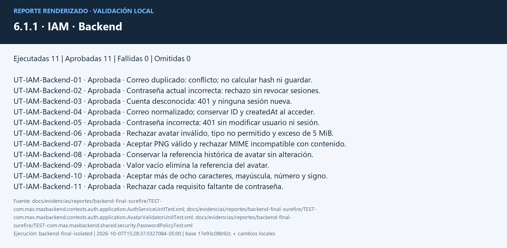
</p>

<p align="center"><em>Pruebas unitarias de Identidad y Acceso en el backend.</em></p>

#### 6.1.1.1.2. Mobile App — iOS

Si la entrega incluye una aplicación iOS, se documentarán las pruebas de sus modelos y componentes de autenticación. Las respuestas del servicio remoto se simularán para verificar el comportamiento del cliente de forma aislada.

| Test ID | Unidad o responsabilidad | Caso propuesto | Resultado esperado |
|---|---|---|---|
| UT-IAM-IOS-01 | Validación del formulario | Evaluar credenciales incompletas. | El estado del formulario identifica los campos inválidos. |
| UT-IAM-IOS-02 | Estado de autenticación | Simular una respuesta de autenticación rechazada. | El cliente conserva el estado no autenticado y comunica el error. |
| UT-IAM-IOS-03 | Estado de sesión | Ejecutar el cierre de sesión con almacenamiento de prueba. | Elimina los datos de sesión administrados por el cliente. |

<!-- ALCANCE POR CONFIRMAR: conservar esta sección únicamente si MAX incluye una aplicación iOS.
COMPLETAR: tecnología, framework de pruebas y rutas reales. -->

<!-- IMAGEN: resultados de las pruebas unitarias de IAM en iOS. -->

<p align="center">
  
</p>

<p align="center"><em>Pruebas unitarias de Identidad y Acceso en iOS.</em></p>

#### 6.1.1.1.3. Mobile App — Android

En Android se evaluarán los componentes responsables de validar el registro, procesar las respuestas de autenticación y administrar el estado de sesión. Estas verificaciones utilizarán datos controlados y servicios simulados.

| Test ID | Unidad o responsabilidad | Caso propuesto | Resultado esperado |
|---|---|---|---|
| UT-IAM-AND-01 | Validación del registro | Evaluar contraseñas y confirmaciones diferentes. | El formulario identifica la diferencia e impide considerar válido el registro. |
| UT-IAM-AND-02 | Estado de autenticación | Simular credenciales rechazadas por el servicio. | Se mantiene el estado no autenticado y se expone el mensaje correspondiente. |
| UT-IAM-AND-03 | Estado de sesión | Ejecutar el cierre de sesión. | Se elimina el estado local asociado con el usuario autenticado. |

<!-- COMPLETAR: tecnología real, framework de pruebas, archivos y unidades evaluadas. -->

<!-- IMAGEN: resultados de las pruebas unitarias de IAM en Android. -->

<p align="center">
  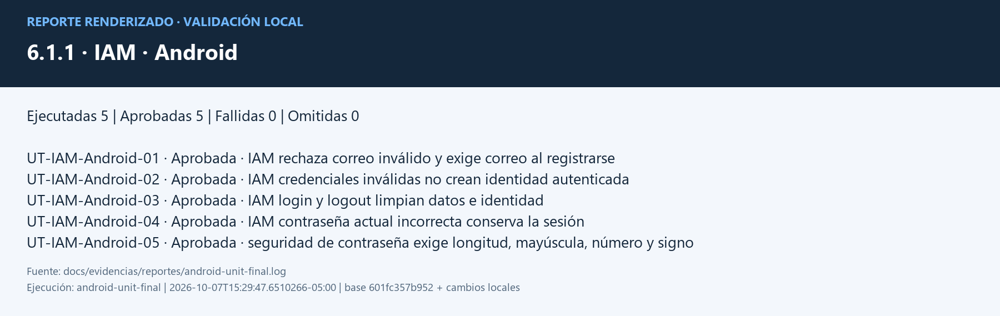
</p>

<p align="center"><em>Pruebas unitarias de Identidad y Acceso en Android.</em></p>

#### 6.1.1.1.4. Frontend Web

Las pruebas del frontend web verificarán los validadores y los componentes que administran el estado de autenticación. El servicio de acceso remoto se sustituirá para controlar sus respuestas.

| Test ID | Unidad o responsabilidad | Caso propuesto | Resultado esperado |
|---|---|---|---|
| UT-IAM-WEB-01 | Validador de registro | Evaluar un correo con formato inválido. | Identifica el correo como inválido. |
| UT-IAM-WEB-02 | Estado de autenticación | Simular una respuesta satisfactoria del servicio. | Actualiza el estado de la aplicación con los datos de sesión previstos. |
| UT-IAM-WEB-03 | Gestión de errores | Simular una respuesta de autenticación fallida. | Mantiene el estado no autenticado y presenta la información del error. |

<!-- COMPLETAR: framework web, herramienta de pruebas y rutas de archivos. -->

<!-- IMAGEN: resultados de las pruebas unitarias de IAM en el frontend web. -->

<p align="center">
  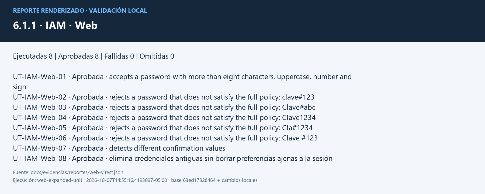
</p>

<p align="center"><em>Pruebas unitarias de Identidad y Acceso en el frontend web.</em></p>

#### 6.1.1.1.5. Resumen agregado — IAM

El resumen consolidará los resultados reales de cada plataforma. Las cifras deberán obtenerse de los reportes de ejecución y corresponder a una versión identificada.

| Plataforma | Ejecutadas | Aprobadas | Fallidas | Omitidas | Evidencia |
|---|---:|---:|---:|---:|---|
| Backend | — | — | — | — | Pendiente |
| iOS, si corresponde | — | — | — | — | Pendiente de confirmar alcance |
| Android | — | — | — | — | Pendiente |
| Frontend web | — | — | — | — | Pendiente |
| **Total** | **—** | **—** | **—** | **—** | **Por consolidar** |

El símbolo «—» representa información todavía no documentada, no un resultado igual a cero.

### 6.1.1.2. Gestión de Pacientes — Patients

Esta agrupación aborda las reglas y componentes utilizados para registrar, consultar, buscar y actualizar información de los pacientes. Los casos se relacionan principalmente con las historias US-06 a US-11 y la historia técnica TS-03.

#### 6.1.1.2.1. Backend

Las pruebas del backend evaluarán la creación y modificación de los datos del paciente. Cuando intervengan consultas a repositorios, se utilizarán respuestas simuladas para mantener el aislamiento.

| Test ID | Unidad o responsabilidad | Caso propuesto | Resultado esperado |
|---|---|---|---|
| UT-PAT-BE-01 | Entidad o validador de paciente | Crear un paciente con datos válidos. | Conserva correctamente los valores proporcionados. |
| UT-PAT-BE-02 | Actualización de paciente | Modificar los campos permitidos de un registro existente. | Actualiza los valores y conserva su identificador. |
| UT-PAT-BE-03 | Servicio de consulta | Simular una consulta de un identificador inexistente. | Devuelve el resultado de ausencia o el error definido por el contrato. |

<!-- COMPLETAR: framework, archivos, clases y reglas específicas implementadas. -->

<!-- IMAGEN: resultados de pruebas unitarias de Pacientes en el backend. -->

<p align="center">
  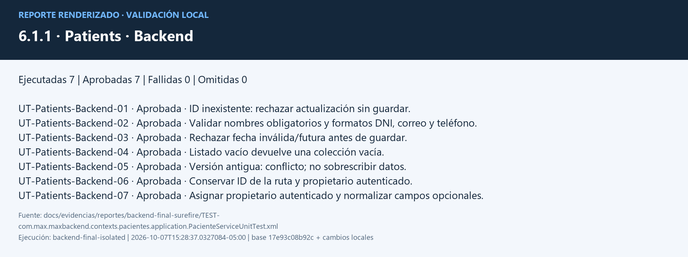
</p>

<p align="center"><em>Pruebas unitarias de Gestión de Pacientes en el backend.</em></p>

#### 6.1.1.2.2. Mobile App — iOS

Si existe una aplicación iOS en el alcance de la entrega, se comprobará la transformación de los datos de pacientes y el manejo de estados de los componentes correspondientes.

| Test ID | Unidad o responsabilidad | Caso propuesto | Resultado esperado |
|---|---|---|---|
| UT-PAT-IOS-01 | Transformación de datos | Convertir una respuesta de paciente en el modelo del cliente. | Mantiene correctamente los campos y el identificador. |
| UT-PAT-IOS-02 | Estado del listado | Simular una respuesta sin pacientes. | Representa un listado vacío sin generar un error de procesamiento. |
| UT-PAT-IOS-03 | Estado de edición | Simular una respuesta satisfactoria de actualización. | Actualiza el paciente correspondiente dentro del estado local. |

<!-- ALCANCE POR CONFIRMAR: conservar únicamente si existe una aplicación iOS.
COMPLETAR: tecnología, herramienta de pruebas y archivos. -->

<!-- IMAGEN: resultados de pruebas unitarias de Pacientes en iOS. -->

<p align="center">
  
</p>

<p align="center"><em>Pruebas unitarias de Gestión de Pacientes en iOS.</em></p>

#### 6.1.1.2.3. Mobile App — Android

En Android se revisará el procesamiento de datos del formulario, los criterios enviados al servicio de búsqueda y la representación de respuestas vacías o fallidas.

| Test ID | Unidad o responsabilidad | Caso propuesto | Resultado esperado |
|---|---|---|---|
| UT-PAT-AND-01 | Estado del formulario | Evaluar campos obligatorios incompletos. | Identifica los errores de validación. |
| UT-PAT-AND-02 | Construcción de búsqueda | Proporcionar un criterio de nombre o DNI. | Construye los parámetros previstos para consultar al servicio. |
| UT-PAT-AND-03 | Estado del listado | Simular una búsqueda sin coincidencias. | Expone el estado sin resultados. |

<!-- COMPLETAR: herramienta de pruebas, unidades evaluadas y rutas reales. -->

<!-- IMAGEN: resultados de pruebas unitarias de Pacientes en Android. -->

<p align="center">
  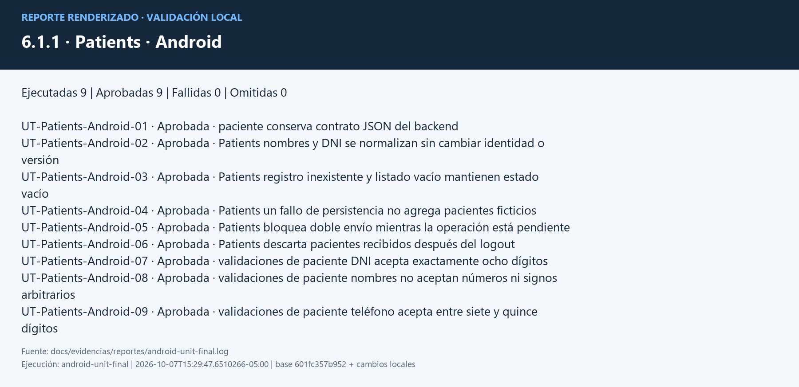
</p>

<p align="center"><em>Pruebas unitarias de Gestión de Pacientes en Android.</em></p>

#### 6.1.1.2.4. Frontend Web

Las pruebas web verificarán el procesamiento de datos del paciente, la validación de formularios y la actualización del estado local después de operaciones simuladas.

| Test ID | Unidad o responsabilidad | Caso propuesto | Resultado esperado |
|---|---|---|---|
| UT-PAT-WEB-01 | Transformación de datos | Procesar una respuesta del listado de pacientes. | Conserva los datos requeridos para representar cada registro. |
| UT-PAT-WEB-02 | Validación del formulario | Evaluar datos incompletos antes de guardar. | Identifica los campos inválidos. |
| UT-PAT-WEB-03 | Estado de edición | Simular una actualización satisfactoria. | Modifica únicamente el registro correspondiente en el estado local. |

<!-- COMPLETAR: framework, herramientas y archivos de pruebas. -->

<!-- IMAGEN: resultados de pruebas unitarias de Pacientes en el frontend web. -->

<p align="center">
  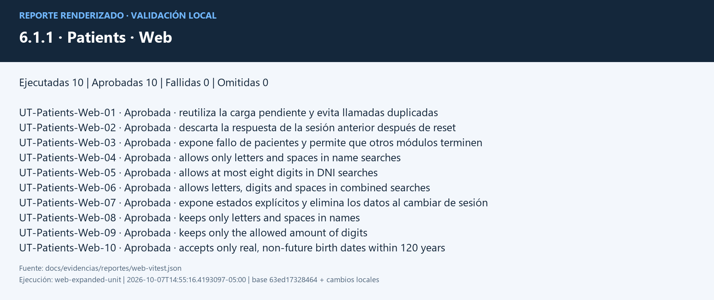
</p>

<p align="center"><em>Pruebas unitarias de Gestión de Pacientes en el frontend web.</em></p>

#### 6.1.1.2.5. Resumen agregado — Patients

| Plataforma | Ejecutadas | Aprobadas | Fallidas | Omitidas | Evidencia |
|---|---:|---:|---:|---:|---|
| Backend | — | — | — | — | Pendiente |
| iOS, si corresponde | — | — | — | — | Pendiente de confirmar alcance |
| Android | — | — | — | — | Pendiente |
| Frontend web | — | — | — | — | Pendiente |
| **Total** | **—** | **—** | **—** | **—** | **Por consolidar** |

El resumen deberá incluir la versión evaluada y las incidencias detectadas, cuando existan.

### 6.1.1.3. Gestión de Placas y Estudios — Studies

Esta agrupación comprende las validaciones y los componentes utilizados para asociar archivos con pacientes, consultar estudios y representar sus formatos. Se relaciona principalmente con las historias US-12 a US-15 y las historias técnicas TS-04 y TS-05.

#### 6.1.1.3.1. Backend

Las pruebas del backend evaluarán las reglas de asociación y validación de los estudios. El almacenamiento externo se sustituirá cuando sea necesario para evitar que una prueba unitaria dependa de la infraestructura.

| Test ID | Unidad o responsabilidad | Caso propuesto | Resultado esperado |
|---|---|---|---|
| UT-STU-BE-01 | Validador de estudio | Evaluar un estudio sin referencia al paciente. | Rechaza la ausencia de la asociación requerida. |
| UT-STU-BE-02 | Validador de archivos | Evaluar formatos permitidos y no permitidos. | Acepta únicamente los formatos definidos por la aplicación. |
| UT-STU-BE-03 | Registro de estudio | Simular una carga satisfactoria del archivo. | Conserva la referencia devuelta por el almacenamiento y su asociación con el paciente. |

<!-- COMPLETAR: framework, unidades evaluadas, formatos admitidos y rutas reales. -->

<!-- IMAGEN: resultados de pruebas unitarias de Estudios en el backend. -->

<p align="center">
  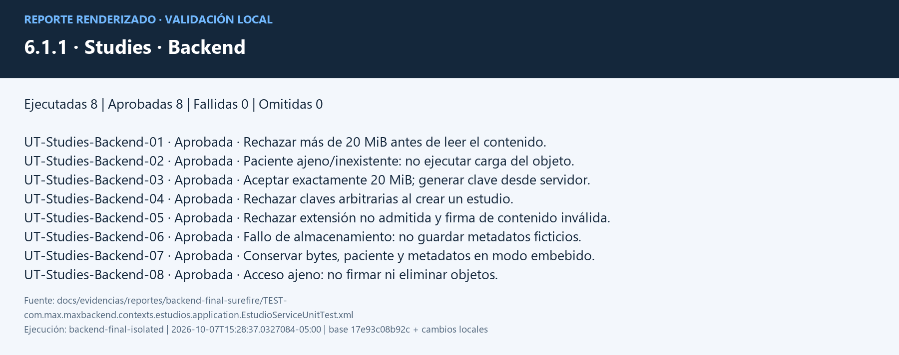
</p>

<p align="center"><em>Pruebas unitarias de Gestión de Estudios en el backend.</em></p>

#### 6.1.1.3.2. Mobile App — iOS

Si la entrega incluye una aplicación iOS, se evaluarán los modelos de estudios y el procesamiento de respuestas de registro o consulta.

| Test ID | Unidad o responsabilidad | Caso propuesto | Resultado esperado |
|---|---|---|---|
| UT-STU-IOS-01 | Transformación de datos | Procesar la respuesta de un estudio. | Conserva su identificador, paciente asociado y referencia de archivo. |
| UT-STU-IOS-02 | Estado de carga | Simular una carga rechazada. | Expone el error sin representar el estudio como registrado. |
| UT-STU-IOS-03 | Representación del formato | Proporcionar un tipo de documento reconocido. | Obtiene la etiqueta correspondiente al formato. |

<!-- ALCANCE POR CONFIRMAR: conservar únicamente si existe una aplicación iOS.
COMPLETAR: tecnología, herramienta de pruebas y rutas. -->

<!-- IMAGEN: resultados de pruebas unitarias de Estudios en iOS. -->

<p align="center">
  
</p>

<p align="center"><em>Pruebas unitarias de Gestión de Estudios en iOS.</em></p>

#### 6.1.1.3.3. Mobile App — Android

En Android se comprobarán los estados de registro, búsqueda y presentación de estudios mediante respuestas simuladas del servicio.

| Test ID | Unidad o responsabilidad | Caso propuesto | Resultado esperado |
|---|---|---|---|
| UT-STU-AND-01 | Estado de registro | Evaluar una solicitud sin paciente seleccionado. | Identifica la asociación pendiente. |
| UT-STU-AND-02 | Construcción de búsqueda | Proporcionar los filtros disponibles de estudio. | Genera los parámetros previstos por el contrato del servicio. |
| UT-STU-AND-03 | Estado de carga | Simular una operación fallida. | Expone el error y no agrega un registro inexistente al listado. |

<!-- COMPLETAR: framework, componentes evaluados y archivos de pruebas. -->

<!-- IMAGEN: resultados de pruebas unitarias de Estudios en Android. -->

<p align="center">
  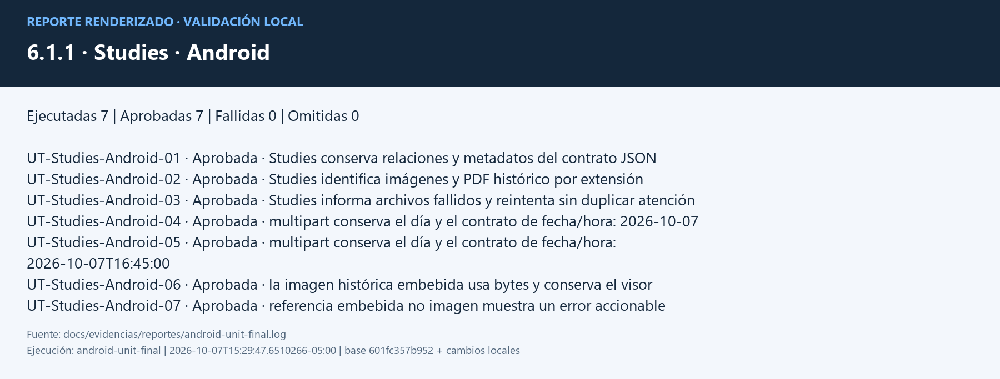
</p>

<p align="center"><em>Pruebas unitarias de Gestión de Estudios en Android.</em></p>

#### 6.1.1.3.4. Frontend Web

Las pruebas web se enfocarán en la transformación de datos, la validación previa al envío y la representación del resultado de las operaciones.

| Test ID | Unidad o responsabilidad | Caso propuesto | Resultado esperado |
|---|---|---|---|
| UT-STU-WEB-01 | Transformación de datos | Procesar un estudio asociado con un paciente. | Conserva correctamente las referencias necesarias para su representación. |
| UT-STU-WEB-02 | Validación del formulario | Evaluar el registro sin archivo o paciente requerido. | Identifica los datos faltantes. |
| UT-STU-WEB-03 | Estado de registro | Simular una respuesta satisfactoria. | Incorpora el estudio devuelto por el servicio al estado correspondiente. |

Las validaciones del cliente complementan las del backend. Su aprobación no acredita que el servidor aplique los mismos controles.

<!-- COMPLETAR: framework web, herramienta de pruebas y archivos. -->

<!-- IMAGEN: resultados de pruebas unitarias de Estudios en el frontend web. -->

<p align="center">
  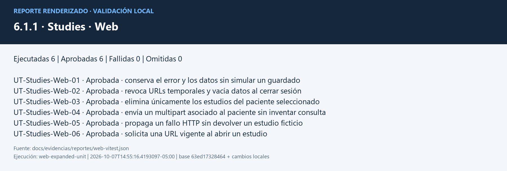
</p>

<p align="center"><em>Pruebas unitarias de Gestión de Estudios en el frontend web.</em></p>

#### 6.1.1.3.5. Resumen agregado — Studies

| Plataforma | Ejecutadas | Aprobadas | Fallidas | Omitidas | Evidencia |
|---|---:|---:|---:|---:|---|
| Backend | — | — | — | — | Pendiente |
| iOS, si corresponde | — | — | — | — | Pendiente de confirmar alcance |
| Android | — | — | — | — | Pendiente |
| Frontend web | — | — | — | — | Pendiente |
| **Total** | **—** | **—** | **—** | **—** | **Por consolidar** |

Los resultados deberán indicar qué operaciones de almacenamiento se simularon y cuáles fueron evaluadas posteriormente mediante integración.

## 6.1.2. Core Integration Tests

Las pruebas de integración comprobarán la interacción entre los clientes, la API, la lógica de aplicación, la persistencia y el almacenamiento de archivos.

Cada suite deberá especificar sus límites: componentes reales, dependencias sustituidas y entorno de ejecución. Esta información permitirá determinar qué interacciones han sido verificadas.

### 6.1.2.1. Identidad y Acceso — IAM

| Test ID | Componentes integrados | Escenario | Resultado esperado |
|---|---|---|---|
| IT-IAM-01 | API de registro y persistencia | Registrar una cuenta válida. | La cuenta queda almacenada con los datos previstos y sin guardar la contraseña en texto plano. |
| IT-IAM-02 | API de autenticación y persistencia | Iniciar sesión con una cuenta registrada. | Se obtiene una respuesta de autenticación válida según el contrato. |
| IT-IAM-03 | Cliente, API y control de acceso | Solicitar información protegida sin autenticación válida. | La solicitud es rechazada y no se devuelve información protegida. |

<!-- IMAGEN: resultados reales de las pruebas de integración de IAM. -->

<p align="center">
  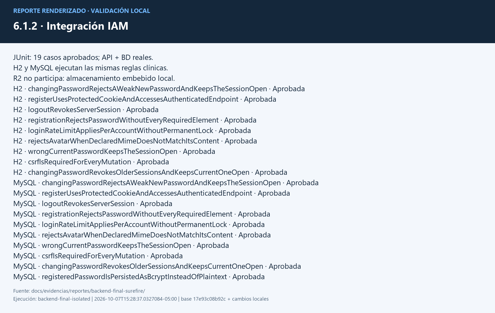
</p>

<p align="center"><em>Pruebas de integración de Identidad y Acceso.</em></p>

### 6.1.2.2. Gestión de Pacientes — Patients

| Test ID | Componentes integrados | Escenario | Resultado esperado |
|---|---|---|---|
| IT-PAT-01 | Cliente, API y persistencia | Registrar un paciente y consultarlo posteriormente. | La información recuperada corresponde al registro creado. |
| IT-PAT-02 | API, búsqueda y persistencia | Buscar mediante un nombre o DNI registrado. | La respuesta contiene los registros que cumplen el criterio. |
| IT-PAT-03 | API de actualización y persistencia | Modificar un paciente y realizar una nueva consulta. | Los cambios se encuentran almacenados. |
| IT-PAT-04 | API y persistencia | Solicitar un identificador inexistente. | Se devuelve la respuesta de ausencia definida por el contrato. |

<!-- IMAGEN: resultados reales de las pruebas de integración de Pacientes. -->

<p align="center">
  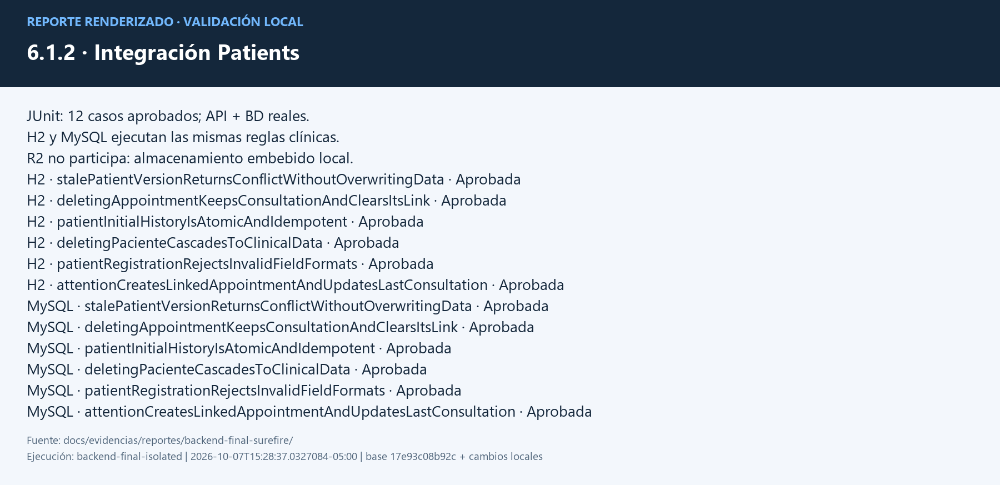
</p>

<p align="center"><em>Pruebas de integración de Gestión de Pacientes.</em></p>

### 6.1.2.3. Gestión de Placas y Estudios — Studies

| Test ID | Componentes integrados | Escenario | Resultado esperado |
|---|---|---|---|
| IT-STU-01 | API, persistencia y almacenamiento | Registrar un estudio con un archivo permitido. | El archivo y sus metadatos quedan asociados con el paciente correcto. |
| IT-STU-02 | API, validación y almacenamiento | Enviar un formato no permitido. | La solicitud es rechazada sin registrar un estudio válido. |
| IT-STU-03 | API y consulta de pacientes | Registrar un estudio para un paciente inexistente. | La operación rechaza la asociación inválida. |
| IT-STU-04 | Cliente, API y almacenamiento | Recuperar el archivo de un estudio registrado. | Se obtiene el archivo correspondiente al estudio solicitado. |

Las pruebas deberán contemplar la consistencia entre el archivo almacenado y sus metadatos. Si una operación falla, se verificará el comportamiento previsto para evitar registros incompletos o archivos huérfanos.

<!-- IMAGEN: resultados reales de las pruebas de integración de Estudios. -->

<p align="center">
  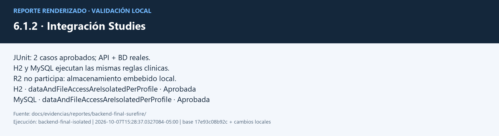
</p>

<p align="center"><em>Pruebas de integración de Gestión de Estudios.</em></p>

### 6.1.2.4. Comandos de ejecución

Los comandos deberán obtenerse de la configuración real de cada repositorio. Se registrarán junto con sus requisitos previos para permitir que otro integrante reproduzca las ejecuciones.

| Componente | Directorio | Comando | Requisitos previos |
|---|---|---|---|
| Backend | Por completar | Por completar | Entorno de pruebas y dependencias requeridas. |
| Frontend web | Por completar | Por completar | Configuración de conexión con el entorno de pruebas. |
| Android | Por completar | Por completar | Dispositivo o emulador, cuando corresponda. |
| iOS, si corresponde | Por completar | Por completar | Entorno y dispositivo o simulador requerido. |

<!-- INSERTAR: comandos reales en bloques de código.
No copiar los comandos del proyecto de ejemplo sin comprobar su compatibilidad con MAX. -->

### 6.1.2.5. Evidencia de ejecución

Las evidencias deberán mostrar el comando utilizado, el entorno y el resumen de resultados. Cada reporte se asociará con la versión del código evaluada.

| Ejecución | Componente | Commit o versión | Fecha | Resultado | Reporte |
|---|---|---|---|---|---|
| Por completar | Backend | — | — | Pendiente | — |
| Por completar | Frontend web | — | — | Pendiente | — |
| Por completar | Android | — | — | Pendiente | — |
| Si corresponde | iOS | — | — | Pendiente | — |

<!-- IMAGEN: ejecución real de las pruebas de integración del backend. -->

<p align="center">
  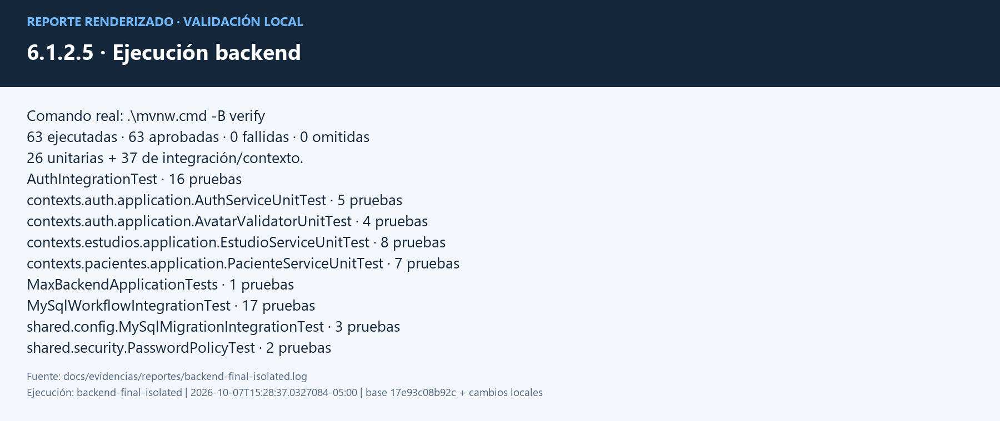
</p>

<!-- IMAGEN: ejecución real de las pruebas de integración del cliente web.
Añadir evidencias móviles equivalentes si forman parte de la suite. -->

<p align="center">
  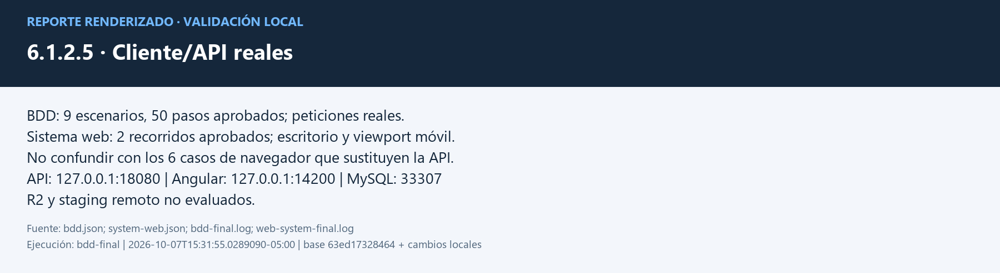
</p>

## 6.1.3. Core Behavior-Driven Development

Los escenarios BDD describirán el comportamiento esperado de MAX desde la perspectiva del médico. Se vincularán con las historias de usuario y se redactarán mediante la estructura Given–When–Then.

Los archivos de características expresarán las condiciones verificables del negocio. Las definiciones de pasos conectarán estas condiciones con las acciones y comprobaciones automatizadas.

Los escenarios siguientes son propuestas para su implementación. Sus nombres de archivo también deberán ajustarse al repositorio real.

### 6.1.3.1. Identidad y Acceso — IAM

Los escenarios de esta agrupación verificarán que el profesional puede acceder con credenciales válidas y que el sistema rechaza los intentos de autenticación incorrectos.

**Feature file propuesto: `iam.feature`**

```gherkin
@iam @US01
Feature: Medical account authentication
  As a physician
  I want to sign in to MAX
  So that I can access my workspace

  Scenario: Sign in with valid credentials
    Given a registered physician account exists
    When the physician signs in with valid credentials
    Then access to the workspace is granted

  Scenario: Reject invalid credentials
    Given a registered physician account exists
    When the physician signs in with an incorrect password
    Then access to the workspace is denied
    And an authentication error is displayed
```

**Definición de pasos**

| Paso | Responsabilidad de la automatización |
|---|---|
| Given | Preparar una cuenta de prueba conocida. |
| When | Ejecutar el intento de autenticación con las credenciales del escenario. |
| Then | Comprobar el resultado observable y el estado de autenticación. |

<!-- CÓDIGO: insertar una definición de pasos real.
COMPLETAR: herramienta, ruta del archivo y mecanismo de preparación de datos. -->

**Evidencia de ejecución**

<!-- IMAGEN: reporte de los escenarios BDD de IAM. -->

<p align="center">
  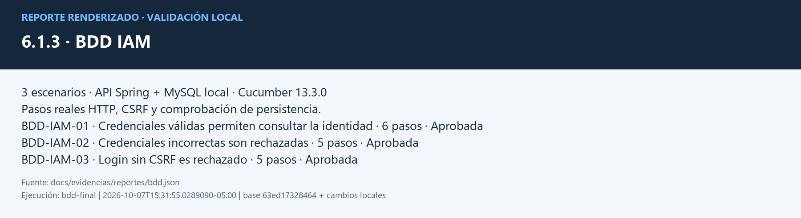
</p>

<p align="center"><em>Ejecución de escenarios BDD de Identidad y Acceso.</em></p>

### 6.1.3.2. Gestión de Pacientes — Patients

Los escenarios comprobarán el registro y la localización de pacientes. Su finalidad será verificar que el médico puede incorporar un expediente y recuperarlo mediante los criterios disponibles.

**Feature file propuesto: `patients.feature`**

```gherkin
@patients
Feature: Patient management
  As an authenticated physician
  I want to register and find patients
  So that I can organize their information

  @US06
  Scenario: Register a patient
    Given the physician is authenticated
    And valid patient information is available
    When the physician registers the patient
    Then the patient record is created
    And its information can be consulted

  @US08
  Scenario: Find a patient by document number
    Given the physician is authenticated
    And a patient with a known document number exists
    When the physician searches using that document number
    Then the matching patient is returned
```

**Definición de pasos**

| Paso | Responsabilidad de la automatización |
|---|---|
| Given | Preparar la sesión y los datos necesarios del paciente. |
| When | Ejecutar el registro o la búsqueda prevista. |
| Then | Comprobar la creación del expediente o la correspondencia del resultado. |

Los datos creados durante las pruebas deberán identificarse y limpiarse mediante el procedimiento definido para el entorno.

<!-- CÓDIGO: insertar una definición de pasos real de Pacientes.
COMPLETAR: herramienta, rutas y procedimiento de limpieza. -->

**Evidencia de ejecución**

<!-- IMAGEN: reporte de los escenarios BDD de Pacientes. -->

<p align="center">
  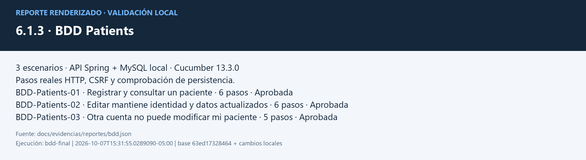
</p>

<p align="center"><em>Ejecución de escenarios BDD de Gestión de Pacientes.</em></p>

### 6.1.3.3. Gestión de Placas y Estudios — Studies

Los escenarios verificarán la asociación de archivos con pacientes y el rechazo de formatos no admitidos. Estas condiciones permiten comprobar que el sistema mantiene organizada la documentación médica.

**Feature file propuesto: `studies.feature`**

```gherkin
@studies
Feature: Medical study management
  As an authenticated physician
  I want to attach medical files to patients
  So that I can consult their studies

  @US12
  Scenario: Attach an allowed file
    Given the physician is authenticated
    And a registered patient exists
    And an allowed medical file is available
    When the physician registers the study for that patient
    Then the study is associated with the patient
    And the attached file can be retrieved

  @TS05
  Scenario: Reject an unsupported file
    Given the physician is authenticated
    And a registered patient exists
    When the physician submits an unsupported file
    Then the upload is rejected
    And no valid study is created from that submission
```

**Definición de pasos**

| Paso | Responsabilidad de la automatización |
|---|---|
| Given | Preparar la sesión, el paciente y los archivos de prueba. |
| When | Ejecutar el registro del estudio con el archivo seleccionado. |
| Then | Comprobar su asociación y recuperación, o el rechazo correspondiente. |

<!-- CÓDIGO: insertar una definición de pasos real de Estudios.
COMPLETAR: herramienta, rutas y archivos de prueba utilizados. -->

**Evidencia de ejecución**

<!-- IMAGEN: reporte de los escenarios BDD de Estudios. -->

<p align="center">
  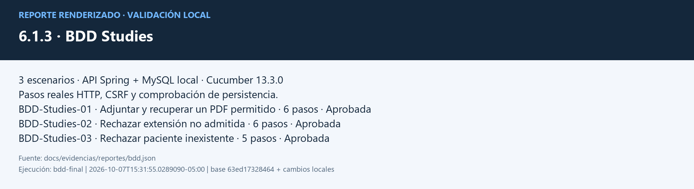
</p>

<p align="center"><em>Ejecución de escenarios BDD de Gestión de Estudios.</em></p>

### 6.1.3.4. Trazabilidad de pruebas

La matriz de trazabilidad relacionará los escenarios con las historias de usuario y sus evidencias. Esto permitirá identificar qué comportamientos cuentan con automatización y cuáles requieren trabajo adicional.

| Historia | Comportamiento propuesto | Archivo propuesto | Estado de evidencia |
|---|---|---|---|
| US-01 | Acceso con credenciales válidas. | `iam.feature` | Pendiente |
| US-01 | Rechazo de credenciales incorrectas. | `iam.feature` | Pendiente |
| US-06 | Registro de un paciente. | `patients.feature` | Pendiente |
| US-08 | Búsqueda por número de documento. | `patients.feature` | Pendiente |
| US-12 | Registro de un estudio con archivo permitido. | `studies.feature` | Pendiente |
| TS-05 | Rechazo de un archivo no admitido. | `studies.feature` | Pendiente |

La matriz se ampliará conforme se implementen escenarios adicionales. Estos casos iniciales no representan la cobertura total del backlog.

## 6.1.4. Core System Tests

Las pruebas de sistema evaluarán recorridos completos de MAX desde sus interfaces. A diferencia de las pruebas unitarias, comprobarán la interacción de la aplicación con los servicios necesarios para completar las tareas del usuario.

Se registrarán la plataforma, la versión, el entorno, los pasos realizados, los resultados y las incidencias encontradas.

### 6.1.4.1. Aplicación Web

Las pruebas web verificarán los recorridos principales de autenticación, gestión de pacientes y consulta de estudios.

| Test ID | Recorrido | Resultado esperado |
|---|---|---|
| SYS-WEB-01 | Iniciar sesión con una cuenta válida. | Se accede al panel principal. |
| SYS-WEB-02 | Registrar un paciente y abrir su detalle. | Se presenta la información ingresada. |
| SYS-WEB-03 | Buscar un paciente por nombre o DNI. | Se muestran los registros correspondientes. |
| SYS-WEB-04 | Editar un paciente y volver a consultar sus datos. | Los cambios permanecen almacenados. |
| SYS-WEB-05 | Adjuntar un estudio y abrir su archivo. | El documento corresponde al estudio y paciente seleccionados. |
| SYS-WEB-06 | Cerrar sesión e intentar acceder a una sección protegida. | Se requiere una nueva autenticación. |

**Datos de ejecución por completar:** herramienta, navegador, versión, sistema operativo, URL del entorno y commit evaluado.

<!-- IMAGEN: reporte real de pruebas de sistema web. -->

<p align="center">
  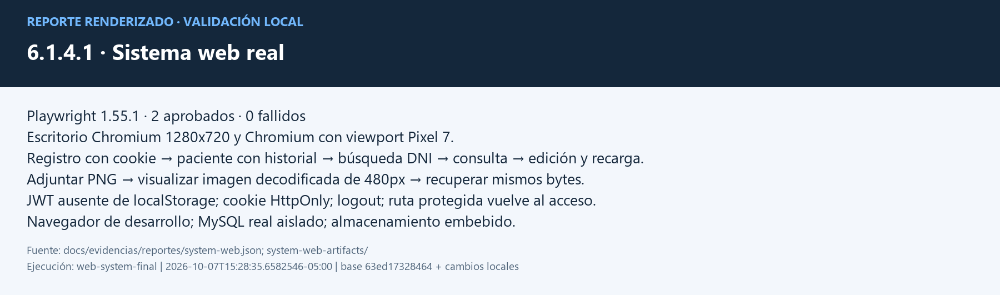
</p>

<!-- IMAGEN: recorrido web completo con pasos identificados. -->

<p align="center">
  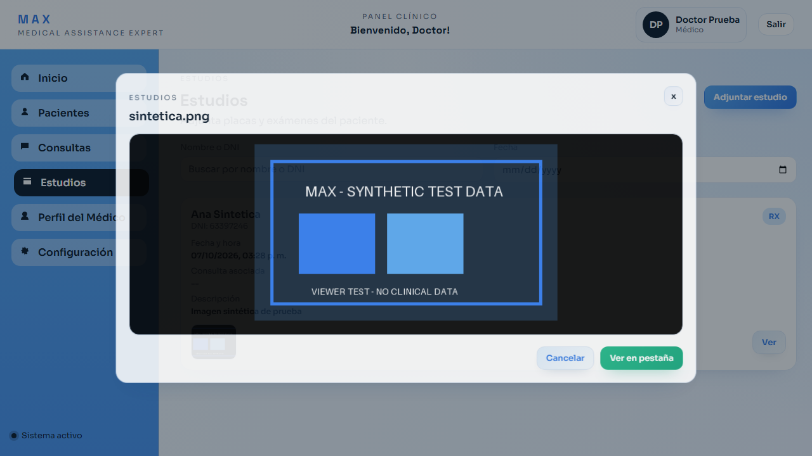
</p>

### 6.1.4.2. Aplicación Móvil — Android

Las pruebas Android verificarán las funciones disponibles en el dispositivo y la comunicación con el backend. Se considerarán formularios, navegación, estados vacíos y manejo de errores.

| Test ID | Recorrido | Resultado esperado |
|---|---|---|
| SYS-AND-01 | Registrar una cuenta e iniciar sesión. | Se accede a la aplicación con las credenciales registradas. |
| SYS-AND-02 | Registrar un paciente desde el formulario móvil. | El registro puede consultarse posteriormente. |
| SYS-AND-03 | Buscar un paciente mediante los filtros disponibles. | Los resultados corresponden al criterio ingresado. |
| SYS-AND-04 | Acceder a Estudios sin pacientes registrados. | Se informa la necesidad de registrar un paciente. |
| SYS-AND-05 | Navegar entre Inicio, Pacientes, Consultas y Estudios. | Cada sección se abre y presenta el estado correspondiente. |
| SYS-AND-06 | Interrumpir la conexión durante una operación que utiliza la API. | Se comunica el problema sin mostrar como completada una operación fallida. |

**Datos de ejecución por completar:** herramienta, dispositivo o emulador, versión de Android, versión de la aplicación y entorno del backend.

<!-- IMAGEN: reporte de pruebas de sistema Android. -->

<p align="center">
  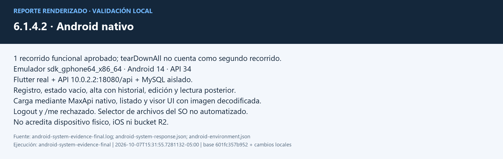
</p>

<!-- IMAGEN: secuencia de capturas del recorrido móvil evaluado. -->

<p align="center">
  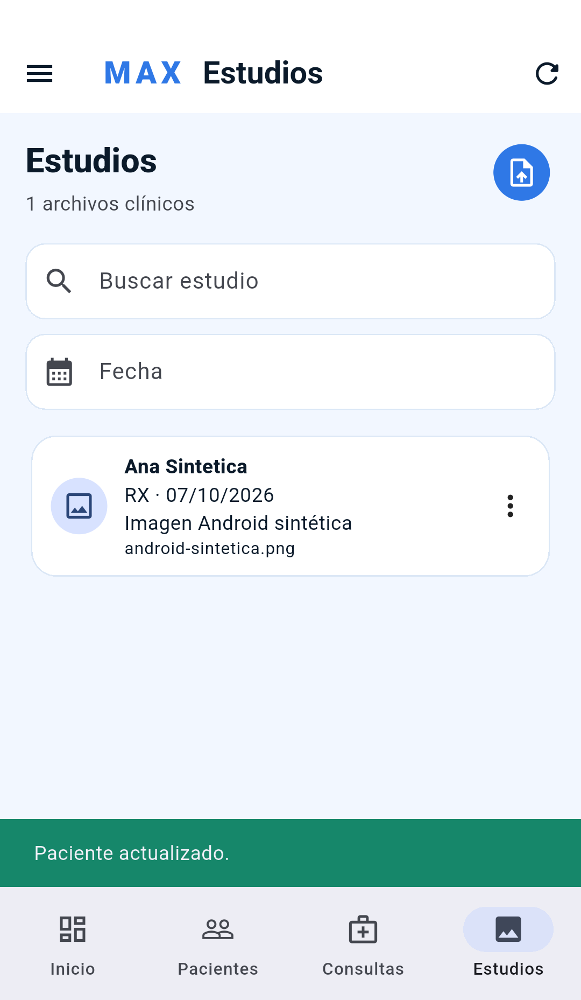
</p>

### 6.1.4.3. Aplicación Móvil — iOS

Este apartado se completará si MAX incluye una aplicación iOS en la entrega. Se documentarán únicamente los recorridos disponibles en dicha implementación y las pruebas efectivamente realizadas.

| Test ID | Recorrido propuesto | Resultado esperado |
|---|---|---|
| SYS-IOS-01 | Iniciar sesión con una cuenta válida. | Se permite acceder a las funciones protegidas. |
| SYS-IOS-02 | Registrar y consultar un paciente. | La información queda disponible en las vistas correspondientes. |
| SYS-IOS-03 | Consultar un estudio y abrir su archivo. | Se presenta el documento asociado al registro seleccionado. |

**Datos de ejecución por completar:** alcance funcional, tecnología, herramienta de pruebas, dispositivo o simulador, versión de iOS y aplicación evaluada.

<!-- ALCANCE POR CONFIRMAR: conservar esta sección solo si la aplicación iOS forma parte de la entrega. -->

<!-- IMAGEN: reporte real de pruebas de sistema iOS. -->

<p align="center">
  
</p>
