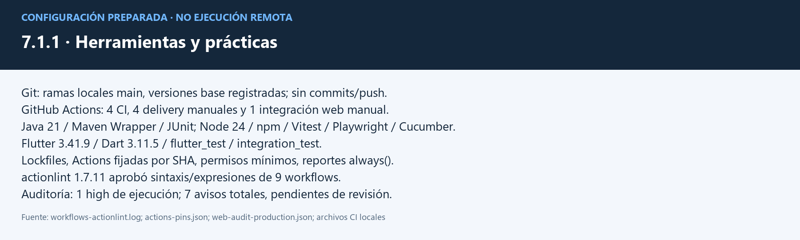
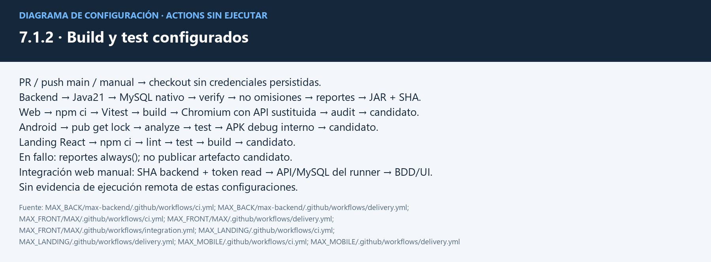
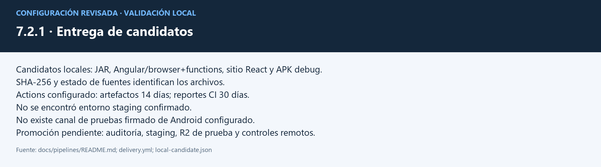
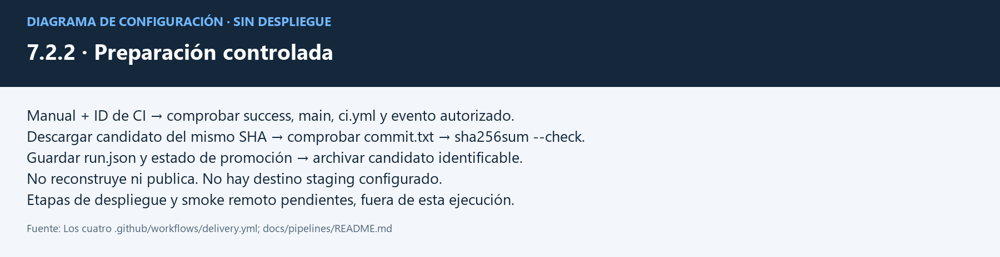
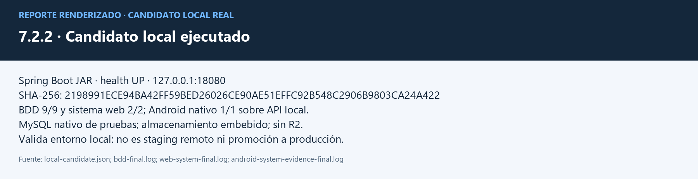
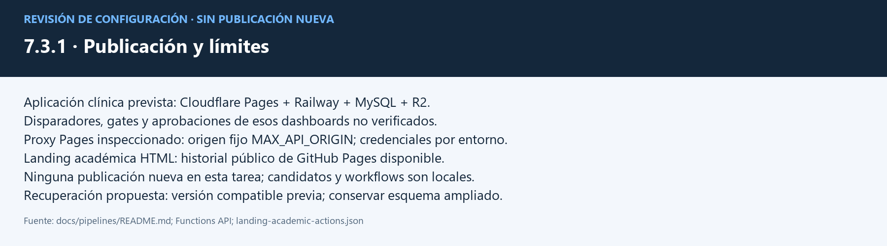
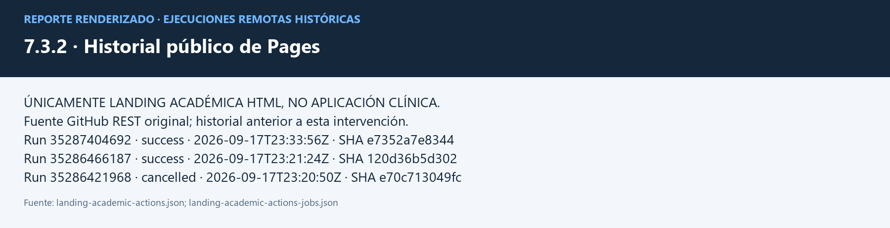
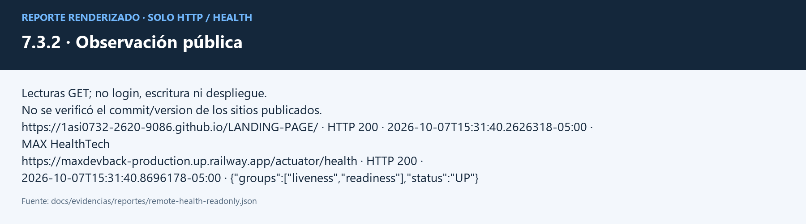

# Capítulo VII: DevOps Practices

## 7.1. Continuous Integration

La integración continua de MAX se documenta mediante configuraciones locales de construcción y pruebas para los cuatro proyectos. Se verificaron comandos locales y la sintaxis de los workflows. La ejecución de esos workflows en GitHub Actions todavía no está acreditada; por ello se distingue entre configuración preparada y automatización remota ejecutada.

### 7.1.1. Tools and Practices

| Categoría | Herramienta/version | Uso concreto | Evidencia |
|---|---|---|---|
| Versionado | Git; cuatro repositorios locales en main | SHA base + cambios locales; sin publicación | `source-state-final.json`, `changed-files.json` |
| Automatización | GitHub Actions, configuración nueva local | PR/push main/manual; reportes always; candidatos condicionados | Nueve YAML bajo `.github/workflows/` |
| Construcción backend | Java 21, Maven 3.9.12 Wrapper, Boot 4.0.8 | `verify`, JAR ejecutable | `backend-final-isolated.log` |
| Construcción web | Node 24.13.1, npm 10.9.3 configurado, Angular CLI 21.2.24 | Lockfile, bundle/browser y proxy | `web-build.log` |
| Construcción Android | Flutter 3.41.9/Java21/Gradle del proyecto | Analyze, unidades, APK debug interno | `android-analysis-final.log`, `android-build-internal.log` |
| Pruebas | JUnit6/Mockito5; Vitest4; Playwright1.55; Cucumber13; flutter_test | Unidades e integración locales reales según cada suite | XML/JSON/logs originales |
| Análisis de workflows | actionlint 1.7.11, binario oficial con checksum comprobado | Sintaxis y expresiones GitHub; shellcheck/pyflakes desactivados por no estar instalados | `workflows-actionlint.log/json` |
| Reportes | Surefire, JSON/HTML/eventos; Pillow para PNG | Preservar originales y renderizar tablas identificadas | `render_max_evidence.py`, PNG y fuentes |
| Artefactos | JAR, browser/functions, dist y APK debug | SHA-256 e identificación del código | `docs/evidencias/artefactos/manifest.json` |
| Dependencias | package-lock/pubspec.lock/Maven BOM | Instalar desde lock; registrar auditoría | `web-audit-*.json`, `web-audit-run.log` |

Las Actions se fijaron al SHA consultado de checkout v5, setup-node v6, setup-java v5, upload-artifact v4 y flutter-action v2. Fuentes y SHAs: `actions-pins.json`, [documentación de herramientas](docs/pipelines/README.md).

La auditoría detectó **7 avisos totales (5 high, 2 critical)** y **1 high en dependencias de ejecución**, Angular Router GHSA-ff3f-86qr-9cv3. El advisory se refiere a SSR; la aplicación inspeccionada es cliente Angular y no se demostró explotación. Revisar aplicabilidad y parches antes de promover; no se ejecutó `npm audit fix --force` ni se actualizaron dependencias fuera del objetivo de pruebas. El gate configurado de auditoría fallaría con este lockfile. [Advisory original](https://github.com/advisories/GHSA-ff3f-86qr-9cv3).

Ramas/PR: el trabajo siguió en main local, no se integró a remoto. Protección de rama, revisiones obligatorias y requerimientos de checks remotos **no verificados**. Configurar esos controles requiere acceso al repositorio; un YAML por sí solo no configura la protección de main.
<p align="center">
  
</p>

<p align="center"><em>Figura 25. Resumen de herramientas y configuración de CI revisadas localmente.</em></p>

### 7.1.2. Build & Test Suite Pipeline Components

| Workflow local | Eventos/jobs | Comprobaciones y artefactos | Estado |
|---|---|---|---|
| `MAX_BACK/max-backend/.github/workflows/ci.yml` | PR/push main/manual → verify | MySQL nativo del runner; Maven verify; guard de pruebas MySQL no omitidas; Surefire always; JAR+SHA | actionlint aprobado; comandos locales aprobados; Actions pendiente |
| `MAX_FRONT/MAX/.github/workflows/ci.yml` | PR/push main/manual → verify | npm ci, test:ci, build, Playwright con API sustituida, audit; browser+functions+SHA | actionlint aprobado; auditoría local fallida; Actions pendiente |
| `MAX_MOBILE/.github/workflows/ci.yml` | PR/push main/manual → verify | lock, analyze, flutter test JSON, APK debug interno+SHA; sin emulador remoto | actionlint/comandos locales aprobados; Actions pendiente |
| `MAX_LANDING/.github/workflows/ci.yml` | PR/push main/manual → verify | React local: npm ci/lint/test/build; sitio+SHA | actionlint/comandos locales aprobados; Actions pendiente |
| `MAX_FRONT/MAX/.github/workflows/integration.yml` | Solo manual; SHA backend | token de lectura limitado; checkout backend; verify; API/MySQL del runner; BDD/UI real; reportes always | actionlint aprobado; equivalente local aprobado; requiere secreto de acceso |

Los cuatro CI básicos tienen timeout, permisos `contents:read` y cancelación de ejecuciones supersedidas. Un comando fallido impide pasos posteriores de candidato; los reportes se suben incluso ante fallo. El workflow manual de integración conserva también logs backend y capturas UI. Los candidatos no contienen credenciales de producción. La shell local usó npm 11.8.0; packageManager y el CI preparado fijan npm 10.9.3. Las versiones originales constan en `reportes/tool-versions.json`. El build web pasó con tres avisos de presupuesto CSS, conservados en el log; no se modificaron esos estilos.

Ejecuciones remotas consultadas: MOBILE y REPORT no tenían runs; los back/front devolvieron 404 en la consulta pública sin autenticación (no prueba que no tengan workflows). La landing académica tiene runs históricos de Pages, descritos en 7.3; no ejecutaron estas suites ni pertenecen a la landing React local. No existe ID de Actions para los YAML nuevos porque no se publicaron. **No se generó `MAX-CI-Resultados.png` como si hubiera una ejecución remota clínica.**
<p align="center">
  
</p>

<p align="center"><em>Figura 26. Diagrama de la configuración de CI preparada; no acredita ejecución remota.</em></p>

## 7.2. Continuous Delivery

La entrega continua se encuentra en fase de preparación de candidatos identificables. Se empaquetaron artefactos locales y se describió cómo recuperar una construcción validada conservando su versión y sus sumas de comprobación. No se acredita despliegue en staging ni promoción remota de una versión.

### 7.2.1. Tools and Practices

Artefactos internos locales en `docs/evidencias/artefactos/`: `backend-local.jar`, `web-browser/`, `web-functions/`, `landing-react/` y `android-interno-debug.apk`. `manifest.json` registra tamaños y SHA-256. El JAR de la API evaluada tiene SHA **2198991ECE94BA42FF59BED26026CE90AE51EFFC92B548C2906B9803CA24A422**, con health UP. La fuente web fue recorrida con servidor de desarrollo; no se afirma verificación del Service Worker del bundle de producción. El APK normal debug construido al final es distinto del APK instrumental utilizado por el recorrido; no es una release firmada ni se presenta como publicación móvil validada.

No se encontró staging confirmado en configuración/documentación ni fue proporcionada una URL. Los resultados corresponden a Windows/MySQL/API/emulador locales. Ambiente clínico previsto: Pages/Railway/R2; configuración separada mediante variables, no secretos guardados. Falta canal de distribución de Android y credenciales de firma/canal de pruebas. iOS no aplica.
<p align="center">
  
</p>

<p align="center"><em>Figura 27. Configuración de entrega y límites de la validación local.</em></p>

### 7.2.2. Stages Deployment Pipeline Components

Se añadieron cuatro `.github/workflows/delivery.yml`. Solo manual: recibe `ci_run_id`; exige run completado y success de `ci.yml`, main y evento push/manual; recupera el candidato del mismo SHA; verifica `commit.txt` y `SHA256SUMS`; conserva el JSON del run y el candidato. No reconstruye ni despliega, no usa `pull_request_target`, permisos limitados a lectura de código/Actions. Sin staging, la etapa remota permanece pendiente.

La versión local fue iniciada con `Start-MaxTestApi.ps1`, validada con health/BDD/UI y empaquetada con `Package-MaxLocalCandidate.ps1`. El manifest declara **no elegible para producción**: auditoría y validaciones externas pendientes. No se ejecutó delivery en Actions ni se presentó aprobación/transferencia a staging.
<p align="center">
  
</p>

<p align="center"><em>Figura 28. Diagrama de preparación de candidatos; sin despliegue de staging acreditado.</em></p>

<p align="center">
  
</p>

<p align="center"><em>Figura 29. Reporte de la validación local del candidato; no es evidencia de staging.</em></p>

`MAX-Delivery-Staging.png` no se generó: no hay un despliegue de staging comprobado. Para continuar, proporcionar URL/ubicación de staging, permisos limitados y configuración protegida; usar una copia restaurada y bucket de prueba, sin modificar producción.

## 7.3. Continuous Deployment

El despliegue continuo clínico no queda demostrado con la entrega recibida. La evidencia remota disponible corresponde a ejecuciones históricas de la landing académica y a lecturas de disponibilidad. Estas observaciones se conservan como antecedentes, diferenciadas de una publicación nueva del backend, de la aplicación web o de Android.

### 7.3.1. Tools and Practices

Aplicación clínica: Cloudflare Pages, Railway/MySQL y R2 son los destinos descritos por el proyecto. El proxy Pages real está en `MAX_FRONT/MAX/functions/api/[[path]].ts`, destino fijo `MAX_API_ORIGIN`, cookies y `Set-Cookie`, con `MAX_PROXY_SECRET` opcional compartido con backend. Variables backend: `MYSQLHOST`, `MYSQLPORT`, `MYSQLDATABASE`, `MYSQLUSER`, `MYSQLPASSWORD`, `MAX_JWT_SECRET`, `MAX_JWT_EXPIRATION_MINUTES`, `MAX_CORS_ALLOWED_ORIGINS`, `MAX_PROXY_SECRET` y `MAX_R2_*` según README/configuración. Configurar valores en la plataforma; no incluir secretos en el informe.

Los disparadores/branch seleccionada, checks antes de publicar, aprobaciones y revisión activa de Pages/Railway **no pudieron verificarse en sus dashboards**. No se afirma despliegue continuo clínico. Esta entrega configura **CI y preparación manual de candidatos**; no publica automáticamente en producción. El historial de GitHub Pages acredita una automatización anterior de la landing estática académica, no del backend/Angular/Flutter.
<p align="center">
  
</p>

<p align="center"><em>Figura 30. Revisión de configuración de publicación; sin nuevo despliegue clínico.</em></p>

### 7.3.2. Production Deployment Pipeline Components

Evidencia histórica real: [run Pages 35287404692](https://github.com/1ASI0732-2620-9086/LANDING-PAGE/actions/runs/35287404692), `pages build and deployment`, success, **17/09/2026 23:33:56 UTC**, SHA `e7352a7e834445a174568f22c5d54217ebcc5c48`. JSON original del run/listado y jobs: `landing-academic-actions.json`, `landing-academic-actions-jobs.json`. Hubo otro run success y uno cancelled; no se ocultaron. El workflow dinámico de Pages demuestra esa ejecución, pero sin acceso a settings no se verifica aquí qué aprobación/evento regula futuras publicaciones.

Lecturas del 07/10/2026 15:31:40 America/Lima: landing académica HTTP 200 con título MAX HealthTech; Railway `/actuator/health` HTTP 200 y UP. No se verificó el SHA activo de ninguno. Estas lecturas no acreditan funcionamiento clínico completo, integración Cloudflare/Railway ni publicación de los cambios locales. Fuente original: `remote-health-readonly.json`.
<p align="center">
  
</p>

<p align="center"><em>Figura 31. Reporte de ejecuciones históricas de la landing académica en GitHub Pages.</em></p>

<p align="center">
  
</p>

<p align="center"><em>Figura 32. Lecturas HTTP y health registradas; no verifican la versión activa ni el flujo clínico completo.</em></p>

Secuencia preparada para revisión (sin ejecutar): candidato aprobado → copia protegida/backup y ensayo de restauración → preflight/migraciones compatibles → backend y proxy → Angular → verificaciones sintéticas autorizadas → registrar versiones y reabrir. Antes de cualquier publicación nueva se necesita autorización explícita, destinos y acceso a controles remotos.

Recuperación documentada en `docs/pipelines/README.md`: restablecer aplicaciones a una versión compatible previa, conservar ampliaciones de esquema y no restaurar un backup antiguo sobre nuevas escrituras. No se ensayó rollback en producción ni se eliminó contenido de R2. Ninguna automatización nueva de producción se activó.

## Defectos encontrados y correcciones verificadas

| Hallazgo | Tipo | Corrección/estado | Archivo y evidencia |
|---|---|---|---|
| Estudio Flutter enviaba fecha sin hora; API devolvía Invalid date/time | Producto, dentro del flujo probado | Añadir T00:00:00 únicamente a yyyy-MM-dd; conservar fechas ya completas | `lib/data/max_api.dart`; regression red 1 fallo/1 pass, green 2 pass; recorrido nativo aprobado |
| Visor Flutter usaba Image.network para data URI | Producto, lectura histórica/local | Image.memory para data:image; conservar HTTP network y error visible para referencia inválida | `lib/features/shared/study_viewer.dart`; `test/study_viewer_test.dart`; intento3 fallido y final aprobado |
| Puerto web 14200 no incluido en CORS de entorno de prueba | Configuración de prueba | CORS local explícito, sin ampliar producción | `scripts/Start-MaxTestApi.ps1`; intento1 web 403, final aprobado |
| Selector DNI Android encontraba búsqueda y modal | Automatización | Seleccionar campo del modal (último visible) | `integration_test/max_system_test.dart`; intento1 Too many elements |
| Test usaba texto “Registrar estudio”; botón real “Adjuntar estudio” | Automatización | Selector corregido; UI sin cambios | Web intento2 vs final |
| Host Angular del visor no tiene caja visible; modal hijo sí | Automatización | Aserción sobre modal real y naturalWidth | Web intento3 vs final |
| Repetir suite MySQL reutilizaba DNI de pruebas | Aislamiento de pruebas | Crear esquema UUID por ejecución y eliminar solo ese esquema guardado | `MySqlWorkflowIntegrationTest.java`; ejecución fallida 5, final 63/63 |
| Surefire conserva XML antiguos | Recopilación de evidencia | Copiar solo clases nombradas por log final; total corroborado en log | `Collect-MaxEvidence.ps1`; final 63, no sumar archivo obsoleto |
| Capturas Android se perdían al reemplazar reportData | Automatización/evidencia | Conservar campos existentes y screenshots | `integration_test/max_system_test.dart`; dos capturas reales del run final |
| Auditoría Angular | Dependencias, pendiente de revisión | 1 high de ejecución/7 total; applicability SSR por revisar; sin force update | JSON/log audit; CI de candidatos bloqueará con este lockfile |

Los intentos fallidos están conservados y no forman parte del total final aprobado: `web-system-attempt1/2/3`, logs Android attempts 1/2/3, `backend-final.log` y `backend-final-failed-surefire/`. No hubo cambios visuales, renombre de paquetes, endpoints ni reglas clínicas; las dos correcciones de producto adaptan transporte/visor a contratos existentes.

## Pendientes y datos necesarios

Los archivos fuente de las pruebas, los nueve workflows y los scripts PowerShell mencionados permanecen en el workspace del equipo; no se incluyeron en `docs.zip` ni en `assets.zip`. Para permitir la reproducción, deben conservarse en los repositorios correspondientes y enlazarse desde el informe. Los reportes por sí solos no sustituyen esos archivos.

No hay implementación iOS activa en la entrega inspeccionada. Esta constatación describe el alcance técnico disponible; no sustituye los requisitos de diseño o implementación que correspondan según el enunciado y el alcance acordado del proyecto.

| Pendiente | Qué hace falta | Estado verificable |
|---|---|---|
| Staging clínico | URL/ubicación confirmada, configuración y permisos limitados | Bloqueado externamente; validación local completada |
| Actions remoto nuevo | Autorizar publicación de los cambios; acceso a repo/Actions y MAX_BACKEND_READ_TOKEN para integración web | Workflows locales y actionlint aprobados; sin run nuevo |
| Gates/PR | Configurar protección de main/checks/revisiones con acceso al repositorio | No verificado |
| R2 integración | Bucket de pruebas, credenciales limitadas e inventario sintético | No ejecutado; no tocar bucket real |
| Copia real para migración | Backup protegido/restaurable y entorno aislado autorizado | Se probó legacy sintético; no copia clínica real |
| Android release/dispositivo | Keystore/canal de pruebas y dispositivo físico | Emulador y debug local aprobados; release/distribución pendientes |
| Picker/PDF/escenarios restantes | Automatización del selector del SO, lector PDF disponible y casos ampliados | Parcial, explicitado en 6.1.4 |
| Auditoría | Revisar avisos/aplicabilidad, autorizar parche compatible y repetir gates | Fallo audit conservado |
| Publicación clínica | Acceso a dashboards, destino, SHA candidato, respaldo/recuperación y autorización expresa | No se realizó despliegue |
| iOS | Nueva plataforma/configuración, macOS/Xcode si se decide soportar | No aplica al producto actual |

## Archivos modificados y cómo comprobarlos

Inventario preciso en `reportes/changed-files.json`. Backend: pruebas nuevas y workflows; código principal conservado. Web: tres specs nuevos, BDD, recorridos UI, proxies/config de pruebas, scripts/dependencia Cucumber/lock y workflows. Flutter: cinco suites nuevas + fake API, integración/driver, SDK integration_test, dos correcciones pequeñas y workflows. Landing React: prueba de fecha, script test y workflows. Raíz: scripts, documentos, reportes y assets. No se cambió el remoto de landing ni se sobrescribió el README remoto de REPORT.

Además de los comandos anteriores:

```powershell
Push-Location MAX_LANDING
npm.cmd test
npm.cmd run lint
npm.cmd run build
Pop-Location
# Verificación estática (requiere actionlint instalado):
$flows=Get-ChildItem MAX_BACK\max-backend\.github\workflows,MAX_FRONT\MAX\.github\workflows,MAX_MOBILE\.github\workflows,MAX_LANDING\.github\workflows -Filter *.yml
actionlint -shellcheck= -pyflakes= @($flows.FullName)
# Auditoría actual: el fallo queda visible, no significa que las pruebas funcionales fallen.
Push-Location MAX_FRONT\MAX
npm.cmd audit --omit=dev
Pop-Location
```

## Inventario de imágenes y ubicación en el informe

Cada PNG de resultados se identifica como reporte renderizado; cada diagrama como configuración. Ninguno sustituye una ejecución que no ocurrió. Las fuentes están en `reportes/` y los archivos UI provienen de Playwright/Flutter.

| Apartado | Evidencia requerida | Archivo | Fuente | Estado | Pendiente |
|---|---|---|---|---|---|
| 6.1.1.1.1 | Unidades IAM/Backend | `assets/MAX-UT-IAM-Backend.png` | XML/JSON/eventos reales | Generada | — |
| 6.1.1.1.2 | Unidades IAM/iOS | `assets/MAX-UT-IAM-iOS.png` | Sin plataforma iOS | No aplica; no generada | Decidir soporte iOS |
| 6.1.1.1.3 | Unidades IAM/Android | `assets/MAX-UT-IAM-Android.png` | XML/JSON/eventos reales | Generada | — |
| 6.1.1.1.4 | Unidades IAM/Web | `assets/MAX-UT-IAM-Web.png` | XML/JSON/eventos reales | Generada | — |
| 6.1.1.2.1 | Unidades Patients/Backend | `assets/MAX-UT-Patients-Backend.png` | XML/JSON/eventos reales | Generada | — |
| 6.1.1.2.2 | Unidades Patients/iOS | `assets/MAX-UT-Patients-iOS.png` | Sin plataforma iOS | No aplica; no generada | Decidir soporte iOS |
| 6.1.1.2.3 | Unidades Patients/Android | `assets/MAX-UT-Patients-Android.png` | XML/JSON/eventos reales | Generada | — |
| 6.1.1.2.4 | Unidades Patients/Web | `assets/MAX-UT-Patients-Web.png` | XML/JSON/eventos reales | Generada | — |
| 6.1.1.3.1 | Unidades Studies/Backend | `assets/MAX-UT-Studies-Backend.png` | XML/JSON/eventos reales | Generada | — |
| 6.1.1.3.2 | Unidades Studies/iOS | `assets/MAX-UT-Studies-iOS.png` | Sin plataforma iOS | No aplica; no generada | Decidir soporte iOS |
| 6.1.1.3.3 | Unidades Studies/Android | `assets/MAX-UT-Studies-Android.png` | XML/JSON/eventos reales | Generada | — |
| 6.1.1.3.4 | Unidades Studies/Web | `assets/MAX-UT-Studies-Web.png` | XML/JSON/eventos reales | Generada | — |
| 6.1.2.1 | MAX-IT-IAM | `assets/MAX-IT-IAM.png` | docs/evidencias/reportes/backend-final-surefire/ | REPORTE RENDERIZADO · VALIDACIÓN LOCAL | — |
| 6.1.2.2 | MAX-IT-Patients | `assets/MAX-IT-Patients.png` | docs/evidencias/reportes/backend-final-surefire/ | REPORTE RENDERIZADO · VALIDACIÓN LOCAL | — |
| 6.1.2.3 | MAX-IT-Studies | `assets/MAX-IT-Studies.png` | docs/evidencias/reportes/backend-final-surefire/ | REPORTE RENDERIZADO · VALIDACIÓN LOCAL | — |
| 6.1.2.5 | MAX-IT-Ejecucion-Backend | `assets/MAX-IT-Ejecucion-Backend.png` | docs/evidencias/reportes/backend-final-isolated.log | REPORTE RENDERIZADO · VALIDACIÓN LOCAL | — |
| 6.1.2.5 | MAX-IT-Ejecucion-Web | `assets/MAX-IT-Ejecucion-Web.png` | bdd.json; system-web.json; bdd-final.log; web-system-final.log | REPORTE RENDERIZADO · VALIDACIÓN LOCAL | — |
| 6.1.3.1 | MAX-BDD-IAM-Resultados | `assets/MAX-BDD-IAM-Resultados.png` | docs/evidencias/reportes/bdd.json | REPORTE RENDERIZADO · VALIDACIÓN LOCAL | — |
| 6.1.3.2 | MAX-BDD-Patients-Resultados | `assets/MAX-BDD-Patients-Resultados.png` | docs/evidencias/reportes/bdd.json | REPORTE RENDERIZADO · VALIDACIÓN LOCAL | — |
| 6.1.3.3 | MAX-BDD-Studies-Resultados | `assets/MAX-BDD-Studies-Resultados.png` | docs/evidencias/reportes/bdd.json | REPORTE RENDERIZADO · VALIDACIÓN LOCAL | — |
| 6.1.4.1 | MAX-System-Web-Resultados | `assets/MAX-System-Web-Resultados.png` | docs/evidencias/reportes/system-web.json; system-web-artifacts/ | REPORTE RENDERIZADO · VALIDACIÓN LOCAL | — |
| 6.1.4.1 | MAX-System-Web-Recorrido | `assets/MAX-System-Web-Recorrido.png` | Playwright/Flutter captura de UI | Captura real UI | — |
| 6.1.4.1 | MAX-System-Web-Mobile-Recorrido | `assets/MAX-System-Web-Mobile-Recorrido.png` | Playwright/Flutter captura de UI | Captura real UI | — |
| 6.1.4.2 | MAX-System-Android-Resultados | `assets/MAX-System-Android-Resultados.png` | android-system-evidence-final.log; android-system-response.json; android-environment.json | REPORTE RENDERIZADO · VALIDACIÓN LOCAL | — |
| 6.1.4.2 | MAX-System-Android-Recorrido | `assets/MAX-System-Android-Recorrido.png` | Playwright/Flutter captura de UI | Captura real UI | — |
| 6.1.4.2 | MAX-System-Android-Estudio | `assets/MAX-System-Android-Estudio.png` | Playwright/Flutter captura de UI | Captura real UI | — |
| 6.1.4.3 | MAX-System-iOS-Resultados | `assets/MAX-System-iOS-Resultados.png` | Sin ejecución/plataforma | No generada | iOS no aplica |
| 7.1.1 | MAX-CI-Tools-Practices | `assets/MAX-CI-Tools-Practices.png` | workflows-actionlint.log; actions-pins.json; web-audit-production.json; archivos CI locales | CONFIGURACIÓN PREPARADA · NO EJECUCIÓN REMOTA | — |
| 7.1.2 | MAX-CI-Pipeline | `assets/MAX-CI-Pipeline.png` | MAX_BACK/max-backend/.github/workflows/ci.yml; MAX_BACK/max-backend/.github/workflows/delivery.yml; MAX_FRONT/MAX/.github/workflows/ci.yml; MAX_FRONT/MAX/.github/workflows/delivery.yml; MAX_FRONT/MAX/.github/workflows/integration.yml; MAX_LANDING/.github/workflows/ci.yml; MAX_LANDING/.github/workflows/delivery.yml; MAX_MOBILE/.github/workflows/ci.yml; MAX_MOBILE/.github/workflows/delivery.yml | DIAGRAMA DE CONFIGURACIÓN · ACTIONS SIN EJECUTAR | — |
| 7.1.2 | MAX-CI-Resultados | `assets/MAX-CI-Resultados.png` | Sin ejecución/plataforma | No generada | Publicar y ejecutar CI con autorización |
| 7.2.1 | MAX-Delivery-Tools-Practices | `assets/MAX-Delivery-Tools-Practices.png` | docs/pipelines/README.md; delivery.yml; local-candidate.json | CONFIGURACIÓN REVISADA · VALIDACIÓN LOCAL | — |
| 7.2.2 | MAX-Delivery-Pipeline | `assets/MAX-Delivery-Pipeline.png` | Los cuatro .github/workflows/delivery.yml; docs/pipelines/README.md | DIAGRAMA DE CONFIGURACIÓN · SIN DESPLIEGUE | — |
| 7.2.2 | MAX-Delivery-Local-Validacion | `assets/MAX-Delivery-Local-Validacion.png` | local-candidate.json; bdd-final.log; web-system-final.log; android-system-evidence-final.log | REPORTE RENDERIZADO · CANDIDATO LOCAL REAL | — |
| 7.2.2 | MAX-Delivery-Staging | `assets/MAX-Delivery-Staging.png` | Sin ejecución/plataforma | No generada | Staging confirmado |
| 7.3.1 | MAX-Deployment-Tools-Practices | `assets/MAX-Deployment-Tools-Practices.png` | docs/pipelines/README.md; Functions API; landing-academic-actions.json | REVISIÓN DE CONFIGURACIÓN · SIN PUBLICACIÓN NUEVA | — |
| 7.3.2 | MAX-Production-Pipeline | `assets/MAX-Production-Pipeline.png` | landing-academic-actions.json; landing-academic-actions-jobs.json | REPORTE RENDERIZADO · EJECUCIONES REMOTAS HISTÓRICAS | — |
| 7.3.2 | MAX-Production-Validacion | `assets/MAX-Production-Validacion.png` | docs/evidencias/reportes/remote-health-readonly.json | REPORTE RENDERIZADO · SOLO HTTP / HEALTH | — |
| 6.1 complementario | MAX-UT-Landing-Web | `assets/MAX-UT-Landing-Web.png` | docs/evidencias/reportes/landing-unit.log | REPORTE RENDERIZADO · VALIDACIÓN LOCAL | — |
