

  
   
  <h3>Universidad Peruana de Ciencias Aplicadas</h3>
  <h4>Facultad de Ingeniería</h4>
  <h4>Carrera de Ingeniería de Software</h4>
   
  <h4>Ciclo 2026-20</h4>
   
  <h4>1ASI0732 - Diseño de Experimentos de Ingeniería de Software</h4>
  <h4>NRC: 2620</h4>
  <h4>Profesor: Julio Manuel Noriega Melendez</h4>
   
  <h2>Informe de Trabajo Final</h2>
   
  <h3>Startup: [Nuevo Nombre de la Startup]</h3>
  <h3>Producto: [Nuevo Nombre del Producto]</h3>
   
  <h4>Integrantes:</h4>
  <ul style="list-style-type: none; padding: 0;">
    <li>U202311828 - Landauri Preciado, Stephano Mayrzon</li>
    <li>U202311842 - Quijandria Espinoza, Oscar Leonardo</li>
    <li>[Código 3] - [Apellidos, Nombres 3]</li>
  </ul>
   
  <h4>Septiembre, 2026</h4>

---

## Registro de Versiones del Informe

| Versión | Fecha | Autor | Descripción de modificación |
|---------|-------|-------|-----------------------------|
| 1.0     | [Fecha] | [Autor] | Versión inicial del documento (Estructura base) |

---

## Project Report Collaboration Insights

URL del repositorio: `[URL del Repositorio de GitHub para el Informe]`

*(En esta sección se explicará cómo se han desarrollado las actividades de elaboración del informe y se presentarán capturas de los analíticos de colaboración y commits en GitHub).*

---

## Contenido

- [Registro de Versiones del Informe](#registro-de-versiones-del-informe)
- [Project Report Collaboration Insights](#project-report-collaboration-insights)
- [Contenido](#contenido)
- [Student Outcome](#student-outcome)
- [Capítulo I: Introducción](#capítulo-i-introducción)
  - [1.1. Startup Profile](#11-startup-profile)
    - [1.1.1. Descripción de la Startup](#111-descripción-de-la-startup)
    - [Misión](#misión)
    - [Visión](#visión)
    - [Valores](#valores)
    - [Objetivo General](#objetivo-general)
    - [Objetivos Específicos](#objetivos-específicos)
    - [1.1.2. Perfiles de integrantes del equipo](#112-perfiles-de-integrantes-del-equipo)
  - [1.2. Solution Profile](#12-solution-profile)
    - [1.2.1 Antecedentes y problemática](#121-antecedentes-y-problemática)
    - [Análisis 5W + 2H](#análisis-5w--2h)
    - [Referencias](#referencias)
    - [1.2.2 Lean UX Process](#122-lean-ux-process)
      - [1.2.2.1. Lean UX Problem Statements](#1221-lean-ux-problem-statements)
      - [1.2.2.2. Lean UX Assumptions](#1222-lean-ux-assumptions)
      - [1.2.2.3. Lean UX Hypothesis Statements](#1223-lean-ux-hypothesis-statements)
      - [1.2.2.4. Lean UX Canvas](#1224-lean-ux-canvas)
  - [1.3. Segmentos objetivo](#13-segmentos-objetivo)
    - [Segmento 1: Médicos cirujanos](#segmento-1-médicos-cirujanos)
    - [Segmento 2: Pacientes](#segmento-2-pacientes)
- [Capítulo II: Requirements Elicitation & Analysis](#capítulo-ii-requirements-elicitation--analysis)
  - [2.1. Competidores](#21-competidores)
    - [2.1.1. Análisis competitivo](#211-análisis-competitivo)
    - [2.1.2. Estrategias y tácticas frente a competidores](#212-estrategias-y-tácticas-frente-a-competidores)
  - [2.2. Entrevistas](#22-entrevistas)
    - [2.2.1. Diseño de entrevistas](#221-diseño-de-entrevistas)
    - [Segmento 1: Médicos](#segmento-1-médicos)
    - [Segmento 2: Pacientes](#segmento-2-pacientes-1)
    - [2.2.2. Registro de entrevistas](#222-registro-de-entrevistas)
    - [Segmento 2: Pacientes](#segmento-2-pacientes-2)
      - [Entrevista 1](#entrevista-1)
      - [Entrevista 2](#entrevista-2)
    - [Segmento 1: Médicos](#segmento-1-médicos-1)
      - [Entrevista 1](#entrevista-1-1)
      - [Entrevista 2](#entrevista-2-1)
    - [2.2.3. Análisis de entrevistas](#223-análisis-de-entrevistas)
    - [Médicos](#médicos)
    - [Pacientes](#pacientes)
  - [2.3. Needfinding](#23-needfinding)
    - [2.3.1. User Personas](#231-user-personas)
    - [User Persona - Médico](#user-persona---médico)
    - [User Persona - Paciente](#user-persona---paciente)
    - [2.3.2. User Task Matrix](#232-user-task-matrix)
    - [2.3.3. User Journey Mapping](#233-user-journey-mapping)
    - [User Journey Mapping - Médico](#user-journey-mapping---médico)
    - [User Journey Mapping - Paciente](#user-journey-mapping---paciente)
    - [2.3.4. Empathy Mapping](#234-empathy-mapping)
    - [Empathy Mapping - Médico](#empathy-mapping---médico)
    - [Empathy Mapping - Paciente](#empathy-mapping---paciente)
    - [2.3.5. As-Is Scenario Mapping](#235-as-is-scenario-mapping)
    - [As-Is Scenario Mapping - Médico](#as-is-scenario-mapping---médico)
    - [As-Is Scenario Mapping - Paciente](#as-is-scenario-mapping---paciente)
  - [2.4. Ubiquitous Language](#24-ubiquitous-language)
- [Capítulo III: Requirements Specification](#capítulo-iii-requirements-specification)
  - [3.1. To-Be Scenario Mapping](#31-to-be-scenario-mapping)
  - [3.2. User Stories](#32-user-stories)
  - [3.3. Product Backlog](#33-product-backlog)
  - [3.4. Impact Mapping](#34-impact-mapping)
- [Capítulo IV: Product Design](#capítulo-iv-product-design)
  - [4.1. Style Guidelines](#41-style-guidelines)
    - [4.1.1. General Style Guidelines](#411-general-style-guidelines)
    - [4.1.2. Web Style Guidelines](#412-web-style-guidelines)
    - [4.1.3. Mobile Style Guidelines](#413-mobile-style-guidelines)
      - [4.1.3.1. IOS Mobile Style Guidelines](#4131-ios-mobile-style-guidelines)
      - [4.1.3.2. Android Mobile Style Guidelines](#4132-android-mobile-style-guidelines)
  - [4.2. Information Architecture](#42-information-architecture)
    - [4.2.1. Organization Systems](#421-organization-systems)
    - [4.2.2. Labeling Systems](#422-labeling-systems)
    - [4.2.3. SEO Tags and Meta Tags](#423-seo-tags-and-meta-tags)
    - [4.2.4. Searching Systems](#424-searching-systems)
    - [4.2.5. Navigation Systems](#425-navigation-systems)
  - [4.3. Landing Page UI Design](#43-landing-page-ui-design)
    - [4.3.1. Landing Page Wireframe](#431-landing-page-wireframe)
    - [4.3.2. Landing Page Mock-up](#432-landing-page-mock-up)
  - [4.4. Mobile Applications UX/UI Design](#44-mobile-applications-uxui-design)
    - [4.4.1. Mobile Applications Wireframes](#441-mobile-applications-wireframes)
    - [4.4.2. Mobile Applications Wireflow Diagrams](#442-mobile-applications-wireflow-diagrams)
    - [4.4.3. Mobile Applications Mock-ups](#443-mobile-applications-mock-ups)
    - [4.4.4. Mobile Applications User Flow Diagrams](#444-mobile-applications-user-flow-diagrams)
  - [4.5. Mobile Applications Prototyping](#45-mobile-applications-prototyping)
    - [4.5.1. Android Mobile Applications Prototyping](#451-android-mobile-applications-prototyping)
    - [4.5.2. IOS Mobile Applications Prototyping](#452-ios-mobile-applications-prototyping)
  - [4.6. Web Applications UX/UI Design](#46-web-applications-uxui-design)
    - [4.6.1. Web Applications Wireframes](#461-web-applications-wireframes)
    - [4.6.2. Web Applications Wireflow Diagrams](#462-web-applications-wireflow-diagrams)
    - [4.6.3. Web Applications Mock-ups](#463-web-applications-mock-ups)
    - [4.6.4. Web Applications User Flow Diagrams](#464-web-applications-user-flow-diagrams)
  - [4.7. Web Applications Prototyping](#47-web-applications-prototyping)
  - [4.8. Domain-Driven Software Architecture](#48-domain-driven-software-architecture)
    - [4.8.1. Software Architecture Context Diagram](#481-software-architecture-context-diagram)
    - [4.8.2. Software Architecture Container Diagrams](#482-software-architecture-container-diagrams)
    - [4.8.3. Software Architecture Components Diagrams](#483-software-architecture-components-diagrams)
  - [4.9. Software Object-Oriented Design](#49-software-object-oriented-design)
    - [4.9.1. Class Diagrams](#491-class-diagrams)
    - [4.9.2. Class Dictionary](#492-class-dictionary)
  - [4.10. Database Design](#410-database-design)
    - [4.10.1. Relational/Non-Relational Database Diagrams](#4101-relationalnon-relational-database-diagrams)
- [Capítulo V: Product Implementation, Validation & Deployment](#capítulo-v-product-implementation-validation--deployment)
  - [5.1. Software Configuration Management](#51-software-configuration-management)
    - [5.1.1. Software Development Environment Configuration](#511-software-development-environment-configuration)
    - [5.1.2. Source Code Management](#512-source-code-management)
    - [5.1.3. Source Code Style Guide & Conventions](#513-source-code-style-guide--conventions)
    - [5.1.4. Software Deployment Configuration](#514-software-deployment-configuration)
  - [5.2. Product implementation & deployment](#52-product-implementation--deployment)
    - [5.2.1. Sprint 1](#521-sprint-1)
      - [5.2.1.1. Sprint Planning 1](#5211-sprint-planning-1)
      - [5.2.1.2. Aspect Leaders and Collaborators](#5212-aspect-leaders-and-collaborators)
      - [5.2.1.3. Sprint Backlog 1](#5213-sprint-backlog-1)
      - [5.2.1.4. Development Evidence for Sprint Review](#5214-development-evidence-for-sprint-review)
      - [5.2.1.5. Execution Evidence for Sprint Review](#5215-execution-evidence-for-sprint-review)
      - [5.2.1.6. Services Documentation Evidence for Sprint Review](#5216-services-documentation-evidence-for-sprint-review)
      - [5.2.1.7. Software Deployment Evidence for Sprint Review](#5217-software-deployment-evidence-for-sprint-review)
      - [5.2.1.8. Team Collaboration Insights during Sprint](#5218-team-collaboration-insights-during-sprint)
    - [5.2.2. Implemented Landing Page Evidence](#522-implemented-landing-page-evidence)
    - [5.2.3. Implemented Frontend-Web Application Evidence](#523-implemented-frontend-web-application-evidence)
    - [5.2.4. Implemented Native-Mobile Application Evidence](#524-implemented-native-mobile-application-evidence)
    - [5.2.5. Implemented RESTful API and/or Serverless Backend Evidence](#525-implemented-restful-api-andor-serverless-backend-evidence)
    - [5.2.6. RESTful API Documentation](#526-restful-api-documentation)
    - [5.2.7. Team Collaboration Insights](#527-team-collaboration-insights)
  - [5.3. Video About-the-Product](#53-video-about-the-product)
- [Conclusiones](#conclusiones)
  - [Conclusiones y recomendaciones](#conclusiones-y-recomendaciones)
  - [Video About-the-Team](#video-about-the-team)
- [Bibliografía](#bibliografía)
- [Anexos](#anexos)
  - [Anexo A. Videos de Exposiciones](#anexo-a-videos-de-exposiciones)

---

## Student Outcome
**ABET - EAC - Student Outcome 3**
**Criterio:** Capacidad de comunicarse efectivamente con un rango de audiencias.

El curso contribuye al cumplimiento del Student Outcome ABET. En el siguiente cuadro se describe las acciones realizadas y enunciados de conclusiones por parte del grupo, que permiten sustentar el haber alcanzado el logro.

| Criterio específico | Acciones realizadas | Conclusiones |
|---------------------|---------------------|--------------|
| **3.c1. Comunica oralmente sus ideas y/o resultados con objetividad a público de diferentes especialidades y niveles jerárquicos, en el marco del desarrollo de un proyecto en ingeniería de software.** | **Stephano Mayrzon Landauri** AV1: Comunicó los avances y resultados correspondientes a los capítulos 1 y 2 y parte del capítulo 5, explicando la propuesta de MAX, la problemática identificada, los segmentos objetivo, el análisis competitivo, los resultados de las entrevistas, el Needfinding y aspectos relacionados con la gestión y configuración del proyecto.  **Oscar Leonardos Espinoza Quijandria** AV1: Comunicó los aspectos técnicos relacionados con el despliegue de MAX, explicando la configuración y publicación de los diferentes componentes de la solución, incluyendo el Landing Page, Frontend, Backend y Base de Datos.  **Johnny Alexander Ojanama Abanto** AV1: Comunicó los avances y resultados correspondientes al capítulo 3, explicando los requerimientos y especificaciones definidos para MAX y su relación con las funcionalidades planteadas para la solución. | Durante el AV1, el equipo fortaleció su capacidad para comunicar oralmente los avances y resultados del proyecto MAX de manera objetiva y organizada. Cada integrante presentó los aspectos correspondientes a su participación en el proyecto, permitiendo comunicar tanto elementos relacionados con la investigación y definición del producto como aspectos técnicos de requerimientos, desarrollo y despliegue. |
| **3.c2. Comunica en forma escrita ideas y/o resultados con objetividad a público de diferentes especialidades y niveles jerárquicos, en el marco del desarrollo de un proyecto de ingeniería de software.** | **Stephano Mayrzon Landauri** AV1: Elaboró la documentación correspondiente a los capítulos 1 y 2 y parte del capítulo 5, incluyendo la definición de MAX, análisis de la problemática, Lean UX, segmentos objetivo, análisis competitivo, entrevistas, Needfinding y documentación relacionada con la gestión y configuración del proyecto.  **Oscar Leonardos Espinoza Quijandria** AV1: Elaboró la documentación y evidencias relacionadas con la configuración y despliegue de los componentes de MAX, incluyendo el Landing Page, Frontend, Backend y Base de Datos.  **Johnny Alexander Ojanama Abanto** AV1: Elaboró la documentación correspondiente al capítulo 3, estructurando los requerimientos y especificaciones de la solución de acuerdo con las necesidades identificadas para MAX. | Durante el AV1, el equipo desarrolló documentación técnica de manera clara, objetiva y estructurada. La distribución del trabajo permitió integrar en un mismo proyecto la investigación de usuarios, la definición de requerimientos y los aspectos técnicos de desarrollo y despliegue. El uso de Markdown y GitHub permitió mantener la información organizada y comprensible para diferentes tipos de audiencia. |

---

## Capítulo I: Introducción
### 1.1. Startup Profile
#### 1.1.1. Descripción de la Startup

Max es una startup tecnológica enfocada en mejorar la interacción entre médicos y pacientes mediante una plataforma digital. La solución busca centralizar la gestión de citas y documentos relacionados con la atención, como recetas, informes, resultados de exámenes y estudios médicos.

A través de la plataforma, los médicos podrán gestionar sus citas, pacientes y documentos, mientras que los pacientes podrán consultar sus citas y acceder de manera organizada a la información compartida por sus médicos.

#### Misión

Facilitar la interacción entre médicos y pacientes mediante una solución tecnológica que permita gestionar citas y documentación médica de manera organizada, accesible y segura.

#### Visión

Convertirse en una plataforma tecnológica reconocida por mejorar la experiencia y comunicación entre médicos y pacientes, ofreciendo soluciones innovadoras que faciliten el seguimiento de la atención médica.

#### Valores

Nuestros valores se basan en la **innovación**, buscando constantemente nuevas formas de mejorar la experiencia de médicos y pacientes mediante la tecnología; la **seguridad**, priorizando la protección de la información de los usuarios; la **confianza**, promoviendo una relación transparente entre médicos, pacientes y la plataforma; la **accesibilidad**, desarrollando una solución sencilla y fácil de utilizar; y la **responsabilidad**, considerando la sensibilidad de la información gestionada y el impacto que nuestra solución puede generar en sus usuarios.

#### Objetivo General

Desarrollar una plataforma digital que conecte a médicos y pacientes mediante la gestión centralizada de citas y documentación relacionada con la atención, facilitando el acceso y seguimiento de la información.

#### Objetivos Específicos

- Facilitar a los médicos la gestión de sus citas, pacientes y documentación.

- Permitir el intercambio organizado de recetas, informes, resultados y otros documentos entre médicos y pacientes.

- Facilitar a los pacientes la consulta de sus citas y documentación desde un único lugar.

- Implementar notificaciones que faciliten el seguimiento de citas y nueva información disponible.

- Incorporar mecanismos de autenticación y control de acceso para proteger la información gestionada por la plataforma.

- Recopilar métricas de uso que permitan evaluar funcionalidades y mejorar continuamente la experiencia de médicos y pacientes.

#### 1.1.2. Perfiles de integrantes del equipo

| Foto | Nombre completo | Código | Carrera | Habilidades técnicas y rol |
|:---:|---|---|---|---|
|  | Stephano Mayrzon Landauri Preciado | U202311828 | Ingeniería de Software | Desarrollo Full Stack con React, TypeScript, JavaScript, Node.js y Express. Creación de APIs REST y manejo de SQLite, MySQL y MongoDB. Conocimientos en Git, GitHub, PWA, Capacitor, JWT y despliegue en Oracle Cloud. Aporta al análisis de las necesidades del usuario y promueve el trabajo colaborativo. |
| Por agregar | Johnny Alexander Ojanama Abanto | U20231F412 | Ingeniería de Software | Conocimientos en C++, MySQL, MongoDB y Python. Experiencia en desarrollo Frontend y Backend con tecnologías como Angular, Vue.js y Flutter. Conocimientos en DDD y su integración con Clean Architecture. Participa en la resolución de problemas y apoya al equipo ante contratiempos. |
|  | Oscar Leonardo Espinoza Quijandria | U202311842 | Ingeniería de Software | Conocimientos en programación orientada a objetos con C++, estructuras de datos y bases de datos SQL. Participación en el análisis de requerimientos, diseño de arquitectura con ADD, DDD, Clean Architecture y microservicios. Elaboración de diagramas y documentación técnica mediante Markdown, Git y GitHub. |

### 1.2. Solution Profile
#### 1.2.1 Antecedentes y problemática

En el Perú, la gestión de la información médica presenta dificultades debido a la fragmentación de los sistemas de salud y a la existencia de múltiples registros clínicos. Según Rojas-Mezarina, Cedamanos-Medina y Vargas-Herrera (2015), esta fragmentación puede ocasionar la pérdida de información valiosa del paciente al no contar con mecanismos adecuados para integrar sus diferentes historias clínicas. Asimismo, Huapaya-Huertas et al. (2021) destacan que la implementación de historias clínicas electrónicas permite mejorar la disponibilidad de la información y favorecer la continuidad de la atención.

Esta problemática evidencia la necesidad de soluciones digitales que faciliten la organización y disponibilidad de la información relacionada con la atención. Por ello, se propone una plataforma que conecte a médicos y pacientes, permitiendo gestionar citas y compartir de manera organizada recetas, informes, resultados de exámenes y otros documentos.

#### Análisis 5W + 2H

| Elemento | Descripción |
| --- | --- |
| **What? (¿Qué?)** | Fragmentación y dificultad para organizar y acceder a la información relacionada con la atención médica (Rojas-Mezarina et al., 2015). |
| **Why? (¿Por qué?)** | Debido a la existencia de diferentes registros y sistemas que dificultan integrar la información de un mismo paciente (Rojas-Mezarina et al., 2015). |
| **Who? (¿Quién?)** | Médicos y pacientes que necesitan consultar, gestionar o compartir información relacionada con la atención. |
| **Where? (¿Dónde?)** | En el contexto de los servicios de salud en el Perú (Rojas-Mezarina et al., 2015). |
| **When? (¿Cuándo?)** | Durante las consultas y el posterior seguimiento de la atención del paciente. |
| **How? (¿Cómo?)** | Mediante información distribuida en diferentes registros y documentos, dificultando su disponibilidad y continuidad (Huapaya-Huertas et al., 2021). |
| **How much? (¿Cuánto?)** | La fragmentación puede ocasionar pérdida de información relevante y afectar la continuidad de la atención (Rojas-Mezarina et al., 2015; Huapaya-Huertas et al., 2021). |

#### Referencias

Rojas-Mezarina, L., Cedamanos-Medina, C. A., & Vargas-Herrera, J. (2015). Registro nacional de historias clínicas electrónicas en Perú. *Revista Peruana de Medicina Experimental y Salud Pública, 32*(2), 395–396. 

Huapaya-Huertas, O., Palomino-Rojas, J., Calle-Texeira, C., Alvarez-Huiman, G., Montesinos-Segura, R., & Taype-Rondan, A. (2021). Experiencia del Complejo Hospitalario San Pablo (Perú) en la implementación de un sistema de historias clínicas electrónicas. *Anales de la Facultad de Medicina, 82*(4), 349–354. 

#### 1.2.2 Lean UX Process
##### 1.2.2.1. Lean UX Problem Statements

Los **médicos y pacientes** presentan dificultades para gestionar y acceder de manera organizada a la información relacionada con la atención médica. Por un lado, los médicos necesitan administrar sus citas y consultar o compartir documentos como recetas, informes y resultados de exámenes; por otro lado, los pacientes necesitan acceder fácilmente a sus citas y a la documentación proporcionada por sus médicos. La dispersión de esta información entre diferentes registros, documentos y medios digitales puede dificultar su consulta y el seguimiento de la atención.

**¿Cómo podríamos facilitar la interacción entre médicos y pacientes, permitiendo gestionar citas y acceder de manera organizada a la información relacionada con la atención médica desde un mismo entorno digital?**

##### 1.2.2.2. Lean UX Assumptions

**Business Assumptions**

- Creemos que los médicos necesitan una herramienta que les permita gestionar sus citas y la información de sus pacientes desde un mismo entorno.

- Creemos que los pacientes valorarán poder consultar sus citas, recetas, informes y resultados de manera organizada.

- Creemos que centralizar la interacción y documentación entre médicos y pacientes puede facilitar el seguimiento de la atención.

- Creemos que una plataforma web y móvil puede mejorar la accesibilidad a la información para ambos segmentos.

**User Assumptions**

- Creemos que los médicos tienen dificultades al gestionar información de sus pacientes mediante diferentes medios.

- Creemos que los pacientes tienen dificultades para mantener organizados sus documentos relacionados con la atención médica.

- Creemos que los pacientes necesitan acceder rápidamente a sus recetas, informes y resultados.

- Creemos que médicos y pacientes utilizarían una plataforma digital si esta es sencilla, accesible y segura.

- Creemos que los usuarios consideran importante recibir notificaciones sobre citas y nueva documentación disponible.

##### 1.2.2.3. Lean UX Hypothesis Statements

1. Creemos que centralizar las citas y documentos relacionados con la atención médica permitirá a médicos y pacientes acceder y gestionar su información de manera más organizada.

2. Creemos que enviar recordatorios de las próximas citas ayudará a los pacientes a realizar un mejor seguimiento de sus citas programadas.

3. Creemos que permitir a los pacientes consultar sus recetas, informes y resultados desde un único entorno facilitará el acceso a su información.

4. Creemos que permitir a los médicos compartir documentos directamente con sus pacientes facilitará el seguimiento de la atención.

5. Creemos que ofrecer una plataforma sencilla, accesible y organizada aumentará la disposición de médicos y pacientes a utilizarla.

##### 1.2.2.4. Lean UX Canvas

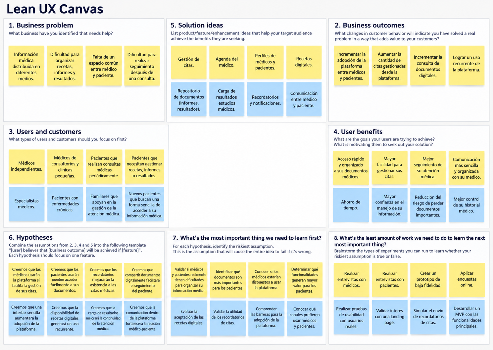

### 1.3. Segmentos objetivo

#### Segmento 1: Médicos cirujanos

Este segmento está conformado por médicos cirujanos que atienden pacientes de manera presencial o virtual y que necesitan organizar sus citas, consultar información de sus pacientes y gestionar documentación relacionada con la atención.

Durante su actividad profesional, pueden generar y consultar recetas, informes médicos y otros documentos, además de recibir resultados de laboratorio, resonancias, estudios y archivos proporcionados por sus pacientes. La información puede encontrarse distribuida entre diferentes medios, dificultando su organización y consulta posterior.

MAX busca brindar a este segmento un entorno digital centralizado desde el cual puedan gestionar sus citas y pacientes, compartir documentación médica, recibir estudios o resultados y consultar información de atenciones anteriores.

**Principales necesidades:**

- Gestionar citas y disponibilidad de atención.

- Consultar información de sus pacientes.

- Generar y compartir recetas e informes médicos.

- Recibir resultados de laboratorio, resonancias y otros estudios.

- Consultar documentos relacionados con atenciones anteriores.

- Realizar seguimiento de los pacientes después de una consulta.

- Mantener organizada la información relacionada con cada atención.

- Contar con mecanismos de autenticación y control de acceso para proteger la información.

#### Segmento 2: Pacientes

Este segmento está conformado por personas que reciben atención médica y necesitan organizar sus citas y acceder a la documentación relacionada con sus atenciones.

Los pacientes pueden recibir recetas, informes, resultados de exámenes y otros documentos durante diferentes etapas de su atención. Asimismo, pueden necesitar compartir resultados de laboratorio, resonancias u otros estudios con sus médicos para continuar con su seguimiento.

MAX busca permitir que los pacientes consulten desde un mismo entorno sus citas y documentos, reciban recordatorios y compartan información con sus médicos de manera organizada.

**Principales necesidades:**

- Programar y consultar sus citas médicas.

- Recibir recordatorios de próximas citas.

- Consultar recetas e informes médicos.

- Acceder a resultados y estudios relacionados con sus atenciones.

- Consultar documentos de atenciones anteriores.

- Compartir resultados o estudios con su médico.

- Mantener organizada su documentación médica.

- Tener control sobre el acceso a su información.

---

## Capítulo II: Requirements Elicitation & Analysis
### 2.1. Competidores

Para identificar oportunidades de diferenciación de la solución se analizaron plataformas digitales que actualmente ofrecen servicios relacionados con la interacción entre médicos y pacientes. Se seleccionaron Doctoralia, Auna y SANNA debido a que presentan funcionalidades relacionadas con búsqueda de especialistas, gestión de citas, teleconsultas y acceso a información médica.

#### 2.1.1. Análisis competitivo

| Sección | Subcategoría | MAX | Doctoralia | Mi Auna | SANNA |
| --- | --- | --- | --- | --- | --- |
| **Perfil** | **Overview** | Plataforma digital orientada a conectar médicos y pacientes mediante la gestión de citas y la centralización de documentos relacionados con la atención, como recetas, informes, resultados de exámenes y estudios médicos. | Plataforma que conecta pacientes con profesionales de la salud, permitiendo buscar especialistas, revisar perfiles y opiniones, reservar citas y acceder a consultas online. | Plataforma digital del ecosistema Auna que permite a sus pacientes gestionar citas y acceder a diferentes servicios e información relacionada con su atención. | Plataforma perteneciente a la red SANNA que permite a los pacientes gestionar citas y acceder a servicios ofrecidos por sus establecimientos y profesionales. |
| **Ventaja competitiva** | **¿Qué valor ofrece a los clientes?** | Integra en un mismo entorno la gestión de citas y el intercambio organizado de documentación entre médicos y pacientes, incluyendo recetas, informes, resultados y estudios. | Facilita encontrar profesionales de diferentes especialidades, comparar perfiles y opiniones, reservar citas y comunicarse con especialistas. | Integra diferentes servicios de Auna en un mismo entorno, incluyendo citas, teleconsultas, recetas y resultados de laboratorio. | Facilita la gestión digital de citas dentro de la red SANNA y permite administrar la atención de familiares desde una misma cuenta. |
| **Perfil de Marketing** | **Mercado objetivo** | Médicos independientes o pertenecientes a pequeños consultorios y pacientes que necesitan gestionar citas y documentación relacionada con su atención. | Pacientes que buscan profesionales de la salud y médicos o especialistas que desean ofrecer sus servicios y gestionar citas mediante una plataforma digital. | Pacientes atendidos dentro de las clínicas, programas y servicios pertenecientes al ecosistema Auna. | Pacientes que utilizan los establecimientos, médicos y servicios pertenecientes a la red SANNA. |
| | **Estrategias de marketing** | Posicionamiento como plataforma sencilla para centralizar la relación médico-paciente, inicialmente enfocada en gestión de citas y documentación relacionada con la atención. | Posicionamiento como marketplace de profesionales de salud basado en disponibilidad, perfiles profesionales, opiniones de pacientes y facilidad para reservar citas. | Integración de servicios digitales con la red de establecimientos y programas de salud de Auna para mantener al paciente dentro de su ecosistema de atención. | Integración de la experiencia digital con los establecimientos y profesionales pertenecientes a la red SANNA. |
| **Perfil de Producto** | **Productos & Servicios** | Gestión de citas, agenda médica, perfiles de pacientes, recetas, informes, carga y consulta de resultados o estudios, repositorio de documentos, recordatorios y notificaciones. | Búsqueda de especialistas, perfiles profesionales, opiniones, reserva y gestión de citas, recordatorios, mensajería y consultas online. | Gestión de citas, historial de citas, teleconsultas, recetas, resultados de laboratorio, información de coberturas, sedes y pagos. | Agendamiento, pago y reprogramación de citas, búsqueda de médicos y gestión de familiares asociados a la cuenta. |
| | **Precios & Costos** | El MVP tendrá inicialmente acceso gratuito para médicos y pacientes con el objetivo de validar la propuesta. El modelo de monetización será evaluado posteriormente. | La búsqueda y reserva de citas no tiene costos añadidos para el paciente. El precio de las consultas depende del profesional y servicio seleccionado. | El acceso a Mi Auna funciona como parte del ecosistema de servicios de Auna; los costos dependen de las consultas, programas, coberturas y servicios contratados. | El acceso a la plataforma forma parte de los servicios digitales de SANNA; los costos dependen de las consultas y servicios médicos utilizados. |
| | **Canales de distribución (Web/Móvil)** | Landing Page, aplicación web para médicos y aplicación móvil para pacientes, de acuerdo con el alcance inicial del producto. | Plataforma web y aplicación móvil para pacientes, además de herramientas digitales destinadas a profesionales. | Plataforma web Mi Auna y aplicación móvil Auna. | Plataforma web de agendamiento y aplicación móvil SANNA. |
| **Análisis SWOT** | **Fortalezas** | Centralización de citas y documentos, intercambio de información entre médico y paciente, orientación tanto a médicos independientes como a pacientes y posibilidad de construir una experiencia específica para cada segmento. | Amplia cantidad de especialistas, sistema de opiniones, facilidad de reserva, recordatorios, consultas online y presencia consolidada en el mercado digital de salud. | Integración de citas, teleconsultas, recetas, resultados y otros servicios dentro de un ecosistema de salud establecido. | Integración con una red de establecimientos y profesionales, gestión digital de citas y posibilidad de administrar familiares. |
| | **Debilidades** | Producto nuevo sin una base inicial de médicos y pacientes. Su valor dependerá de conseguir participación de ambos segmentos y gestionar adecuadamente información sensible. | Su propuesta está principalmente orientada al descubrimiento de especialistas y gestión de consultas, por lo que la centralización longitudinal de documentos médicos entre diferentes profesionales no constituye su enfoque principal. | Su utilización está principalmente relacionada con pacientes y servicios pertenecientes al ecosistema Auna. | Su utilización está principalmente vinculada a profesionales, establecimientos y servicios pertenecientes a la red SANNA. |
| | **Oportunidades** | Incorporar médicos independientes y pequeños consultorios, validar nuevas funcionalidades mediante experimentos, mejorar el seguimiento posterior a las consultas e incorporar progresivamente nuevas herramientas de comunicación y gestión documental. | Ampliar herramientas digitales para profesionales y pacientes e integrar nuevas funcionalidades relacionadas con el seguimiento de la atención. | Continuar integrando servicios médicos digitales y ampliar la experiencia del paciente dentro de su ecosistema. | Ampliar los servicios disponibles digitalmente y mejorar la integración entre pacientes, profesionales y establecimientos de su red. |
| | **Amenazas** | Competencia de plataformas consolidadas, dificultad para generar una masa inicial de usuarios, requisitos de privacidad y seguridad de información sensible y posibilidad de que competidores incorporen funcionalidades similares. | Competencia de otras plataformas de salud y crecimiento de soluciones digitales ofrecidas directamente por clínicas y establecimientos médicos. | Competencia de otros grupos de salud y plataformas digitales independientes que permitan atenderse con profesionales de diferentes instituciones. | Competencia de otras redes privadas de salud y plataformas independientes con mayor variedad de profesionales y servicios digitales. |
#### 2.1.2. Estrategias y tácticas frente a competidores

A partir del análisis competitivo realizado, se desarrolla una matriz FODA y C.A.M.E. para establecer las estrategias que MAX puede aplicar frente a sus competidores. La matriz relaciona las fortalezas y debilidades internas de MAX con las oportunidades y amenazas identificadas en el mercado de plataformas digitales orientadas a la interacción entre médicos y pacientes.

| MATRIZ FODA y C.A.M.E. | Oportunidades: Crecimiento de los servicios digitales de salud, mayor adopción de herramientas para la gestión de citas y oportunidad de centralizar la interacción y documentación entre médicos y pacientes. | Amenazas: Competidores consolidados, plataformas propias de clínicas y redes de salud, requisitos relacionados con privacidad y seguridad de información sensible y aparición de funcionalidades similares. |
| --- | --- | --- |
| **Fortalezas:** Centralización de citas y documentos relacionados con la atención, intercambio de información entre médicos y pacientes, experiencia diferenciada para ambos segmentos y orientación inicial hacia médicos independientes y pacientes. | **Estrategia Ofensiva (F + O):** Aprovechar la centralización de citas y documentos para ofrecer una experiencia enfocada en la continuidad de la interacción entre médico y paciente. La orientación hacia médicos independientes permitirá ampliar progresivamente la adopción de MAX sin limitar la solución a una red clínica específica. | **Estrategia Defensiva (F + A):** Diferenciar MAX frente a Doctoralia, Mi Auna, SANNA y otras plataformas mediante la integración de gestión de citas, recetas, informes, resultados y otros documentos dentro de un mismo entorno. Asimismo, implementar mecanismos de autenticación, autorización y control de acceso que permitan proteger la información gestionada. |
| **Debilidades:** Bajo reconocimiento de marca, ausencia de una comunidad inicial de médicos y pacientes, producto nuevo y necesidad de generar confianza para que los usuarios gestionen información relacionada con su atención mediante la plataforma. | **Estrategia de Reorientación (D + O):** Concentrar inicialmente la adopción en médicos independientes y pacientes que necesiten organizar sus citas y documentos. Realizar entrevistas, pruebas de usabilidad y experimentos permitirá validar las funcionalidades de mayor valor antes de ampliar progresivamente el alcance de MAX. | **Estrategia de Supervivencia (D + A):** Limitar inicialmente el alcance a las funcionalidades esenciales de gestión de citas y documentación, evitando competir directamente con ecosistemas clínicos completos. Implementar controles de seguridad, gestión de permisos y prácticas de protección de información desde el MVP para fortalecer progresivamente la confianza de médicos y pacientes. |

### 2.2. Entrevistas

Las entrevistas permitirán comprender cómo médicos y pacientes gestionan actualmente sus citas y documentación relacionada con la atención. Asimismo, permitirán identificar problemas, necesidades, comportamientos y expectativas que puedan ser utilizados para validar los supuestos planteados durante el desarrollo de MAX.

Para la investigación se consideran los dos segmentos objetivo definidos previamente: médicos y pacientes.

#### 2.2.1. Diseño de entrevistas

Para cada segmento se elaboró un conjunto de diez preguntas. Las entrevistas buscan explorar experiencias reales relacionadas con la gestión de citas, organización de documentos, intercambio de información entre médicos y pacientes y seguimiento posterior a una consulta.

#### Segmento 1: Médicos

**Objetivo de la entrevista:** Comprender cómo los médicos gestionan actualmente sus citas, pacientes y documentación relacionada con la atención, identificar las principales dificultades que experimentan al compartir o consultar información y conocer qué factores considerarían importantes para utilizar una plataforma digital como MAX.

1. ¿Cómo organizas actualmente las citas y horarios de atención de tus pacientes?

2. ¿Qué herramientas o medios utilizas para gestionar tus citas y por qué los utilizas?

3. ¿Qué dificultades encuentras actualmente al gestionar tu agenda o las citas de tus pacientes?

4. ¿Cómo entregas normalmente recetas, informes u otros documentos después de una consulta?

5. ¿Cómo recibes resultados de laboratorio, resonancias u otros estudios realizados por tus pacientes?

6. Cuando necesitas consultar información o documentos de una atención anterior, ¿cómo los buscas actualmente?

7. ¿Qué dificultades has experimentado al organizar o encontrar documentos relacionados con tus pacientes?

8. ¿Cómo realizas actualmente el seguimiento de un paciente después de una consulta?

9. ¿Qué información o funcionalidades considerarías más importantes en una plataforma para gestionar citas y documentos de tus pacientes?

10. ¿Qué necesitarías conocer sobre una plataforma como MAX para confiar en ella y utilizarla para gestionar información relacionada con tus pacientes?

#### Segmento 2: Pacientes

**Objetivo de la entrevista:** Comprender cómo los pacientes gestionan actualmente sus citas y documentos relacionados con su atención, identificar dificultades al acceder o compartir esta información y conocer qué factores consideran importantes para utilizar una plataforma digital que centralice su interacción con el médico.

1. ¿Cómo programas normalmente una cita con un médico?

2. ¿Qué herramientas o medios utilizas actualmente para recordar y organizar tus citas médicas?

3. ¿Alguna vez has tenido alguna dificultad relacionada con una cita médica, como olvidarla, reprogramarla o encontrar la información necesaria?

4. ¿Cómo recibes y dónde guardas normalmente tus recetas, informes y otros documentos entregados por un médico?

5. ¿Alguna vez has tenido dificultades para encontrar una receta, informe o resultado cuando lo necesitabas? ¿Qué ocurrió?

6. ¿Cómo compartes actualmente resultados de laboratorio, resonancias u otros estudios con tu médico?

7. Después de una consulta, ¿cómo realizas el seguimiento de las indicaciones o documentos que te proporciona el médico?

8. ¿Qué información relacionada con tus citas o documentos te gustaría poder consultar desde una aplicación?

9. Si pudieras tener tus citas, recetas, informes y resultados en un mismo lugar, ¿qué funcionalidades considerarías más importantes?

10. ¿Qué necesitarías conocer sobre una plataforma como MAX para confiar en ella y utilizarla para gestionar información relacionada con tu atención?

#### 2.2.2. Registro de entrevistas

#### Segmento 2: Pacientes

##### Entrevista 1

| Campo | Información |
| --- | --- |
| **Nombre** | Fernanda Valderrama |
| **Edad** | 20 años |
| **Ocupación** | Estudiante universitaria |
| **Duración** | 00:00 - 06:07 |
| **Resumen** | Fernanda Valderrama, de 20 años, programa normalmente sus citas médicas mediante aplicaciones o páginas web y, cuando necesita conseguir una cita con mayor urgencia, realiza llamadas para consultar disponibilidad. Indicó que actualmente no utiliza ninguna herramienta para recordar sus citas, por lo que algunas veces las olvida o debe reprogramarlas cuando coinciden con actividades universitarias, llegando a esperar aproximadamente una semana para obtener una nueva cita. Respecto a su documentación médica, señaló que suele guardar las recetas junto con los medicamentos, mientras que los informes son revisados y posteriormente pueden terminar extraviándose. Los estudios médicos, como resonancias u otros documentos, son almacenados físicamente en su clóset y deben ser entregados presencialmente cuando un médico los solicita. Después de una consulta, realiza el seguimiento principalmente cumpliendo el tratamiento hasta finalizar los medicamentos. Manifestó interés en poder consultar recetas anteriores para conocer los medicamentos utilizados previamente y considera importante disponer de un buscador que permita localizar información mediante el nombre de un medicamento. También valoró que las recetas incluyan información específica sobre medicamentos, cantidades y horarios. Finalmente, señaló que la existencia de alianzas con las clínicas que frecuenta contribuiría a su disposición para utilizar una plataforma como MAX. |

**Entrevista 1:** [Link a la entrevista](https://youtu.be/Mw2_g3XfptE)

##### Entrevista 2

| Campo | Información |
| --- | --- |
| **Nombre** | Maricielo Bravo |
| **Edad** | 21 años |
| **Ocupación** | No especificada |
| **Duración** | 00:00 - 05:08 |
| **Resumen** | Maricielo Bravo, de 21 años, gestiona actualmente sus citas médicas mediante la aplicación de la Clínica Internacional, donde puede seleccionar al médico, la especialidad y el horario de atención. Para recordar sus citas, vincula la información con el calendario de su celular y recibe recordatorios; sin embargo, señaló que en algunas ocasiones la sincronización no funciona correctamente y que tiene dificultades para personalizar con cuánta anticipación desea recibir los avisos. Respecto a sus documentos médicos, indicó que los informes y resultados pueden visualizarse en la aplicación y también son enviados a su correo. Para realizar el seguimiento de análisis que demoran algunos días, recibe notificaciones mediante correo electrónico o WhatsApp cuando los resultados están disponibles. Considera importante poder consultar desde un mismo lugar su historial de citas, resultados organizados por especialidad, informes, radiografías e interconsultas, evitando tener que buscar información entre diferentes medios como WhatsApp y correo electrónico. También considera especialmente importantes los recordatorios configurables, prefiriendo recibir avisos varios días antes, un día antes, unas horas antes y aproximadamente treinta minutos antes de una cita. Asimismo, le gustaría recibir recordatorios sobre exámenes pendientes. Finalmente, para confiar en una plataforma como MAX considera fundamental que su información médica únicamente pueda ser visualizada por ella y por el médico que la atiende. También considera importante poder seleccionar qué documentos compartir con otros médicos, conocer quién puede acceder a sus datos y saber qué medidas de seguridad utiliza la plataforma para proteger su información. |

**Entrevista 2:** [Link a la entrevista](https://youtu.be/Q_GEiuq-wkU)

#### Segmento 1: Médicos

##### Entrevista 1

| Campo | Información |
| --- | --- |
| **Nombre** | Francesca Durand Alba |
| **Edad** | 25 años |
| **Ocupación** | Médica cirujana |
| **Duración** | 00:00 - 06:26 |
| **Resumen** | Francesca Durand Alba, médica cirujana de 25 años, organiza actualmente sus citas utilizando principalmente WhatsApp para coordinar con los pacientes y Google Calendar para registrar y organizar sus horarios. Señaló que una de las principales dificultades se presenta cuando existen cancelaciones, cambios o confirmaciones, debido a que la coordinación mediante WhatsApp dificulta visualizar rápidamente la disponibilidad y mantener organizada la agenda. Respecto a la documentación, explicó que las recetas e informes pueden entregarse físicamente durante una atención presencial o enviarse mediante WhatsApp cuando la consulta es virtual. Asimismo, recibe resultados de laboratorio, resonancias y otros estudios tanto físicamente como mediante fotografías, archivos PDF u otros documentos enviados por WhatsApp. Aunque dispone de una historia clínica virtual para consultar atenciones anteriores, los documentos complementarios pueden encontrarse distribuidos en diferentes chats y formatos, lo que dificulta localizarlos rápidamente. También señaló que algunos pacientes olvidan llevar sus resultados a las consultas. Considera importante que una plataforma permita realizar seguimiento del tratamiento, mantener la comunicación con el paciente y centralizar la historia clínica y los documentos en un solo lugar. Para confiar en una plataforma como MAX, considera fundamental conocer las medidas utilizadas para proteger la información, quién puede acceder a ella, cómo se realizan las copias de respaldo, cómo pueden recuperarse los datos y qué ocurre con la información si deja de utilizar el servicio. Además, considera importante que la plataforma sea fácil de utilizar y permita almacenar y adjuntar todos los documentos relacionados con cada paciente. |

**Entrevista 1:** [Link a la entrevista](https://youtu.be/C9Fik3RUqL4)

##### Entrevista 2

| Campo | Información |
| --- | --- |
| **Nombre** | Aixa Valle |
| **Edad** | 21 años |
| **Ocupación** | Doctora |
| **Duración** | 00:00 - 05:45 |
| **Resumen** | Aixa Valle, doctora de 21 años, organiza actualmente las citas de sus pacientes mediante una agenda, WhatsApp y Google Calendar. Utiliza principalmente WhatsApp para coordinar horarios debido a que es el medio de comunicación más utilizado por sus pacientes, mientras que Google Calendar le permite registrar las citas y visualizar su disponibilidad. Entre las principales dificultades identificó las cancelaciones y reprogramaciones, ya que debe revisar diferentes conversaciones y posteriormente actualizar su calendario. Respecto a la documentación, entrega recetas e indicaciones físicamente durante las consultas presenciales y también utiliza WhatsApp para compartir documentos digitales o gestionar atenciones virtuales. Los resultados de laboratorio, resonancias y otros estudios pueden ser entregados físicamente o enviados como fotografías y archivos PDF mediante WhatsApp, lo que puede dificultar encontrarlos posteriormente entre diferentes conversaciones. Indicó que la información de sus pacientes puede encontrarse distribuida entre sistemas, documentos físicos, archivos almacenados y WhatsApp, dificultando disponer de toda la información en un único lugar. Para realizar el seguimiento después de una consulta utiliza principalmente WhatsApp, mediante el cual los pacientes realizan consultas o envían resultados, y coordina nuevas citas cuando necesita volver a evaluarlos. Considera importante que una plataforma permita centralizar la agenda y la información de cada paciente, revisar citas, adjuntar recetas e informes, recibir resultados y estudios, consultar documentos anteriores, recibir notificaciones y recordatorios y facilitar el seguimiento. Finalmente, para confiar en una plataforma como MAX considera fundamental conocer cómo se protege la información de los pacientes, quién puede acceder a ella, cómo se almacenan los documentos y si existen copias de seguridad. También considera importante que la plataforma sea sencilla y permita ahorrar tiempo en la gestión de citas e información. |

**Entrevista 2:** [Link a la entrevista](https://youtu.be/j2yfDpQWgHI)

#### 2.2.3. Análisis de entrevistas
A partir de las entrevistas realizadas a los segmentos objetivo de MAX, se identificaron patrones relacionados con la gestión de citas, la organización y acceso a documentos médicos, los canales utilizados para intercambiar información, los recordatorios y la seguridad de los datos. Los resultados se analizaron de manera independiente para los segmentos de médicos y pacientes.

#### Médicos

Las entrevistas realizadas a **Francesca Durand Alba y Aixa Valle** muestran que ambas utilizan diferentes herramientas para gestionar sus actividades diarias. Las dos entrevistadas utilizan **WhatsApp para comunicarse y coordinar con sus pacientes**, mientras que **Google Calendar es utilizado para organizar y registrar sus citas**.

Uno de los principales problemas identificados es la **dispersión de la información**. Ambas médicas indicaron que reciben documentos como resultados de laboratorio, resonancias, fotografías o archivos PDF mediante WhatsApp, además de manejar información mediante documentos físicos u otros sistemas. Esta situación puede dificultar la búsqueda de información de atenciones anteriores y obliga a consultar diferentes medios para localizar los documentos de un paciente.

También se identificaron dificultades relacionadas con la **gestión de cambios, cancelaciones y reprogramaciones de citas**, debido a que parte de estas coordinaciones se realiza mediante conversaciones de WhatsApp y posteriormente debe actualizarse la agenda.

Respecto al seguimiento posterior a una consulta, las entrevistadas utilizan principalmente la comunicación directa con el paciente para resolver dudas, recibir resultados y coordinar nuevas evaluaciones. Ambas consideran importante disponer de una plataforma que permita **centralizar las citas y documentos de cada paciente**.

Finalmente, la **seguridad de la información** representa un aspecto fundamental para ambas entrevistadas. Entre los elementos mencionados se encuentran conocer quién puede acceder a los datos, cómo se almacenan los documentos, la existencia de copias de seguridad y las medidas utilizadas para proteger la información médica.

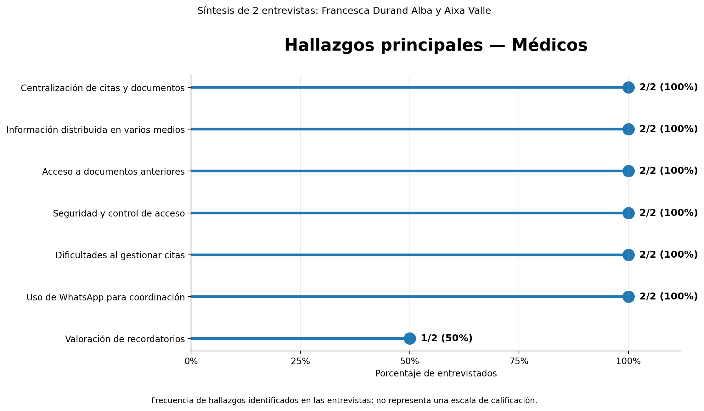

#### Pacientes

Las entrevistas realizadas a **Fernanda Valderrama y Maricielo Bravo** muestran diferentes formas de gestionar las citas y la documentación médica. Fernanda indicó que programa sus citas mediante aplicaciones o páginas web, pero no utiliza una herramienta específica para recordarlas, lo que ha ocasionado que algunas veces olvide una cita. Maricielo, por otro lado, utiliza la aplicación de la Clínica Internacional y sincroniza sus citas con el calendario de su celular, aunque ha experimentado problemas con la configuración y sincronización de los recordatorios.

En relación con la documentación, ambas entrevistas evidencian la importancia de poder **consultar información médica de manera organizada**. Fernanda señaló que suele conservar las recetas junto con sus medicamentos y que algunos informes terminan extraviándose, mientras que Maricielo puede acceder a parte de su información mediante la aplicación de su clínica y su correo electrónico, aunque también debe consultar diferentes canales.

Las dos entrevistadas manifestaron interés en disponer de sus **citas y documentos médicos en un mismo lugar**. Entre las funcionalidades mencionadas se encuentran consultar recetas anteriores, resultados, informes, radiografías e historial de citas, además de contar con mecanismos que faciliten la búsqueda de información.

Los **recordatorios** también representan una oportunidad relevante. Fernanda indicó que algunas veces olvida sus citas debido a que no las registra, mientras que Maricielo manifestó interés en configurar avisos con diferentes niveles de anticipación y recibir recordatorios sobre exámenes pendientes.

Finalmente, ambas entrevistadas mencionaron elementos relacionados con la **confianza en la plataforma**. Fernanda valoró que MAX pudiera mantener alianzas con las clínicas que utiliza, mientras que Maricielo destacó la necesidad de proteger su información médica, controlar quién puede acceder a ella y decidir qué documentos compartir con otros médicos.

En conjunto, los resultados muestran que MAX puede enfocarse en **centralizar citas y documentación médica, facilitar la búsqueda de información y mejorar la gestión de recordatorios**, considerando además mecanismos de privacidad y control de acceso.

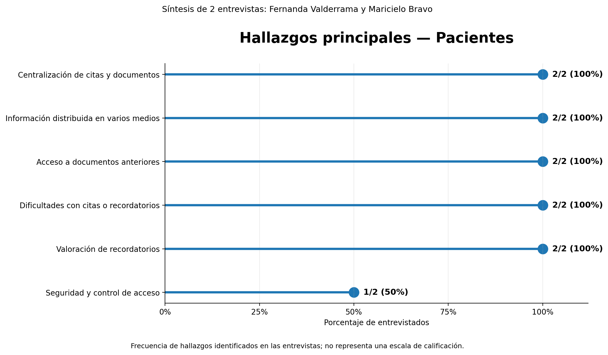

### 2.3. Needfinding
#### 2.3.1. User Personas
#### User Persona - Médico

A partir de los segmentos objetivo definidos para MAX, se desarrollarán dos User Personas que representen a los principales tipos de usuarios de la solución. Los perfiles definitivos serán elaborados a partir de los patrones identificados durante las entrevistas.

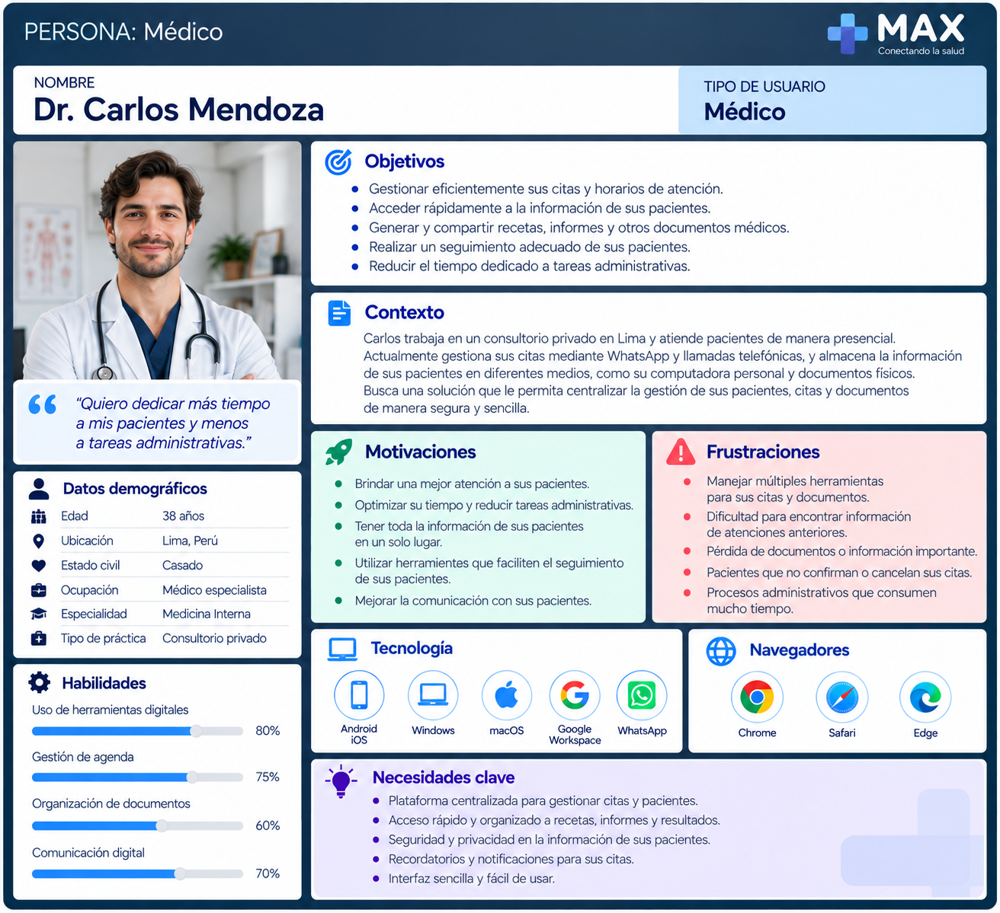

#### User Persona - Paciente

Este User Persona representa a pacientes que realizan consultas médicas y necesitan gestionar sus citas y mantener organizada la documentación relacionada con su atención. Sus principales necesidades se relacionan con el acceso a recetas, informes, resultados y recordatorios, así como con la posibilidad de compartir información con sus médicos.

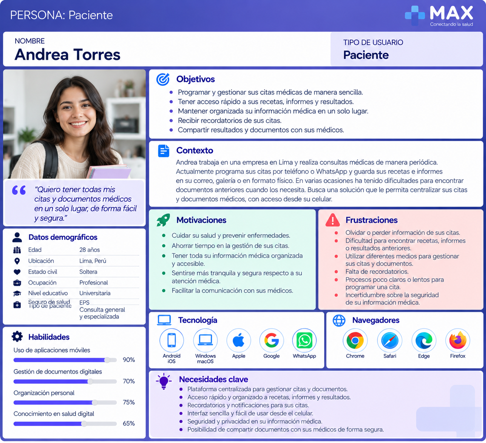

#### 2.3.2. User Task Matrix

La User Task Matrix permite identificar y comparar las principales actividades realizadas por médicos y pacientes relacionadas con la gestión de citas y documentación. Para cada tarea se considera la frecuencia con la que se realiza y su nivel de importancia para cada segmento.

| Tarea del usuario | Médico - Frecuencia | Médico - Importancia | Paciente - Frecuencia | Paciente - Importancia |
| --- | --- | --- | --- | --- |
| Consultar próximas citas | Alta | Alta | Media | Alta |
| Gestionar una cita | Alta | Alta | Media | Alta |
| Gestionar agenda | Alta | Alta | No aplica | No aplica |
| Consultar información relacionada con una atención | Alta | Alta | Media | Alta |
| Generar una receta | Alta | Alta | No aplica | No aplica |
| Consultar una receta | Media | Alta | Media | Alta |
| Generar un informe | Media | Alta | No aplica | No aplica |
| Consultar un informe | Media | Alta | Media | Alta |
| Subir resultados o estudios | Baja | Media | Media | Alta |
| Revisar resultados o estudios | Alta | Alta | Media | Alta |
| Compartir documentos | Alta | Alta | Media | Alta |
| Consultar documentos anteriores | Alta | Alta | Media | Alta |
| Recibir recordatorios de citas | Media | Media | Media | Alta |
| Consultar notificaciones | Media | Media | Media | Media |

A partir de la matriz se observa que ambos segmentos comparten actividades relacionadas con la gestión de citas, consulta de documentos y acceso a información relacionada con la atención. Sin embargo, las responsabilidades de cada usuario son diferentes.

El médico presenta una mayor frecuencia en actividades relacionadas con la administración de la agenda, generación de recetas e informes y revisión de resultados. Por otro lado, el paciente presenta una mayor necesidad de consultar documentos, recibir recordatorios y compartir resultados obtenidos después de una consulta.

Los valores definitivos de frecuencia e importancia deberán ser revisados después de analizar las entrevistas realizadas a ambos segmentos.

#### 2.3.3. User Journey Mapping

En esta sección se presenta el recorrido que realizan los principales usuarios de MAX, considerando los dos segmentos definidos: médicos y pacientes. El recorrido inicia con la programación de una cita y continúa con la preparación previa a la consulta, la realización de la atención, la gestión de los documentos generados y el seguimiento posterior.

Este análisis permite identificar las acciones, objetivos, pensamientos, dificultades y emociones que experimenta cada segmento durante las diferentes etapas de la atención. A partir de estos hallazgos, se pueden reconocer oportunidades para que MAX facilite la gestión de citas, centralice la documentación y mejore la interacción entre médicos y pacientes.

#### User Journey Mapping - Médico

El recorrido del médico comienza con la organización de sus citas y continúa con la revisión de la información disponible antes de atender al paciente. Durante la consulta, el médico evalúa al paciente y registra las indicaciones correspondientes. Posteriormente, genera o comparte documentos como recetas e informes y, finalmente, realiza el seguimiento mediante la revisión de resultados, estudios u otra información proporcionada por el paciente.

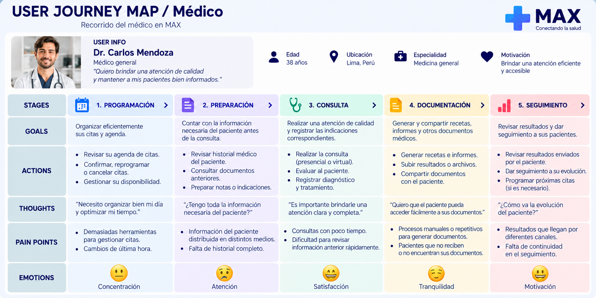

#### User Journey Mapping - Paciente

El recorrido del paciente comienza cuando necesita programar una cita con un médico. Antes de la consulta, organiza la información y documentos que podría necesitar. Durante la atención recibe las indicaciones correspondientes y, posteriormente, debe gestionar recetas, informes, resultados u otros documentos. Finalmente, realiza el seguimiento de su atención, pudiendo compartir nuevos resultados o estudios con su médico.

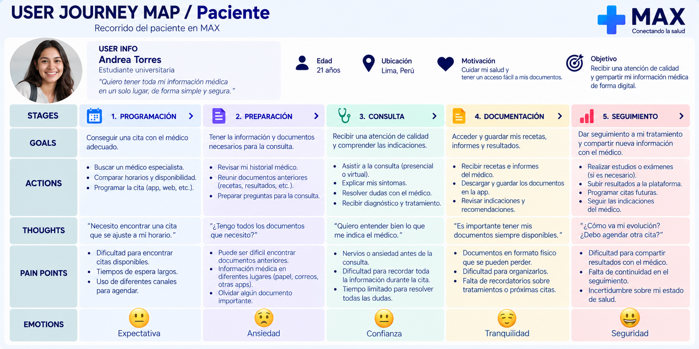

#### 2.3.4. Empathy Mapping

#### Empathy Mapping - Médico

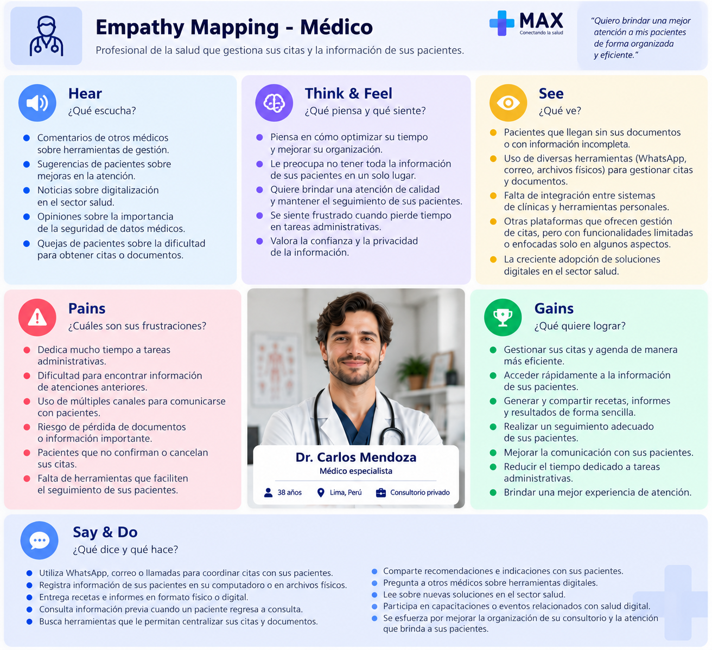

#### Empathy Mapping - Paciente

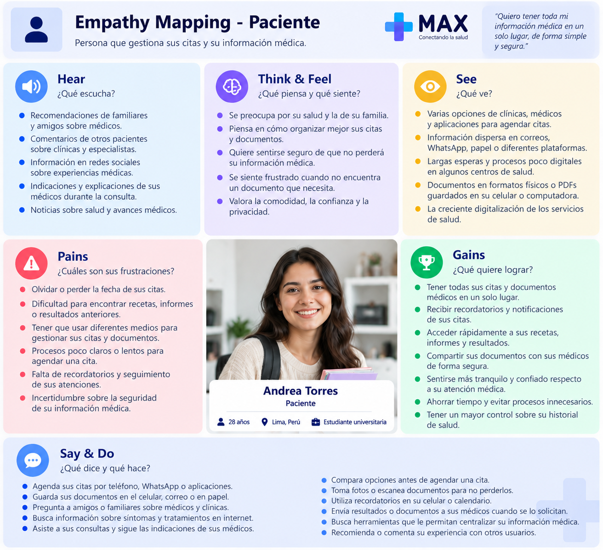

#### 2.3.5. As-Is Scenario Mapping

En esta sección se presenta el As-Is Scenario Mapping de los dos segmentos objetivo de MAX: médicos y pacientes. Este análisis permite comprender cómo ambos usuarios realizan actualmente las actividades relacionadas con la gestión de citas, consultas y documentación médica sin utilizar MAX. A partir de este proceso se identifican las acciones que realizan, sus principales pensamientos y las emociones que experimentan durante cada etapa.

#### As-Is Scenario Mapping - Médico

El escenario actual del médico representa el proceso que realiza desde la organización de sus citas hasta el seguimiento posterior de sus pacientes. Actualmente, estas actividades pueden involucrar diferentes herramientas y medios para gestionar la agenda, consultar información, entregar documentos y recibir resultados.

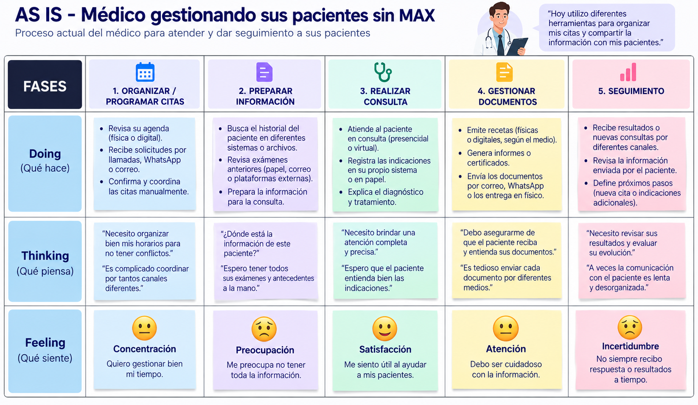

#### As-Is Scenario Mapping - Paciente

El escenario actual del paciente representa el proceso que realiza desde que necesita programar una cita hasta el seguimiento posterior a la consulta. Durante este recorrido puede utilizar diferentes medios para coordinar citas, conservar recetas e informes y compartir resultados con su médico.

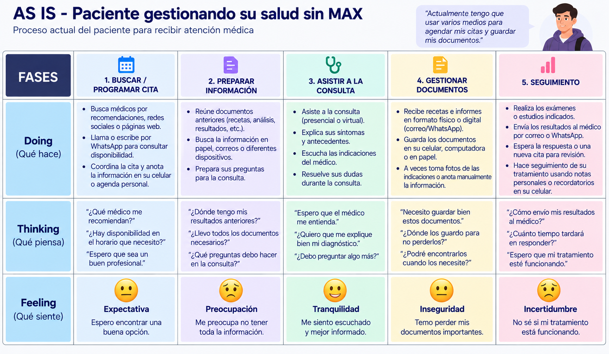

### 2.4. Ubiquitous Language

El Ubiquitous Language de MAX establece un vocabulario común para describir los principales conceptos del dominio de la solución. Su propósito es mantener una terminología consistente entre el equipo de desarrollo, los stakeholders, la documentación, los modelos de dominio y la implementación del software, reduciendo ambigüedades durante el desarrollo del proyecto.

| Término | Definición |
| --- | --- |
| **Usuario (User)** | Persona registrada en MAX que interactúa con la plataforma según los permisos asociados a su rol. |
| **Médico (Doctor)** | Profesional de la salud registrado en MAX que gestiona citas, pacientes y documentación relacionada con la atención. |
| **Paciente (Patient)** | Usuario que recibe atención de un médico y utiliza MAX para gestionar citas y consultar o compartir documentación. |
| **Rol (Role)** | Clasificación asignada a un usuario que determina las funcionalidades y recursos a los que puede acceder dentro de MAX. |
| **Perfil médico (Doctor Profile)** | Información profesional asociada a un médico registrado en MAX. |
| **Perfil del paciente (Patient Profile)** | Información asociada a un paciente registrado en MAX. |
| **Cita (Appointment)** | Encuentro programado entre un médico y un paciente para una fecha y hora determinadas. |
| **Estado de cita (Appointment Status)** | Situación actual de una cita dentro de su ciclo de gestión, como pendiente, confirmada, completada o cancelada. |
| **Agenda médica (Doctor Schedule)** | Conjunto de horarios y citas asociados a un médico. |
| **Disponibilidad (Availability)** | Periodos de tiempo definidos por el médico en los que puede programarse una cita. |
| **Atención (Medical Encounter)** | Interacción entre un médico y un paciente asociada a una cita realizada. |
| **Documento médico (Medical Document)** | Archivo relacionado con una atención que puede ser almacenado y consultado mediante MAX. |
| **Receta (Prescription)** | Documento generado por el médico que contiene las prescripciones o indicaciones correspondientes a una atención. |
| **Informe médico (Medical Report)** | Documento elaborado por el médico con información relacionada con una atención realizada. |
| **Resultado (Medical Result)** | Documento que contiene información obtenida a partir de un examen o estudio realizado al paciente. |
| **Estudio médico (Medical Study)** | Examen o procedimiento cuyos resultados pueden ser registrados o compartidos mediante MAX. |
| **Repositorio de documentos (Document Repository)** | Espacio de MAX utilizado para almacenar y organizar documentos relacionados con un paciente. |
| **Carga de documento (Document Upload)** | Proceso mediante el cual un usuario incorpora un documento autorizado a MAX. |
| **Compartir documento (Document Sharing)** | Acción mediante la cual un documento se pone a disposición de un usuario autorizado. |
| **Acceso a documento (Document Access)** | Permiso que permite a un usuario autorizado visualizar o consultar un documento disponible en MAX. |
| **Historial de citas (Appointment History)** | Registro de citas anteriores asociadas a un usuario. |
| **Notificación (Notification)** | Aviso generado por MAX para comunicar al usuario información relacionada con una cita, documento u otro evento relevante. |
| **Recordatorio de cita (Appointment Reminder)** | Notificación enviada antes de una cita programada. |
| **Seguimiento (Follow-up)** | Actividades posteriores a una atención destinadas a continuar la interacción entre médico y paciente. |
| **Autenticación (Authentication)** | Proceso mediante el cual MAX verifica la identidad de un usuario. |
| **Autorización (Authorization)** | Proceso mediante el cual MAX determina las acciones y recursos a los que puede acceder un usuario autenticado. |
| **Consentimiento (Consent)** | Autorización otorgada por el usuario para determinadas acciones relacionadas con el acceso y gestión de su información dentro del alcance definido por MAX. |

---

## Capítulo III: Requirements Specification
### 3.1. To-Be Scenario Mapping
### 3.2. User Stories
### 3.3. Product Backlog
### 3.4. Impact Mapping

---

## Capítulo IV: Product Design
### 4.1. Style Guidelines
#### 4.1.1. General Style Guidelines
#### 4.1.2. Web Style Guidelines
#### 4.1.3. Mobile Style Guidelines
##### 4.1.3.1. IOS Mobile Style Guidelines
##### 4.1.3.2. Android Mobile Style Guidelines
### 4.2. Information Architecture
#### 4.2.1. Organization Systems
#### 4.2.2. Labeling Systems
#### 4.2.3. SEO Tags and Meta Tags
#### 4.2.4. Searching Systems
#### 4.2.5. Navigation Systems
### 4.3. Landing Page UI Design
#### 4.3.1. Landing Page Wireframe
#### 4.3.2. Landing Page Mock-up
### 4.4. Mobile Applications UX/UI Design
#### 4.4.1. Mobile Applications Wireframes
#### 4.4.2. Mobile Applications Wireflow Diagrams
#### 4.4.3. Mobile Applications Mock-ups
#### 4.4.4. Mobile Applications User Flow Diagrams
### 4.5. Mobile Applications Prototyping
#### 4.5.1. Android Mobile Applications Prototyping
#### 4.5.2. IOS Mobile Applications Prototyping
### 4.6. Web Applications UX/UI Design
#### 4.6.1. Web Applications Wireframes
#### 4.6.2. Web Applications Wireflow Diagrams
#### 4.6.3. Web Applications Mock-ups
#### 4.6.4. Web Applications User Flow Diagrams
### 4.7. Web Applications Prototyping
### 4.8. Domain-Driven Software Architecture
#### 4.8.1. Software Architecture Context Diagram
#### 4.8.2. Software Architecture Container Diagrams
#### 4.8.3. Software Architecture Components Diagrams
### 4.9. Software Object-Oriented Design
#### 4.9.1. Class Diagrams
#### 4.9.2. Class Dictionary
### 4.10. Database Design
#### 4.10.1. Relational/Non-Relational Database Diagrams

---

## Capítulo V: Product Implementation, Validation & Deployment
### 5.1. Software Configuration Management
#### 5.1.1. Software Development Environment Configuration
#### 5.1.2. Source Code Management
#### 5.1.3. Source Code Style Guide & Conventions
#### 5.1.4. Software Deployment Configuration
### 5.2. Product implementation & deployment
#### 5.2.1. Sprint 1
##### 5.2.1.1. Sprint Planning 1
##### 5.2.1.2. Aspect Leaders and Collaborators
##### 5.2.1.3. Sprint Backlog 1
##### 5.2.1.4. Development Evidence for Sprint Review
##### 5.2.1.5. Execution Evidence for Sprint Review
##### 5.2.1.6. Services Documentation Evidence for Sprint Review
##### 5.2.1.7. Software Deployment Evidence for Sprint Review
##### 5.2.1.8. Team Collaboration Insights during Sprint
*(Nota: Repetir esta estructura para Sprint 2, 3, y 4 según corresponda cada hito de evaluación)*
#### 5.2.2. Implemented Landing Page Evidence
#### 5.2.3. Implemented Frontend-Web Application Evidence
#### 5.2.4. Implemented Native-Mobile Application Evidence
#### 5.2.5. Implemented RESTful API and/or Serverless Backend Evidence
#### 5.2.6. RESTful API Documentation
#### 5.2.7. Team Collaboration Insights
### 5.3. Video About-the-Product

---

## Conclusiones
### Conclusiones y recomendaciones
### Video About-the-Team

---

## Bibliografía

---

## Anexos
### Anexo A. Videos de Exposiciones
*(Incluir de forma progresiva el título e hipervínculo al video de Exposición en Microsoft Stream para cada entrega AV1, TB1, AV2, TB2).*
